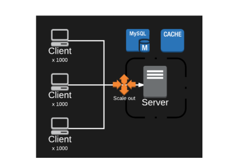
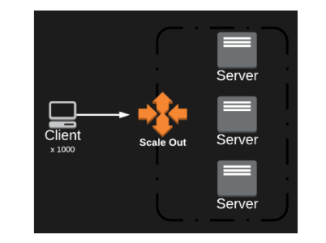
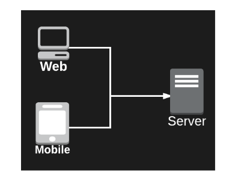

 

# 📝 HTTP 상태유지 기술

- HTTP 프로토콜은 Stateless 프로토콜이다. 
- 즉, HTTP 서버는 클라이언트의 요청 기록(상태)를 유지 하지 않는다.
- 그렇기 때문에 HTTP 서버는 클라이언트를 식별할 수 없다. 
- 서버가 클라이언트를 식별할 수 있게 해주는 쿠키, 세션, 토큰 등의 기술이 있다. 

 

# 📝Cookie

 

## 📌 설명

- 쿠키는 클라이언트의 정보(과거의 요청 기록, 세션 ID 등)를 가지고 있으며, 클라이언트 측(브라우저)에 저장된다.
- 클라이언트는 서버에 요청을 보낼 때마다 쿠키를 함께 보내서 자신이 누구인지 서버에게 알려준다. 

- 쿠키는 "이름-값"  쌍으로 클라이언트의 정보를 저장한다.

- 쿠키는 세션 쿠키와 지속 쿠키로 나뉜다.

  - 세션 쿠키 :  세션 쿠키는 브라우저 메모리에 저장되기 때문에 브라우저가 종료되면 사라진다.
  - 지속 쿠키 :  지속 쿠키는 파일로 저장된다. 브라우저가 종료되어도 사라지지 않는다. 

- 쿠키는 `오늘 더 이상 이 창을 보지 않음 체크`, `비회원 유저의 장바구니 목록 유지` 등에 사용된다.

- 브라우저마다 저장할 수 있는 쿠키의 크기, 개수는 정해져있다.

### 👍🏻 쿠키의 장점

- 클라이언트의 정보가 클라이언트 측에 저장되기 때문에 서버에 부담이 없다.
- 쿠키는 그 자체로 클라이언트의 정보를 담고 있다. 따라서 서버는 별로의 저장소에서 클라이언트의 정보를 가져오는 작업을 하지 않아도 된다.

### 👎🏻 쿠키의 단점

- 클라이언트 측에 저장되는 쿠키는 변질되거나 유출될 수 있다. 보안적으로 좋지 않다.
- 매번 HTTP 요청을 보낼 때마다 많은 정보가 담긴 쿠키를 함께 보내면, 트래픽이 커진다는 단점이 있다.

 

## 📌 쿠키 동작 과정 

1. 클라이언트가 어느날 네이버에 최초로 접속했다.
2. 네이버 서버는 클라이언트가 요청한 웹페이지와 클라이언트의 쿠키를 만들어서 클라이언트에게 응답한다.
3. 클라이언트는 서버로부터 받은 쿠키에 자신의 정보를 기록한다. 예를들어 네이버 메인에 뜨는 광고 팝업 창에  "오늘 더 이상 이 창을 보지 않음"을 체크했다는 정보를 쿠키에 기록 했다고 하자.
4. 이후 클라이언트는 네이버 서버에 요청을 보낼때 마다 쿠키를 보낸다.
5. 네이버 서버는 클라이언트가 보낸 쿠키에 기록된 정보를 확인한다.
6. 이후 네이버는 메인 광고가 없는 웹 페이지를 클라이언트에게 응답한다.

 

# 📝Session

 

## 📌 설명

- 클라이언트의 정보를 기록하고 있는 쿠키는 클라이언트 측(브라우저)에 저장되며, 클라이언트가 요청을  보낼때마다 같이 보내진다.
- 반대로 세션은 클라이언트의 정보를 서버측에 저장한다. 예를들어 서버의 메모리 또는 DB에 저장한다.
- 클라이언트가 매 HTTP 요청 때마다 자신의 세션 ID가 담긴 쿠키를 서버에게 보낼 때마다 
- 서버는 쿠키에 담긴 세션 ID를 통해 메모리 또는 DB에서 클라이언트에 대한 정보를 가져온다. 

### 👍🏻 세션의 장점

- 클라이언트의 정보는 서버 메모리 또는 DB에 저장하기 때문에 보안이 우수하다.
- 클라이언트는 세션 ID만 담긴 쿠키를 보내기만 하면 되기 때문에 트래픽 문제가 없다.  

### 👎🏻 세션의 단점

- **서버측 부하** 

  

  - 세션은 메모리 또는 DB 또는 세션 전용 서버에서 저장되게 할 수 있다.
  - 하지만 어떤 방식이던 수 많은 클라이언트의 정보를 서버측에 저장하는 것이므로 부하가 발생한다. 

- **서버를 여러대로 운영할 경우 세션을 동기화 해줘야 한다.**

  

  - 서버가 스케일 아웃 되어서 여러개로 구성되는 경우 각 서버마다 세션 정보가 저장된다.
  - 이 경우 만약 사용자가 1번 서버에서 로그인을 하고, 2번 서버를 통해 마이페이지를 접속한다면, 로그인이 풀릴 수 있다.
  - 로그인 세션 정보는 1번 서버에 있기 때문이다. 따라서 동기화를 해줘야한다. 

- **웹, 앱간 상이한 쿠키-세션 처리 방법**

  

  - 브라우저와 모바일 앱의 쿠키 처리 방법은 다르다. 
  - 또 다른 형태의 클라이언트가 생기면 새로운 쿠키 처리 방법이 필요하다. 

 

## 📌 세션 동작 과정

1. 클라이언트가 어느날 네이버에 최초로 접속했다.
2. 네이버 서버는 클라이언트에 대한 세션 저장소를 만들고, 클라이언트가 요청한 웹페이지와 세션 ID가 담긴 쿠키를 만들어서 클라이언트에게 응답한다.
3. 클라이언트는 네이버 서버에 요청을 보낼때마다 세션 ID가 담긴 쿠키를 보낸다.
4. 네이버 서버는 클라이언트가 보낸 쿠키에 들어있는 세션 ID를 통해 세션 저장소에 접근하여 클라이언트를 식별할 수 있다. 

 

# 🐥 참고

* [쿠키란? - 부스트코스](https://www.edwith.org/boostcourse-web/lecture/16799/)

* [Web-쿠키와 세션의 차이, 용도, 사용법(cookie,session)](https://jeong-pro.tistory.com/80)
