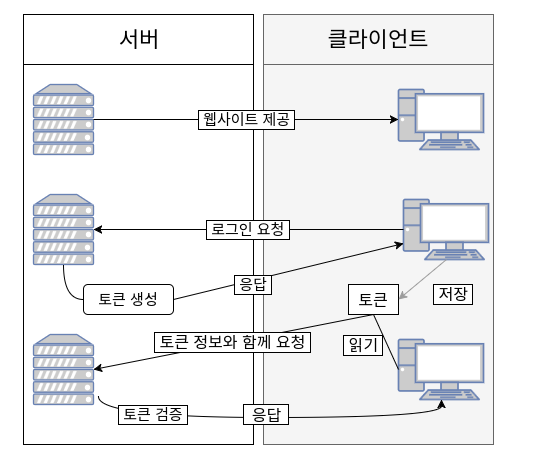

<br>

# 📝 서버 기반 인증 


- 세션을 통한 서버 기반 인증은 다음과 같은 문제가 있다.
  - 세션은 서버의 메모리 또는 DB에 저장되는데, 세션이 많아질 경우 부하 문제가 발생한다.
  - 세션을 사용하면 서버를 확장하는 것이 어려워진다. 각 서버의 세션 정보를 동기화 해줘야하기 때문이다.

<br>

# 📝 토큰 기반 인증 



- 토큰 기반 인증은 stateless한다. 즉, 서버 기반 인증처럼 세션을 서버측에 유지하지 않는다. 
- 서버가 클라이언트에게 토큰을 발급해주면, 클라이언트는 매 요청시 토큰을 서버에게 보내서 인증 받는 식이다. 
- 토큰에는 서버가 개인키로 만든 서명이 담겨 있으며, 서버는 토큰의 서명을 공개키로 검증할 수 있다.
- 즉, 토큰 자체로 인증이 가능하다.  
- 토큰 기반 인증은 다음과 같은 장점을 갖는다.
  - 서버 부하 문제가 해결된다.
  - 서버 확장시 문제가 되지 않는다. 
  - oauth 등으로 활용될 수 있다. 

<br>

# 📝 JWT(Json Web Token)

- JWT는 일반적으로 클라이언트-서버, 서비스-서비스간 통신시 권한 인가(Authorization)를 위해 사용하는 토큰이다. 
- 문자열로 구성되어 있기 때문에 URL, HTTP 헤더 등 어디든 위치할 수 있다. 

## JWT 구조

```
HEADER.PAYLOAD.SIGNATURE
```

- JWT는 헤더, 페이로드, 서명으로 이루어져있고 점(.)으로 구분된다.

### 1. 헤더(Header)

```json
{
    "alg": "ES256",
    "kid": "Key ID"
}
```

- 헤더는 JWT를 어떻게 검증하는지에 대한 내용을 담고 있다.
- alg는 서명 시 사용하는 알고리즘, kid는 서명시 사용하는 키(Public/Private Key)를 식별하는 값이다.
- 위와 같은 JSON 객체를 문자열로 만들고 UTF-8과 Base64 URL-Safe로 인코딩하면 아래와 같이 헤더를 생성할 수 있다.

```
Base64URLSafe(UTF-8('{"alg": "ES256","kid": "Key ID"}')) -> eyJhbGciOiJFUzI1NiIsImtpZCI6IktleSBJRCJ9
```

### 2. 페이로드(Payload)

```json
{
    "iss": "jinho.shin",
    "iat": "1586364327"
}
```

- 페이로드는 JWT의 내용이다. 페이로드에 있는 속성들을 클레임 셋(Claim Set)이라 부른다.
- 클레임 셋은 JWT에 대한 내용(클라이언트의 정보, 토큰 생성 일시)이나 클라이언트와 서버 간 주고 받기로 한 값들로 구성된다.
- 위와 같은 JSON 객체를 문자열로 만들고 인코딩하면 아래와 같이 페이로드를 생성할 수 있다.

```
Base64URLSafe('{"iss": "jinho.shin","iat": "1586364327"}') -> eyJpYXQiOjE1ODYzNjQzMjcsImlzcyI6ImppbmhvLnNoaW4ifQ
```

### 3. 서명(Signature)

- 점(.)을 구분자로 해서 헤더와 페이로드를 합친 문자열을 서명한 값이다.
- 서명은 헤더의 alg에 정의된 알고리즘과 비밀 키를 사용해 생성하고  인코딩한다.

```
Base64URLSafe(Sign('ES256', '${PRIVATE_KEY}',
'eyJhbGciOiJFUzI1NiIsImtpZCI6IktleSBJRCJ9.eyJpYXQiOjE1ODYzNjQzMjcsImlzcyI6ImppbmhvLnNoaW4ifQ'))) ->
MEQCIBSOVBBsCeZ_8vHulOvspJVFU3GADhyCHyzMiBFVyS3qAiB7Tm_MEXi2kLusOBpanIrcs2NVq24uuVDgH71M_fIQGg
```

## JWT 생성과 검증

- 서버는 사용자에 대해 인증(Authentication)을 수행한다.
- 인증이 되면, 비밀키와 공개키를 생성하고 헤더와 페이로드를 인코딩한다음 둘을 합친 물자열을 비밀키로 서명해서 JWT를 만들어 클라이언트에게 전달한다.
- 클라이언트는 다음 요청시 JWT를 서버에게 보낸다.
- 서버는 JWT의 서명을 공개키로 검증한다.

<br>


# 🐥 참고

* [JWT를 소개합니다.](https://meetup.toast.com/posts/239)

* [Session 기반 인증과 Token 기반 인증](https://jins-dev.tistory.com/entry/Session-기반-인증과-Token-기반-인증)

* [JWT 토큰(Token) 기반 인증에 대한 소개](https://velopert.com/2350)

  

  
