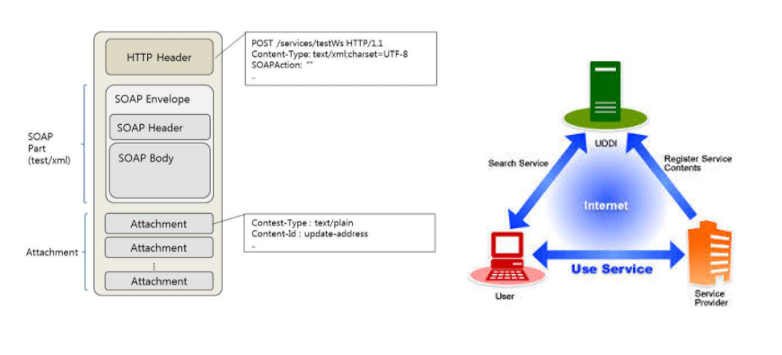
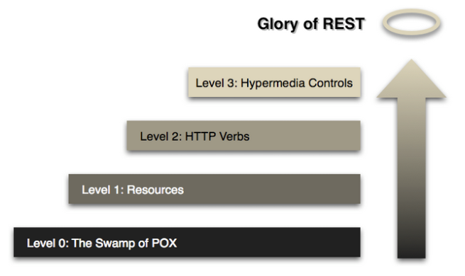
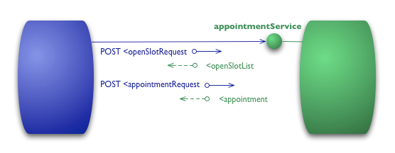
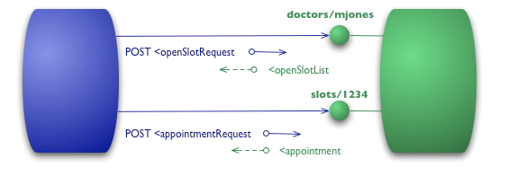
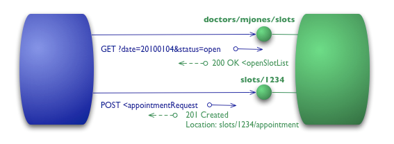
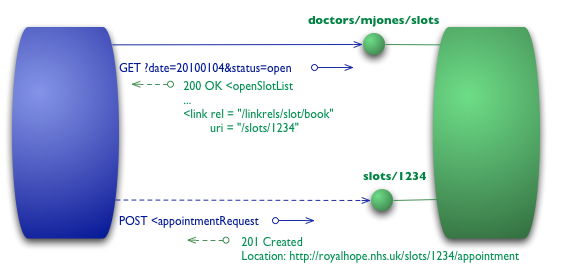

<br>

# 📝 SOA(Service Oriented Architecture)

- SOA는 서비스 지향 아키텍쳐를 뜻한다.
- 업무상의 일 처리에 해당하는 소프트웨어 기능을 서비스로 정의하고
- 서비스를 네트워크상에 연동하여 시스템 전체를 구축해 나가는 방법론이다. 

<br>

------


# 📝 SOAP(Simple Object Access Protocol)

​                                                                     

## 📌 설명

* SOAP은 HTTP, HTTPS, SMTP 등을 통해 XML 기반의 메세지를 컴퓨터 네트워크 상에서 교환하는 프로토콜이다.
* SOAP에서 모든 데이터는 XML로 표현되고 데이터와 데이터를 다루는 오퍼레이션이 WSDL로 정의되면
* UDDI라는 전역적인 서비스 저장소에 등록되고, 누구라도 서비스를 찾을 수 있다.
* 공개된 웹 서비스가 이용될 때 서비스 요청자과 서비스 제공자 간에 SOAP을 이용하여 서비스를 호출하고 결과를 받게한다.
* SOAP 메세지는 SOAP 봉투, SOAP 헤더, SOAP 바디로 구성된 하나의 XML 문서로 표현된다. 
* SOAP 메세지의 복잡한 구성 때문에 HTTP 상에서 전송되기 무겁고, 메시지 인코딩/디코딩 과정 또한 복잡하기 때문에 웹 서비스 개발의 난이도가 높아지고 개발 환경의 지원이 필요하다는 단점이 있다.
* SOAP은 REST보다 더 많은 표준들이 정해져 있기 때문에 오버헤드가 크다.
* 하지만 보안, 트랜잭션, ACID을 준수해야 하는 경우 적합하다.  (은행 관련 애플리케이션, 금융 정보 등 민감한 데이터를 주고 받을 때)
* SOAP은 SOA를 실현하기 위한 기술이다.

### **WSDL**(Web Services Description Language)

- 웹 서비스 기술언어 또는 기술된 정의 파일의 총칭으로 XML로 기술된다. 
- 웹 서비스의 구체적 내용이 기술되어 있어 서비스 제공 장소, 서비스 메시지 포맷, 프로토콜 등이 기술된다.

### **UDDI**(Universal Description, Discovery and Integration)

- 웹 서비스를 등록하고 검색하기 위한 저장소로 웹 서비스를 공개적으로 접근하고 검색이 가능하도록 공개된 레지스트리

<br>

------


# 📝 ROA(Simple Object Access Protocol)

- ROA는 자원 지향 아키텍쳐다. 
- 설계의 중심에 자원을 두고 메서드를 통해 자원을 처리하는 방법론을 말한다. 

<br>

------


# 📝 REST(Representational State Transfer)


<br>

## 📌 설명

* REST는 2000년도 Roy Fielding의 박사학위 논문에서 최초로 소개된 소프트웨어 아키텍쳐이다. 
* REST는 Representational State Transfer의 약자다. 
* 풀어말하면 **자원의 표현**을 가지고 **상태를 전달**한다는 뜻이다.
* **자원의 표현** : HTTP URI
* **상태** : HTTP Status Code
* **전달** : HTTP Method
* 정리 하자면 REST는 자원을 HTTP URI로 표현하고 HTTP Method를 통해 자원의 상태(HTTP Status Code)를 주고 받는 아키텍쳐라고 할 수 있다.
* RESTful : REST 아키텍쳐 스타일의 제약조건을 모두 만족하는 시스템을 뜻한다. 
* REST API : REST 스타일의 API를 뜻한다.

<br>

## 📌 REST 아키텍쳐에 적용되는 6가지 제약 조건

* REST는 아래 6가지 스타일을 반드시 지켜야 한다.
### 1. Cilent-Server (클라이언트-서버 구조)

- REST 서버는 API 제공, 클라이언트는 컨텍스트(세션, 로그인 정보)등을 직접 관리하는 구조로 되어있어 Server와 Client의 역할이 명확히 나뉘기 때문에 각 필드에서 개발해야할 점이 명확해지고 서로 간의 의존성이 줄어들게 된다.

### 2. Sateless (무상태)

- HTTP는 stateless 프로토콜이므로 REST 역시 stateless다. 즉, HttpSession과 같은 컨텍스트 저장소에 상태정보를 따로 저장하고 관리하지 않고, API 서버는 들어오는 요청만을 단순 처리하면 된다. 세션과 같은 컨텍스트 정보를 신경쓸 필요가 없어 구현이 단순해진다.

### 3. Caheable (캐시 처리 가능)

- REST는 웹 표준인 HTTP를 그대로 사용하기 때문에, 웹에서 사용하는 기존 인프라를 그대로 사용할 수 있다. 따라서 HTTP가 가진 캐싱 기능을 적용할 수 있다.

### 4. Layered System (계층화)

- REST 서버는 다중 계층으로 구성될 수 있으며, 보안, 로드 밸런싱, 암호화 계층 등을 추가해 구조상의 유연성을 둘 수 있고, PROXY, 게이트웨이와 같은 네트워크 기반의 중간매체를 사용할 수 있다.

### 5. Uniform Interface (인터페이스 일관성)

- resource는 URL로 식별된다.
- resource를 생성, 수정, 추가하고자 할 때 HTTP 메세지에 표현을 해야한다.
- 메세지는 스스로 설명할 수 있어야 한다. (Self-descriptive message)
- 애플리케이션의 상태는 Hyperlink를 이용해 전이되야한다. (HATEOAS)

### 6. Code on demand (Optional)

- 작성예정

<br>

## 📌 Richardson Maturity Model

- Richardson Maturity Model은 REST의 성숙도를 설명하는 모델이다. [Martin Fowler](https://martinfowler.com/) 사람이 만들었다.
- 단계별로 살펴보면 REST에 대한 이해를 높일 수 있다고 한다.

<br>

### Level 0 : The Swamp of POX


- 웹 매커니즘은 전혀 사용하지 않고 HTTP를 원격 통신을 위한 전송 시스템으로 사용하는 모델이다.
- POX(Plain Old XML)로 요청과 응답을 주고 받는 RPC(Remote Procedure Call) 스타일의 시스템이다.
- 원격 프로시저 호출(Remote Procedure Invocatioin)에 기반한 원격 통신 매커즘을 위한 터널링 매커니즘으로 HTTP를 사용한다. 
- HTTP Method는 POST만을 사용한다. POST만 사용하기에 자원에 대한 End-Point는 단 하나다. 
- 이제부터 병원 예약하기 시스템을 예제로 들어 설명할 것이다. 
- 예제에서는 XML을 사용하지만 JSON, YAML 등 어떤 키-값 쌍 형식이던 가능하다.

<br>

#### Level 0 예제 : 진료 가능한 시간대 알아내기 

- 주치의와 진료를 예약하는 경우에 먼저 주치의가 진료 가능한 시간대를 알아내야 한다.
- 예약 프로그램(클라이언트)는 아래와 같이 HTTP 요청을 보낸다.

```http
POST /appointmentService HTTP/1.1
[various other headers]

<openSlotRequest date = "2021-09-04" doctor = "mjones"/>
```

- 2021년 09월 04일 어느 타임에 mjones 의사가 예약 가능한지 알아내기 위해 위와 같은 HTTP 요청을 보냈다.

```http
HTTP/1.1 200 OK
[various headers]

<openSlotList>
  <slot start = "1400" end = "1450">
    <doctor id = "mjones"/>
  </slot>
  <slot start = "1600" end = "1650">
    <doctor id = "mjones"/>
  </slot>
</openSlotList>
```

- 서버는 위와 같은 HTTP 응답을 반환한다.  
- 2021년 09월 04일 14:00 ~ 14:50, 16:00 ~ 16:50에 예약이 가능함을 알 수 있다.

<br>

#### Level 0 예제 : 진료 예약하기 

- 예약 가능한 시간대를 알아냈으니 아래와 같은 HTTP 요청을 보낸다.

```http
POST /appointmentService HTTP/1.1
[various other headers]

<appointmentRequest>
  <slot doctor = "mjones" start = "1400" end = "1450"/>
  <patient id = "jsmith"/>
</appointmentRequest>
```

- mjones 의사에게14:00~14:50 타임에 진료를 받겠다는 예약 요청이다.
- 환자 id도 있음을 알 수 있다.
- HTTP 요청을 보면 진료 가능한 시간대를 알아낼 때 사용한 엔드 포인트와 동일하다.

```http
HTTP/1.1 200 OK
[various headers]

<appointment>
  <slot doctor = "mjones" start = "1400" end = "1450"/>
  <patient id = "jsmith"/>
</appointment>
```

- 예약이 가능하다면 예약이 진행되고 위와 같이 예약 되었다는 응답을 받는다.

```http
HTTP/1.1 200 OK
[various headers]

<appointmentRequestFailure>
  <slot doctor = "mjones" start = "1400" end = "1450"/>
  <patient id = "jsmith"/>
  <reason>Slot not available</reason>
</appointmentRequestFailure>
```

- 만약 해당 시간대에 예약이 이미 있으면 위와 같은 응답을 받는다.

<br>

### Level 1 : Resources



<br>

#### Level 1 예제 : 진료 가능한 시간대 알아내기 

```http
POST /doctors/mjones HTTP/1.1
[various other headers]

<openSlotRequest date = "2021-09-04"/>
```

- 위와 같은 HTTP 요청을 보냈다.
- URI를 보면 이제 의사별로 요청을 보낼 수 있다. 여전히 POST만 사용하지만 리소스가 여러 End Point를 갖는다.

```http
HTTP/1.1 200 OK
[various headers]

<openSlotList>
  <slot id = "1234" doctor = "mjones" start = "1400" end = "1450"/>
  <slot id = "5678" doctor = "mjones" start = "1600" end = "1650"/>
</openSlotList>
```

- 요청에 대해 위와 같은 HTTP 응답이 왔다.

<br>

#### Level 1 예제 : 진료 예약하기 

```http
POST /slots/1234 HTTP/1.1
[various other headers]

<appointmentRequest>
  <patient id = "jsmith"/>
</appointmentRequest>
```

- 14:00~14:50 시간대를 예약하고 싶다면 위와 같이 예약 id 1234를 보낸다.

```http
HTTP/1.1 200 OK
[various headers]

<appointment>
  <slot id = "1234" doctor = "mjones" start = "1400" end = "1450"/>
  <patient id = "jsmith"/>
</appointment>
```

- 예약이 가능하다면 위와 같은 응답을 받는다.

<br>

### Level 2 : Resources

- 레벨 0과 1에서 HTTP POST 메서드만 사용했다.
- 하지만 레벨 2부터는 아니다. 레벨 2는 HTTP 메소드와 HTTP 응답코드를 사용한다.
- 하지만 여전히 HTTP를 터널링 매커니즘으로 사용한다.

<br>

#### Level 2 예제 : 진료 가능한 시간대 알아내기 

```http
GET /doctors/mjones/slots?date=20210904&status=open HTTP/1.1
Host: royalhope.nhs.uk
```

- 2021년 09년 04일에 mjones 의사가 진료가 가능한 시간대를 알아내기 위해 GET 메서드를 사용해서 HTTP 요청을 보낸다.

```http
HTTP/1.1 200 OK
[various headers]

<openSlotList>
  <slot id = "1234" doctor = "mjones" start = "1400" end = "1450"/>
  <slot id = "5678" doctor = "mjones" start = "1600" end = "1650"/>
</openSlotList>
```

- GET 요청에 대해 위와 같은 결과를 받는다.
- GET은 리소스를 변경하지 않는 안전한 메서드다. 
- 따라서 캐싱을 적용할 수 있다. HTTP는 기본적으로 캐싱을 지원한다. 

<br>

#### Level 2 예제 : 진료 예약하기 

```http
POST /slots/1234 HTTP/1.1
[various other headers]

<appointmentRequest>
  <patient id = "jsmith"/>
</appointmentRequest>
```

- 1234번에 대해 예약하기 위해 POST로 요청을 한다. 

```http
HTTP/1.1 201 Created
Location: slots/1234/appointment
[various headers]

<appointment>
  <slot id = "1234" doctor = "mjones" start = "1400" end = "1450"/>
  <patient id = "jsmith"/>
</appointment>
```

- 요청에 대해 위와 같은 응답이 왔다. 예약이 정상적으로 되었음을 알 수 있다.
- 주목해야할 것은 HTTP 응답이다. 즉 HTTP 상태코드는 201이다. 
- 201은 새 리소스가 생겼음을 뜻한다.

```http
HTTP/1.1 409 Conflict
[various headers]

<openSlotList>
  <slot id = "5678" doctor = "mjones" start = "1600" end = "1650"/>
</openSlotList>
```

- 위와 같이 예약이 되지 않은 경우 응답을 살펴보자.
-  응답으로 온 HTTP 상태코드를 보면 409다.
- 409는 이미 리소스가 만들어졌음을 뜻한다.
- 레벨 2에서는 이와 같이 명시적인 응답을 사용한다. 어떤 응답 코드를 사용할지는 설계자에게 달려있다.

<br>

### Level 3 : Hypermedia Controls


- 레벨 3에서는 HATEOAS(Hypertext As The Engine Of Application State)를 도입한다.

<br>

#### Level 3 예제 : 진료 가능한 시간대 알아내기 

```http
GET /doctors/mjones/slots?date=20100104&status=open HTTP/1.1
Host: royalhope.nhs.uk
```

- 레벨 2에서 보냈던 방식과 동일한 GET 요청이다.

```http
HTTP/1.1 200 OK
[various headers]

<openSlotList>
  <slot id = "1234" doctor = "mjones" start = "1400" end = "1450">
     <link rel = "/linkrels/slot/book" 
           uri = "/slots/1234"/>
  </slot>
  <slot id = "5678" doctor = "mjones" start = "1600" end = "1650">
     <link rel = "/linkrels/slot/book" 
           uri = "/slots/5678"/>
  </slot>
</openSlotList>
```

- 하지만 응답은 다르다. 예약이 가능한 각 시간대는 link를 요소를 포함하고 있다.
- 하이퍼미디어 컨트롤의 요점은 응답의 다음으로 무엇을 할 수 있는지와 그것을 하기 위해 다루어야할 리소스의 URI를 알려준다는 것이다. 
- 우리가 예약 요청을 어디로 보낼지 알아야 하는 것이 아니라 응답에 포함된 하이퍼미디어 컨트롤이 알려준다.

<br>

#### Level 3 예제 : 진료 예약하기 

```http
POST /slots/1234 HTTP/1.1
[various other headers]

<appointmentRequest>
  <patient id = "jsmith"/>
</appointmentRequest>
```

- 진료 예약도 레벨 2와 동일하다.

```http
HTTP/1.1 201 Created
Location: http://royalhope.nhs.uk/slots/1234/appointment
[various headers]

<appointment>
  <slot id = "1234" doctor = "mjones" start = "1400" end = "1450"/>
  <patient id = "jsmith"/>
  <link rel = "/linkrels/appointment/cancel"
        uri = "/slots/1234/appointment"/>
  <link rel = "/linkrels/appointment/addTest"
        uri = "/slots/1234/appointment/tests"/>
  <link rel = "self"
        uri = "/slots/1234/appointment"/>
  <link rel = "/linkrels/appointment/changeTime"
        uri = "/doctors/mjones/slots?date=20100104&status=open"/>
  <link rel = "/linkrels/appointment/updateContactInfo"
        uri = "/patients/jsmith/contactInfo"/>  
  <link rel = "/linkrels/help"
        uri = "/help/appointment"/>
</appointment>
```

- 예약이 올바르게 되었다는 응답이다.
- 그리고 그 다음으로 할 수 있는 다양한 것들에 대한 하이퍼미디어 컨트롤을 포함한다. 
- 예약을 취소할 수 있고, 검진을 추가할 수 있고, 시간을 변경할 수 있고, 예약 정보를 바꿀 수 있고, 예약 도움을 받을 수 있는 링크를 제공해주는 것을 볼 수 있다.
- 하이퍼 미디어 컨트롤의 장점은 서버가 클라이언트를 신경쓰지 않고 URI scheme를 변경할 수 있다는 것이다.
- 서버가 매번 응답에 다른 기능에 대한 URI을 제공하기 때문이다.   


### 레벨들의 의미 

- 레벨 1 : 큰 서비스에 대한 엔드 포인트를 복수개의 리소스로 나누는 분할&정복(divide and conquer)을 사용해서 복잡성을 다루는 문제를 처리한다.
- 레벨 2 : 불필요한 다양성을 제거하고, 동일한 방식으로 유사한 환경을 처리할 수 있도록 메소드의 표준 집합을 도입한다.
- 레벨 3 : 프로토콜이 스스로 문서화할 수 있는 방법을 제공함으로써 발견가능성(discoverability)를 도입한다. 

<br>

## 📌 Web API

* REST의 정확한 정의대로 REST API를 만드는 것은 쉽지 않다. 그래서 보통 Web API를 사용한다.
* REST의 uniform interface를 지원하는 것은 쉽지 않기 때문에(Self-descriptive message, HATEOAS 적용이 어려움) 많은 서비스가 REST에서 바라는 것을 모두 지원하지 않고 API를 만든다.
* REST의 모든 것을 제공하지 않고 REST API라고 부르는 경우도 있다.
* REST의 모든 것을 제공하지 않고 Web API 혹은 HTTP API라고 부르는 경우도 있다.
* 또한 RESTful API를 구현하는 근본적 목적은 일관적인 컨벤션을 통한 API 이해도 및 호환성을 높이는 것이다. 따라서 퍼포먼스가 중요한 상황에서는 굳이 RESTful API를 구현하지 않아도 된다. 

<br>

------


# **🔎** 참고 및 출처

* [RESTful API란 ?](https://brainbackdoor.tistory.com/53)

* [REST 서버, REST API란?](https://velog.io/@kjh107704/REST-서버-REST-API란)

* [[REST] REST란 무엇인가? REST맛보기](https://gangnam-americano.tistory.com/39)

* [REST란? REST 개념 파헤치기](https://mkil.tistory.com/353)

* [REST란? REST API란? RESTful이란?](https://gmlwjd9405.github.io/2018/09/21/rest-and-restful.html)

* [HATEOAS](https://sabarada.tistory.com/31)

* [SOAP API VS. REST API, 두 방식의 가장 큰 차이점은?](http://blog.wishket.com/soap-api-vs-rest-api-두-방식의-가장-큰-차이점은/)

* [Richardson Maturity Model](https://martinfowler.com/articles/richardsonMaturityModel.html)  

* [Richardson 성숙도 모델](https://brunch.co.kr/@pubjinson/12)

* [SOAP? REST? REST API? 무엇인가?](https://mygumi.tistory.com/55#:~:text=SOAP(Simple%20Object%20Access%20Protocol,%EC%83%81%EC%97%90%EC%84%9C%20%EA%B5%90%ED%99%98%ED%95%98%EB%8A%94%20%ED%94%84%EB%A1%9C%ED%86%A0%EC%BD%9C%EC%9D%B4%EB%8B%A4))

  

