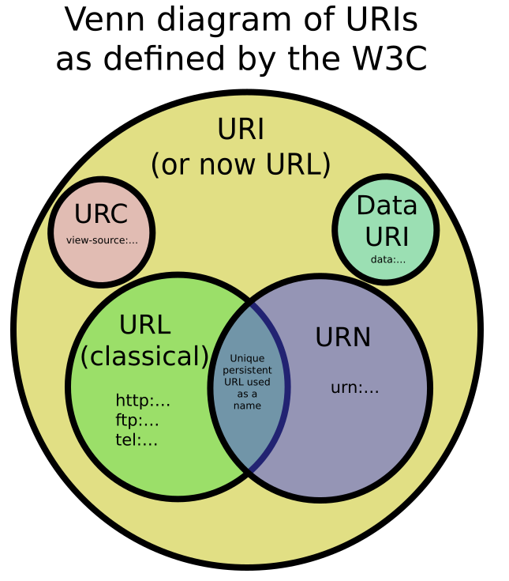

 

# 📝 URI, URL, URN 

- **URI(Uniform Resource Identifier)는 인터넷 상에서 특정 자원을 가리키는 식별자다.**
- URI는 URL(Uniform Resource Locator)과 URN(Uniform Resource Names)을 포함하는 개념이다. 
- 다시 말해 URI의 두 가지 형태로 URL과 URN이 있다. 
- **URL은 인터넷 상에서 특정 시점에서의 자원의 구체적인 위치다.**
- **URN은 인터넷 상에서 자원을 가리키는 영속적이고 고유한 식별자다.**

 

##  📌 URL과 URN

- URL은 특정 시점에서 자원의 위치를 나타낸다고 했다.
- 만약 나중에 자원의 위치가 바뀌면 어떻게 될까?
- 그렇게 되면 기존의 URL로는 자원을 식별할 수 없게 된다. 이는 URL의 단점이라고 할 수 있다.
- 이러한 배경에서 새로나온 표준이 URN이다. 
- URN은 자원에 대해 영속적이고 고유한 이름을 부여한다.
- 자원의 위치가 바뀌더라도 자원을 가리키는 고유 식별자인 URN만 알고 있으면 언제든 자원에 접근할 수 있다.
- URN은 다음과 같은 구조를 가진다. (익숙하지 않다.)
  - `urn:isbn:9788982814471`
  - URN은 urn으로 시작하고 콜론으로 구분되어 표현된다.
  - 위 URN에서 "isbn"이란  ISBN(International Standard Book Numbers)을 뜻한다.
  - ISBN은 국제 표준 도서번호를 뜻한다.
  - 뒤이어 콜론뒤에 나오는 "9780141036144`"은 1984(저자:조지 오웰)라는 도서의 ISBN이다.
  - 즉, 위 URN은 1984라는 제목의 책이란 자원을 고유하게 식별한다. 

 

------

# 🔎 출처 & 더 알아보기

* [URI와 URL의 차이](https://lambdaexp.tistory.com/39#:~:text=URI는 인터넷 상의 자원,으로 해석 될 수 있겠다.&text=URI의 한 형태인,을 포함 하는 개념이다.&text=인터넷 상의 자원의 위치와 식별자.)

* [HTTP 완벽 가이드](https://book.naver.com/bookdb/book_detail.nhn?bid=8509980)

* [URI vs URL vs URN](https://mygumi.tistory.com/139)

* [URI, URL 및 URN의 차이점은 무엇입니까?](https://c10106.tistory.com/1452)

* [URL과 리소스](https://feel5ny.github.io/2019/08/09/HTTP_002/)

  