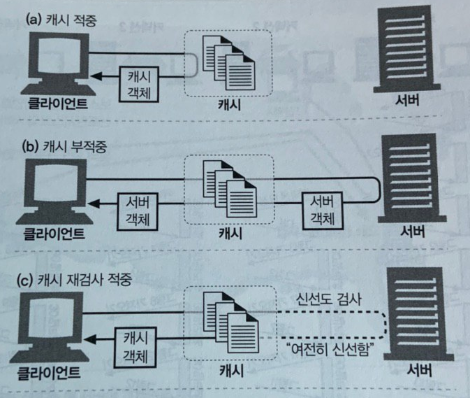

 

# 📝 Web Cache

 

## 📌 설명

- 웹 캐시는 자주 쓰이는 자원의 사본을 자동으로 보관하는 장치다.

- 웹 요청이 캐시에 도착했을 때 캐시된 사본이 존재한다면

- 해당자원은 origin 서버가 아니라 캐시로부터 제공된다.

 

## 📌 웹 캐시의 장점

- **불필요한 데이터 전송을 줄여준다.**
  - 여러 클라이언트의 동일한 요청을 캐시가 처리하면 origin 서버의 부하를 줄여준다.
- **네트워크 병목을 줄여준다.**
  - 보통 로컬 네트워크는 클라이언트에게 더 넓은 대역폭을 제공한다.
  - 만약 클라이언트가 빠른 LAN에 있는 캐시로부터 사본을 가져온다면, origin 서버까지의 병목을 줄이고 성능을 대폭 개선할 수 있다.
- **갑작스러운 트래픽에 대처할 수 있다.**
  - 많은 사람이 거의 동시에 웹 문서에 접근할 때 불필요한 트래픽 급증은 네트워크와 웹 서버에 심각한 장애를 발생시킨다.
  - 캐싱을 통해서 이러한 갑작스러운 요청에 대처할 수 있다.
- **거리로 인한 지연을 줄일 수 있다.**
  - 모든 네트워크 라우터는 트래픽을 지연시킨다.
  - 그리고 클라이언트와 서버의 거리가 멀수록 지연이 커진다. (빛의 속도는 300,000km/s 이다.)
  - 가까운 캐시 서버에서 자원을 받을 수 있다면, 거리에 따른 지연을 줄일 수 있다.

 

## 📌 캐시 적중과 부적중

- 캐시에 요청이 도착했을 때, 요청에 대응하는 사본이 존재한다면, 해당 요청을 처리할 수 있다. 이를 **캐시 적중(cache hit)**이라고 한다.
- 만약 대응하는 사본이 없다면 origin 서버로 요청이 전달된다. 이를 **캐쉬 부적중(cache miss)**이라고 부른다.
- 만약 대응하는 사본이 존재하는데, 유효기간이 만료돼서 재검사를 했을 때, 해당 사본이 최신인 경우를 **캐시 재검사 적중**이라고 한다.

### ✅ 재검사

- origin 서버 콘텐츠는 변경될 수 있기 때문에 캐시는 갖고 있는 사본이 최신인지 서버를 통해 점검해야 한다.
- 서버에 보내는 GET 요청에 If-Modified-Since 헤더를 추가하면 캐싱된 시간 이후에 사본이 변경되었을 경우에만 사본을 보내달라는 의미다.
  - 만약 서버 자원이 변경되지 않았다면, 서버는 `HTTP 304 Not Modified` 응답을 보낸다.
  - 만약 서버 자원이 캐시된 사본과 다르다면, 서버는 자원과 함께 `HTTP 200 OK` 응답을 보낸다.
  - 만약 서버 객체가 삭제되었다면, 서버는 `404 NOT Found` 응답을 보낸다.
- 재검사를 보내는 기준
  - HTTP는 Cache-Control과 Expire라는 특별한 헤더들을 이용해서 origin  서버가 각 자원에 유효기간을 붙일 수 있게 한다. 
  - 이 유효기간이 만료되면, 캐시는 반드시 서버와 문서에 변경된 것이 있는지 검사해보고, 최신의 사본이 있다면 얻어와야한다.(새로운 유효기간과 함께)
  - Cache-Control : max-age
    - max-age 는 자원의 최대 나이다. 초단위 시간값이다.
    - ex) Cache-Control : max-age=484200
  - Expires
    - 유효기간을 날짜로 명시한다.
    - ex) Expires : Fri, 05 Jul 2002, 05:00:00 GMT 

 

## 📌 캐시 종류

### ✅ 개인 전용 캐시(private cache)

- 한 명의 사용자에게만 할당된 캐시다. 
- 웹 브라우저는 개인 전용 캐시를 내장하고 있다.
- 대부분의 브라우저는 자주 쓰이는 자원을 개인용 컴퓨터의 디스크와 메모리에 캐싱해 놓는다.

### ✅ 공용 프락시 캐시(public cache)

- 프락시 캐시는 로컬 캐시에서 자원을 제공한다.
- 사용자의 입장에서 서버에 접근하기도 한다.
- 공용 캐시는 여러 사용자가 접근하기 때문에 불필요한 트래픽을 더 많이 줄일 수 있다.

 

------

# 🔎 출처 & 더 알아보기

* [HTTP 완벽 가이드](https://book.naver.com/bookdb/book_detail.nhn?bid=8509980)

