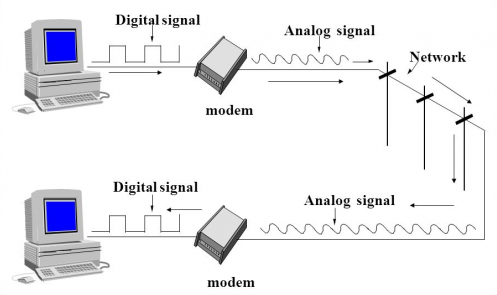

 

# 📝 Protocol Layer

- 크고 복잡한 네트워크 시스템을 여러 개의 계층(Layer)으로 나누면 이해하기 쉽고, 통신의 흐름을 단계적으로 파악할 수 있다.
- 여러 개의 레이어로 나눈 네트워크 시스템은 레이어드 아키텍쳐를 적용한 하나의 소프트웨어라고 할 수 있다.
- 각 계층은 서로 독립적이어서 모듈화의 장점을 갖는다. 즉, 유지보수와 업데이트가 용이하다. 
  
  
  - 예를들어 규모가 큰 프로그램을 여러개의 함수로 나누어 구현하면, 함수 단위로 유지보수와 업데이트를 진행할 수 있다는 장점이 있다. 이와 같은 맥락이다. 
  - 유지보수의 장점 : 다른 계층과 상관없이 어떤 계층에 문제가 생기면 해당 계층만 수정하면 된다.
  - 업데이트의 장점  : 다른 계층과 상관없이 어떤 계층의 기술적 요소를 바꾸고 싶으면 해당 계층만 수정하면 된다. 
- 각 계층은 상위 계층에 서비스를 제공하고 하위 계층으로부터 서비스를 제공 받는다는 특징이 있다.
- 계층화는 다음과 같은 단점을 갖는다.
  - 계층간 기능이 중복될 수 있다.
  - 계층간 많은 상호작용이 요구되기 때문에 오버헤드가 발생한다. 
- 다양한 계층의 프로토콜을 모두 합하여 **프로토콜 스택(Protocol Stack)**이라고 부른다.

 

------

# 📝 OSI 7 Layer Model

 

* 국제표준기구(ISO)에서 1984년에 발표한 네트워크 구조 모델이다.
* 네트워크를 7가지 계층으로 구분했다.

 

## **1계층 Physical Layer**

* 컴퓨터는 1과 0으로 통신한다.
* 1과 0으로 표현되는 데이터를 물리적 매체를 통해 아날로그 신호로 바꿔서 전송한다.
* 0과 1으로 표현되는 데이터를 아날로그 신호로 바꿔서 물리적 매체(전선)으로 흘려보내고,
* 아날로그 신호가 들어오면 0과 1으로 데이터를 표현해서 물리적으로 연결된 두 대의 컴퓨터가 0과 1의 나열을 주고 받게 한다.
* 정리해서, Physical Layer는 네트워크 통신을 위한 물리적인 표준을 정의하는 계층이다.
* 두 호스트간의 전기적, 기계적, 절자적인 연결을 정의한다. (케이블 종류, 데이터 송수신 속도, 신호의 전기 전압 등 )

 

## **2계층 Data Link Layer (전송 단위 : Frame, 주소 단위 : MAC)**

* 데이터 링크 계층은 같은 네트워크에 있는 여러 대의 컴퓨터들이 데이터를 주고받게 해준다.
* 즉, 패킷 스위치를 통해 데이터 전송을 라우터간 데이터 전송 기능을 제공한다. 
* 스위치로 들어오는 각각의 데이터들에 대해 heaer와 tailer 비트를 넣어줘서 데이터간 구분이 가능하도록 작업해주는데, 이를 프레이밍이라고 한다.
* 물리적 계층을 통한 데이터 전송에 신뢰성을 제공한다.
* 물리적 주소(MAC) 지정, 네트워크 토플로지, 오류통지, 프레임의 순차적 전송 흐름제어 등의 기능을 가진다.

 

## **3계층 Network Layer (전송 단위 : Packet, 주소 단위 : IP)**

* **라우팅을 통해 패킷의 최적 이동경로를 결정하고 포워딩으로 패킷을 다음 라우터에 전송한다.** 
* 호스트간 데이터 전송을 한다. 

 

## **4계층 Transport Layer (전송 단위 : Segment, 주소 단위 : Port)**

* **데이터를 분할하여 전송하고, 수신할 때 다시 합치는 과정을 담당**한다.
* 대표적인 프로토콜 : TCP, UDP

 

## **5계층 Session Layer (전송 단위 : Massage)**

* 통신을 하는 두 host간 최초 연결을 수행하고 연결 유지를 한다.
* 통신을 하는 두 hsost 사이의 세션을 열고, 닫고, 관리하는 기능을 담당한다. 동기화 기능과 대화 기능이 있다.
* 동기화 기능
  * 동기란 통신 양단에서 서로 동의하는 논리적인 공통처리 지점으로써, 동기점을 설정하기위해 사용된다.
  * 동기점이 설정된다는 의미는 그 이전까지의 통신은 서로 완벽히 처리했다는 것을 뜻한다.
  * 동기점은 오류 복구에 사용된다. 동기점 이전 과정은 복구가 필요 없고, 동기점 이후 처리 과정에 대한 복구 절차가 진행된다.
* 대화 기능
  * 대화 기능은 데이터 전송 과정을 의미한다.
  * 시간 경과에 따라 순차적으로 동기점을 부여하여 신뢰성 보장 기능을 단계적으로 구현할 수 있게 된다.
  * 의도적으로 일시 정지하여 나중에 이어서 작업하는 것이 가능하다.
* 데이터 송수신 방식(Duplex), 반 이중 방식(Half Duplex), 전 이중 방식(Full Duplex)의 통신과 함께, 체크 포인팅과 유휴, 종료, 다시 시작 과정을 수행한다.
* 대표적인 프로토콜 : SSL(TLS)

 

## **6계층 Presentation Layer (전송 단위 : Massage)**

* **데이터의 Format을 결정**하는 계층이다. 
  * EX) ASCII, EBCDIC, CIF, JPEG, AVI, MPEG 등
* 송신자와 수신자간에 데이터표현이 일관 되도록 변환, 압축, 암호화 기능을 제공한다.

 

## **7 계층 Application Layer (전송 단위 : Massage)**

* 사용자(사람 또는 소프트웨어)가 네트워크에 접근할 수 있도록 **User Interface**를 제공한다.
* 대표적인 프로토콜 : HTTP(80), FTP(20,21), Telnet(23), SMTP(25), DNS(53), TFTP(69) 

 

------

# 📝 TCP/IP 4 Layer

 

* 현대의 인터넷은 OSI 7모델이 아니라 TCP/IP 모델을 따르고 있다.
* TCP/IP는 인터넷 표준 프로토콜 스택이다. 
* 현재는 TCP/IP 오리지날보다 TCP/IP Updated가 더 많이 사용된다.
* 상위 계층인 TCP는 데이터를 패킷으로 나누어 순서대로 전송하는 것을 보장하고 수신된 패킷들을 원본 데이터로 재조립하는 일을 담당한다. 
* 하위 계층인 IP는 각 패킷의 IP 주소를 통해 패킷들이 목적지에 정확하게 도달할 수 있게한다. 

 

------

# 🔎 출처 & 더 알아보기

* [컴퓨터 네트워킹 하향식 접근](https://book.naver.com/bookdb/book_detail.nhn?bid=12500834)
* http://pigbrain.github.io/network/2017/03/08/OSI7_on_Network
* https://goitgo.tistory.com/25
* https://goodgid.github.io/OSI-7-Layer/
* https://www.youtube.com/watch?v=NOFWq2mWeGA

 