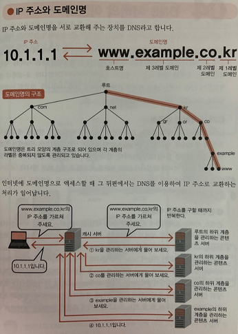

 

# 📝 Domain Name

* Domain Name이란 네트워크 상에서 컴퓨터를 식별하는 이름이다. 
* Domain Name은 IP 주소에 대응된다. 숫자로된 IP 주소 대신 Domain Name을 사용하면 사람이 외우기 쉽다는 장점이 있다. 
* 어떤 Domain Name을 통해 웹 사이트에 접속하려면, DNS로부터 해당 Domain Name에 대한 IP 주소를 알아 내야한다. 

 

------

# 📝 DNS(Domain Name System)

* DNS는 호스트의 Domain Name을 IP 주소로 바꿔주는 애플리케이션 계층 프로토콜이다.
* DNS는 DNS 서버들이 계층구조로 구현된 분산 데이터베이스이다. DNS 전세계적으로 수많은 호스트에 의해 사용되므로 여러 개의 서로 나누어서 구현하는 것이 효율적이고 확장성을 높여준다. 
* DNS는 UDP위에서 동작한하고 포트번호는 53이다.
* DNS는 하나의 도메인 네임에 여러 개의 IP주소를 대응할 수 있다. 이렇게 함으로써 부하를 분산하는 효과를 줄 수 있다.

 

## DNS 동작 과정

1. 브라우저에 URI www.somewebsite.com/index.html을 입력하고 엔터를 쳤다.

2. 브라우저는 URI로부터 호스트 네임 www.somewebsite.com를 추출하고 DNS 클라이언트로 넘긴다.
3. DNS 클라이언트는 DNS 서버로 호스트 네임을 전달한다.
4. DNS 서버는 호스트 네임에 대한 IP주소를 DNS 클라이언트에게 응답한다.
5. 브라우저가 DNS로부터 IP 주소를 받으면, 브라우저는 그 IP 주소와 그 주소의 80번 포트에 위치하는 HTTP  서버 프로세스로 TCP 연결을 초기화 한다. 

 

## 계층 구조

### Root-Level Domain(루트 DNS 서버)

- 인터넷에는 400개 이상의 루트 DNS 서버가 존재한다.
- 이들은 A부터 M까지 분류된다. 
- https://root-servers.org/에 가면 전 세계에 있는 DNS 서버의 위치를 볼 수 있다.

### Top-Level Domain(TLD, 최상위 DNS 서버)

- com, org, net, edu와 같은 상위 레벨 도메인과 kr, uk, fr, ca, jp 같은 국가 도메인을 포함한다.

### Second-Level Domain(Authoritative DNS 서버)

- 기관, 기업 단위 도메인을 관리한다.

### Local DNS 서버

- 로컬 DNS 서버는 DNS 계층 구조에 엄격하게 속하지는 않지만 DNS 구조의 중심에 있다.
- ISP들은 로컬 DNS 서버를 갖는다. 
- ISP는 로컬 DNS 서버로부터 IP 주소를 호스트에게 제공한다. (일반적으로 DHCP 프로토콜을 통해)
- 호스트가 DNS 질의를 보내면, 먼저 프록시로 동작하는 DNS 서버에게 전달된다. 

 

## DNS 질의 동작 과정 그림으로 보기

- 그림을 보면 재귀적 질의와 반복적 질의를 하는 것을 볼 수 있다.
- Recursive Resolver는 로컬 DNS 서버다. 
- 로컬 DNS 서버 까지의 질의는 재귀적이고, 나머지 질의는 반복적이다. 

 

## DNS 캐싱 

- DNS는 지연 성능 향상과 네트워크의 DNS 메세지 수를 줄이기 위해 캐싱을 사용한다.
- 질의 사슬에서 DNS 서버가 DNS 요청을 받았을 때, 해당 요청 정보를 캐슁해둘 수 있다. 

 

------

# 🔎 출처 & 더 알아보기

- [DNS-위키백과](https://ko.wikipedia.org/wiki/DNS)

