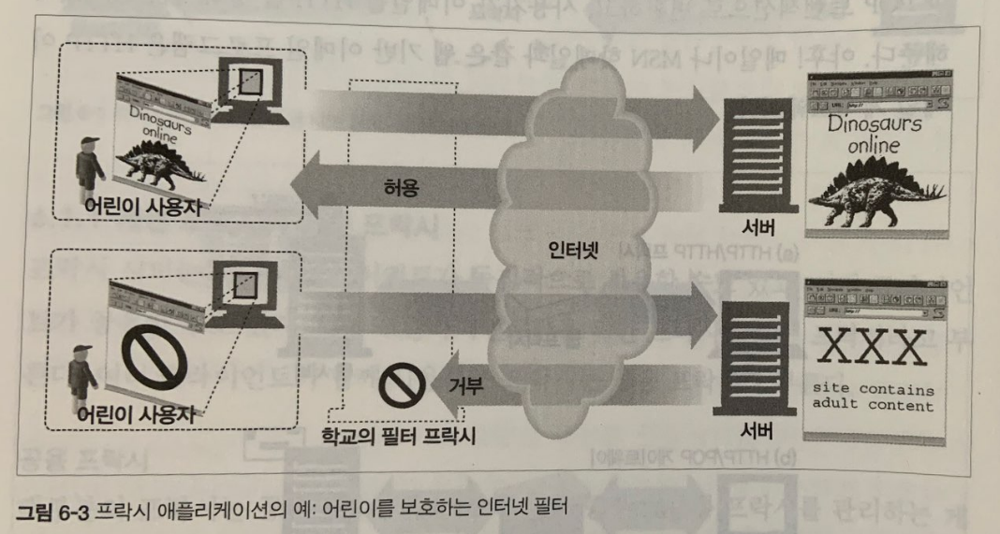

 

# 📝**Proxy (Hypertext Transfer Protocol)**   

 

## 📌 웹 중개자

* 웹 프락시 서버는 클라이언트의 입장에서 트랜잭션을 대신 수행해준다.
* HTTP 프락시 서버는 웹 서버이기도 하고 웹 클라이언트이기도 하다. 
* 프락시는 HTTP 클라이언트의 요청을 받게 되므로, 반드시 웹 서버처럼 요청과 커넥션을 적절히 다루고 응답을 돌려줘야한다. 
* 동시에 프락시는 요청을 서버로 보내기도 하므로, 요청을 보내고 응답을 받는 HTTP 클라이언트처럼 동작해야한다. 

### ✅ 개인 프락시와 공유 프락시

- 하나의 클라이언트만을 위한 프락시를 개인 프락시하고 부른다.
- 여러 클라이언트가 함께 사용하는 프락시는 공용 프락시라고 부른다. 

#### 공용 프락시

- 대부분의 프락시는 공용 프락시다. 중앙 집중형 프락시를 관리하는게 더 비용효율이 높고 쉽다.
- 캐시 프락시 서버와 같은 프락시는 사용자가 많을 수록 유리하다. (여러 사용자들의 공통된 요청에서 이득을 취할 수 있기 때문)

#### 개인 프락시

- 개인 전용 프락시는 그다지 흔하지는 않지만 꾸준히 사용되고 있다. (클라이언트 컴퓨터에서 직접 실행되는 형태로)
- 어떤 브라우저 보조 제품들은 몇몇 ISP 서비스와 마찬가지로 브라우저의 기능을 확장하거나 성능을 개선하거나 무료 ISP 서비스를 위한 광고를 운형하기 위해 작은 프락시를 사용자의 컴퓨터에서 직접 실행한다.

 

## 📌 프락시와 게이트웨이

- 프락시는 같은 프로토콜을 사용하는 둘 이상의 애플리케이션을 연결하고, 게이트웨이는 서로 다른 프로토콜을 사용하는 둘 이상을 연결한다.
- 게이트웨이는 클라이너트와 서버가 서로 다른 프로토콜로 말하더라도 서로 간의 트랜잭션을 완료할 수 있도록 해주는 프로토콜 변환기처럼 동작한다. 
- 실질적으로 프락시와 게이트웨이의 차이점은 모호하다. 브라우저와  서버의 HTTP 버전이 다를 경우 프락시는 약간의 프로토콜 변환을 하기도 하고 상용 프락시 서버는 게이트웨이 기능을 구현하기도 한다.

 

## 📌 왜 프락시를 사용하는가?

- 프락시 서버는 보안, 성능, 비용 측면에서 유용함을 준다. 예시를 통해 살펴보자.

### ✅ 어린이 성인 사이트 필터

- 초등학교는 어린이들에게 교육 사이트를 제공하면서 동시에 성인 콘텐츠를 차단하려고 필터링 프락시를 사용할 수 있다.
- 위 그림처럼 프락시는 교육 콘텐츠에는 제한 없는 접근을 허용하고, 성인 사이트의 접근은 강제로 거부한다.

### ✅ 문서 접근 제어자

- 프락시 서버는 많은 웹 서버들과 웹 리소스에 대한 접근을 제어할 수 있다.
- 위 그림과 같이 접근 제한을 할 수 있다.
  - 클라이언트 1 : 제약 없이 서버의 뉴스 페이지에 접근할 수 있도록 허가한다.
  - 클라이언트 2 : 제약 없이 인터넷 콘텐츠에 접근할 수 있는 권한을 준다.
  - 클라이언트 3 : 서버 B에 접근하기 전에 먼저 비밀 번호를 요구한다. 

### ✅ 보안 방화벽

- 네트워크 보안 엔지니어는 보안을 강화하기 위해 프락시 서버를 사용한다.

- 프락시 서버는 조직 안에 들어오거나 나가는 응용 레벨 프로토콜의 흐름을 네트워크의 한 지점에서 통제한다.

### ✅ 웹 캐시 

- 프락시 캐시는 자주 사용되는 자원의 사본을 관리하고 해당 자원에 대한 요청이 오면 빠르게 제공한다.
- 위 그림에서 클라이언트 3과 4는 원래 서버에 접근하지만, 클라이언트 1과 2는 근처 웹 캐시 프락시에서 자원을 제공받는다. 

### ✅ 대리 프락시(Surrogate)

- 어떤 프락시는 웹 서버인 것 처럼 위장한다. 그렇기 때문에 대리 혹은 리버스 프락시로 불리는 이들은 진짜 웹 서버 요청을 받지만 웹 서버와는 달리 요청 받은 콘텐츠의 위치를 찾아내기 위해 다른 서버와 커뮤니케이션을 시작한다.
- 대리 프락시는 공용 컨텐츠에 대한 느린 웹 서버의 성능을 개선하기 위해 사용될 수 있다.
- 이런 식으로 사용하는 대리 프락시를 흔히 서버 가속기라고 부른다.
- 대리 프락시는 또한 콘텐츠 라우팅 기능과 결합되어 주문형 복제 콘텐츠의 분산 네트워크를 만들기 위해 사용될 수 있다.

### ✅ 콘텐츠 라우터

- 프락시 서버는 요청을 특정 웹 서버로 유도하는 콘텐츠 라우터로 동작할 수 있다.
- 콘텐츠 라우터는 또한 사용자들에게 제공할 여러 서비스를 구현하는데 사용할 수 있다.
- 예를들어 사용자나 콘텐츠 제공자가 더 높은 성능을 위해 돈을 지불했다면 콘텐츠 라우터는 요청을 가까운 복제 캐시로 전달한다.
- 예를들어 사용자가 필터링 서비스에 가입했다면 HTTP 요청이 플터링 프락시를 통과하도록 할 수 있을 것이다. 

### ✅ 트랜스 코더

- 프락시 서버는 콘텐츠를 클라이언트에게 전달하기 전에 본문 포맷을 수정할 수 있다.
- 이와 같이 데이터의 표현 방식을 자연스럽게 변환하는 것을 트랜스 코딩이라고 부른다.
- 트랜스코딩 프락시는 GIF 이미지를 JPG 이미지로 변환하거나, 이미지의 크기를 줄이거나, 이미지를 텔레비전에서 볼 수 있도록 색 강도를 조절할 수 있다.
- 마찬가지로 텍스트 파일은 압출될 수 있고 스마트폰을 위해 작은 텍스트로 줄인 웹 페이지를 생성할 수 있다.
- 문서를 외국어로 바꾸는 것 또한 가능하다.

### ✅ 익명화 프락시(Anoymizer)

- 익명화 프락시는 HTTP 메세지에서 신원을 식별할 수 있는 특성들을 적극적으로 제거함으로써 개인 정보 보호와 익명성 보장을 제공한다.
- 위 그림에서 익명화 프락시는 개인 정보 보호를 위해 사용자의 메세지를 다음과 같이 변경한다.
  - User-Agent 헤더에서 사용자의 컴퓨터와 OS의 종류를 제거한다.
  - 사용자의 이메일 주소를 보호하기 위해 From 헤더는 제거한다.
  - 어떤 사이트를 거쳐서 방문했는지 알기 어렵게 하기 위해 Referer 헤더는 제거한다.
  - 프로필 신원 정보를 없애기 위해 Cookie 헤더를 제거한다.
  

 

## 📌 Foward Proxy

- Foward Proxy는 클라이언트의 요청을 대신 서버에게 보내준다.
- Foward Proxy에 클라이언트의 요청한 내용을 캐싱할 수 있다.
- Foward Proxy는 클라이언트가 보낸 요청을 익명으로 서버에게 전달할 수 있다. (서버는 요청으로 들어온 클라이언트의 IP 주소를 알아내지 못하고, Proxy 서버의 IP주소를 알 수 있을 뿐이다.)

 

## 📌 Reverse Proxy

- Reverse Proxy는 서버의 응답을 대신 클라이언트에게 전달한다. 
- Reverse Proxy는 클라이언트의 요청을 캐싱할 수 있다.
- Reverse Proxy는 실제 서버를 노출하지 않게 해준다. 클라이언트는 Reverse Proxy를 실제 서버라고 생각하고 Reverse Proxy에 요청을 보낸다. 
- Reverse Proxy를 활용하여 로드 밸런싱을 할 수 있다.
- 로드밸런싱이란 부하를 분산 시키는 것을 뜻한다. 
- Reverse Proxy 한 대를 두고 뒤에 여러 개의 WAS를 두는 구조에서 Reverse Proxy는 들어오는 요청의 부하를 여러 WAS로 분산 시켜줄 수 있다.

 

------

# 🔎 출처 & 더 알아보기

* [HTTP 완벽 가이드](https://book.naver.com/bookdb/book_detail.nhn?bid=8509980)
* [포워드 프록시와 리버스 프록시의 차이점](http://blog.naver.com/PostView.nhn?blogId=alice_k106&logNo=221190043948&redirect=Dlog&widgetTypeCall=true&directAccess=false)
* [Reverse Proxy, Forward Proxy (프록시란?)](https://cornswrold.tistory.com/404)
* [Forward Proxy(포워드 프록시) 와 Reverse Proxy(리버스 프록시)](https://m.blog.naver.com/PostView.nhn?blogId=yhsterran&logNo=220372259447&proxyReferer=https:%2F%2Fwww.google.com%2F)

 

