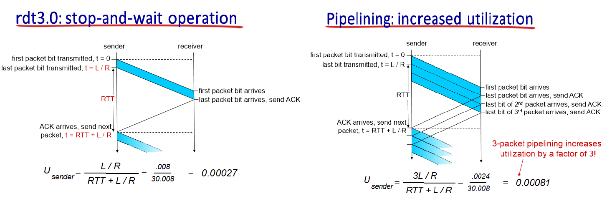
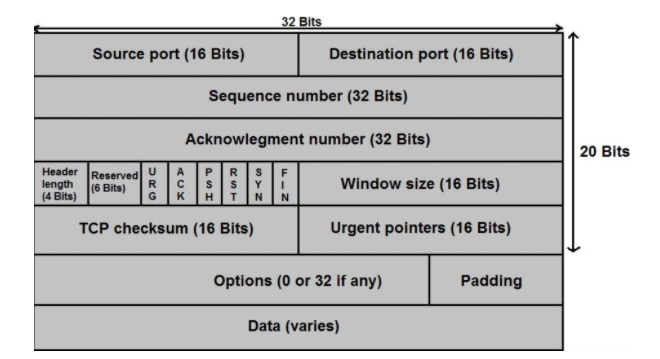

 

# 📝서론

- UDP와 TCP는 트랜스포트 계층 프로토콜이며  프로세스간 데이터 전송을 지원한다.
- UDP와 TCP에 대해 각각 알아보자.
- 트랜스포트 계층에서 전송되는 데이터의 단위는 '세그먼트'라고 불린다.

 

------

# 📝UDP (User Datagram Protocol)

## 📌 UDP의 특징

### 1️⃣ UDP는 신뢰적 데이터 전송을 보장하지 않는다. 

* UDP를 사용해서 송신한 세그먼트들은 중간에 손상 되거나 아예 손실 되거나 수신자에게 도착하는 순서가 달라질 수 있다.
* 하지만 UDP는 이와같은 데이터 전송 오류를 신경 쓰지 않는다. 
* 단지 UDP는 checksum 헤더를 통해 수신된 데이터에 변조되지 않았는지 여부만 판단할 수 있다. (네트워크로 송신된 데이터는 네트워크의 물리적 구성요소에 의해 비트 오류가 발생할 수 있음)
  * **UDP checksum 상세설명**
    * UDP 세그먼트를 word(16비트)단위로 나눈다.
    * 나누어진 각 word를 모두 더한 다음 1의 보수 연산을 수행하여 checksum을 만든다.
    * UDP 세그먼트 헤더의 checksum에 만든 checksum을 넣고 세그먼트를 송신한다. 
    * 수신측에서 세그먼트를 수신하면 그 세그먼트에 대해 checksum을 다시 만든 다음
    * 수신된 checksum과 비교하면 오류 여부를 판단할 수 있다.
* 신뢰적 전송이 매우 중요할 때 오히려 UDP를 사용 사용하는 경우도 있다.
* 이 경우 애플리케이션 레벨에서 신뢰성 보장을 직접 구현한다.

### 2️⃣ UDP는 사전 연결 설정을 하지 않는다. (Connectionless)

- TCP는 연결 시작 전에 3-way-handshake라는 사전 연결 설정을 한다.
- 하지만 UDP는 사전 연결 설정을 하지 않는다. 
- 사전 연결 설정이 없기 때문에 TCP에 비해서 빠르다.  

### 3️⃣ UDP는 별 기능이 없다. 그래서 빠르다.

- UDP는 신뢰적 데이터 전송을 보장하지 않고 사전 연결을 설정하고 유지하지 않는다. 
- UDP는 다중화, 역다중화, 간단한 오류 검사 기능만을 제공할 뿐이다.
- 따라서 UDP는 오버헤드가 적고 빠르다. (TCP 세그먼트가 20Byte의 헤더 오버헤드를 갖는 반면, UDP는 8Byte의 오버헤드를 갖는다.)

* UDP는 빠르기 때문에 DNS와 SNMP등의 프로토콜에서 활용된다.
  * DNS의 목적은 단지 도메인 네임에 대한 IP주소를 얻는 것이다. 따라서 오버헤드가 적고 빠른 UDP 위에서 동작하는 것이 적합하다.
  * SNMP는 주기적으로 네트워크 장비에 대한 정보를 수집하고 관리하는 프로토콜이다. 네트워크 장비는 수백대 수천대가 될 수 있다. 따라서 오버헤드가 적고 빠른 UDP가 적합하다.
* UDP는 인터넷 전화 또는 스트리밍 서비스에 적합하다.
  * 인터넷 전화 또는 스트리밍 서비스는 최소한의 전송률이 보장되면서 약간의 데이터 손실을 허용한다.
  * 따라서 속도가 빠르지만 신뢰적인 데이터 전송을 보장하지는 못하는 UDP가 적합하다.

 

------

# 📝신뢰적인 데이터 전송의 원리

- TCP를 알아보기 위해 신뢰적인 데이터 전송에 대한 원리를 알아보자.
- **패킷 손상이 발생하는 네트워크**와 **패킷 손실이 발생하는 네트워크**를 가정하고 
- 각 경우에서 어떻게 하면 신뢰적인 데이터 전송을 할 수 있을지 알아보자.

## ⚔️ 패킷 손상이 발생하는 채널에서의 신뢰적인 데이터 전송

* 송신한 패킷 내부 비트들이 하위 계층에서 손상되는 경우다.
* 비트 오류는 네트워크의 물리적 구성 요소에서 일반적으로 발생한다.

## 🛡️ 패킷 손상에 대한 대응책

* 송신한 패킷이 손상되었을 경우 패킷을 재전송하는 방법을 사용한다.
* 이와 같은 방법을 취하는 프로토콜을 **자동 재전송 요구(Automatic Repaet reQuest, ARQ) 또는 Stop-and-wait프로토콜**이라고 한다.
* **ARQ의 3가지 특징**
  * **오류검출** 
    * **체크섬(checksum)**을 사용해 패킷의 비트 오류를 발견한다.
  * **수신자 피드백** 
    * 수신자가 패킷을 올바르게 수신하면 **긍정확인 응답(ACK)**를 송신자에게 보낸다.
    * 패킷을 올바르게 수신하지 못했다면 **부정확인 응답(NAK)**를 송신자에게 보낸다.
    * 순서가 바뀐 패킷을 수신하면 가장 최근에 정확하게 수신된 패킷에 대한 ACK를 송신측에 보낸다. 
    * 이는 ACK한 패킷 다음 패킷을 수신하지 못했음을 뜻한다.
    * 순서가 바뀐 패킷이란 것은 어떻게 알아차릴까? 순서번호를 사용하면 된다. 
  * **송신자의 재전송** 
    * 비트 오류가 있는 패킷을 수신하면 NAK를 송신자에게 보내고, 송신자는 이를 보고 해당 패킷을 재전송한다.
    * 송신자는 수신자가 패킷을 정확하게 수신했다는 것을 확인받기 전까지 새로운 데이터를 전송하지 않는다. 
* 수신자가 보낸 ACK 또는 NAK 패킷 또한 손상될 수 있다. 이 경우 송신자는 단순히 패킷을 재전송한다. (이 경우 패킷이 중복으로 전송될 수 있다.)
* ARQ에서 송신자는 어떤 패킷을 송신 하는지 알아야 하고, 수신자는 어떤 패킷을 수신 했는지 알아야 한다.
* 따라서 송신자와 수신자는 패킷을 구별하기 위해 패킷에 **순서번호(squence number)**를 매기는 방법을 사용한다.

 

## ⚔️ 패킷 손실이 발생하는 채널에서의 신뢰적 데이터 전송

* 송신한 패킷 내부 비트들이 하위 계층에서 손실되는 경우다.
* 전송한 패킷이 손실되는 경우와 전송한 패킷에 대한 확인 응답(ACK, NAK) 패킷이 손실되는 경우가 있다.
* 이러한 네트워크에서는 패킷 손실 여부를 검출하고 패킷이 손실 되었다면 대응 해야한다.

## 🛡️ 패킷 손실에 대한 대응책

* 송신자는 패킷을 전송한후 일정 시간이 지나면, 패킷이 손실되었다고 가정하고 패킷을 재전송한다.
* 패킷이 손실되거나 ACK가 손실되거나 전송 지연이 지나치게 클 경우에도 모두 재전송한다.
* 송신자는 패킷 전송후 얼마나 기다려야할까? 적어도 `송신자-수신자 사이의 왕복 시간 지연` + `수신측에서 패킷을 처리하는 시간` 만큼 기다려야 한다.
* 전송된 패킷 또는 ACK의 전송 지연이 매우 클경우, 손실되지 않은 패킷에 대해서 재전송이 발생한다. 이 경우 중복 패킷 수신이 발생할 수 있다.
* 송신자는 패킷을 전송할 때마다**카운트 다운 타이머(countdown timer)**를 작동 시키고 일정 시간이 지나서 타이머 인터럽트가 발생하면 재전송을 한다. 

 

## 📌파이프라인 프로토콜(Pipelined Protocol)

* 앞서 알아봤듯이 신뢰적인 데이터 전송은 **Stop-and-wait 프로토콜**을 통해 이루어진다. 
* 즉, 데이터를 전송한뒤 수신자로부터 데이터 전송에 대한 결과를 피드백 받은 후 다음 데이터를 전송하는 방식이다.
* 하지만 이러한 **Stop-and-wait** 방식은 송신자가 패킷을 전송하는데 오랜 시간이 걸린다. 
* 송신자는 패킷이 올바르게 전송되었다는 수신자의 피드백(ACK)를 받고나서 다음 패킷을 전송하기 때문이다.
* 이러한 성능 이슈를 **파이프라이닝(pipelining)**을 통해 해결할 수 있다.
* 파이프라이닝(pipelining)은 전송된 패킷에 대해 피드백을 받지 않고도 다음 패킷들을 전송하도록 허용하여 링크 이용률을 높이는 기술이다.
* 파이프라이닝에서도 패킷 손상과 손실, 순서가 맞지 않는 전송이 발생하는데, 이러한 오류에 대해 두 가지 기본적인 접근 방법이 있다.
*  바로 **Go-Back-N(GBN)** 과 **Selective Repeat(SR)**이다.

 

### 1️⃣ Go-back-N(GBN)

* GBN에서 송신자는 송신한 패킷에 대한 확인 응답 없이, 최대 N개의 패킷을 전송할 수 있다.
* 이를 크기가 N인 윈도우로 표현한다. (N은 흐름제어와 혼잡제어에 의해 조정된다.)
* 송신한 패킷이 올바르게 수신측에 도착하여 확인 응답을 받으면, 윈도우는 앞으로 이동하고 다음 패킷을 전송한다.
* 이를 슬라이딩 윈도우 프로토콜(sliding-window protocol)이라고 부른다.
* 왼쪽 위 그림을 살펴보자
  * 초록색 : 전송이 성공적으로 완료되어 ACK 받은 패킷들
  * 노란색 : 전송 후 ACK를 못 받은 패킷들
  * 파란색 : 전송 가능한 패킷들
  * 흰색 : 아직 전송 불가능한 패킷들 

 

### **👉🏼 GBN 송신자의 행동**

#### **1. 패킷 송신하기**

* 상위 계층에서 데이터를 받으면, 먼저 윈도우가 가득 찼는지 확인한다.
* 윈도우가 가득 차지 않았다면, 다음 순서 번호에 해당하는 패킷이 생성되고 전송된다. 
* 윈도우가 가득 차 있다면, 상위 계층으로부터 받은 데이터를 반환하며 윈도우가 가득차서 전송을 할 수 없음을 나타낸다. (송신자는 나중에 다시 데이터를 보내서 전송을 시도한다.)

#### **2. ACK 수신하기**

* GBN 프로토콜에서 순서번호 n을 가진 패킷에 대한 확인 응답은 
* n까지의 순서번호를 가진 모든 패킷들에 대한 확인 응답이다. 
* 이를 **누적 확인 응답(cumulative acknowledgement)**이라고 한다. 
* 예를들어 송신자가 수신자로부터 ACK 7을 받았다면, 7번 패킷까지 올바르게 전송 되었음을 뜻한다.
* 윈도우를 앞으로 이동시키고, 다음 패킷을 전송한다.

#### **3. 타이머 작동시키기**

* 패킷이 손실 되거나 매우 긴 전송 지연으로 인해 확인 응답이 늦어져서, 타임 아웃이 발생한다면
* 해당 패킷부터 윈도우 크기 N개 만큼의 패킷을 재전송한다. 그래서 `Go back N`이다.
* 송신자는 전송 되었지만 아직 확인 응답을 받지 못한 패킷중 가장 오래된 것에 대한 단일 타이머를 사용한다.

 

### **👋🏼 GBN 수신자의 행동**

#### 1. 수신된 패킷의 순서가 올바른 경우

- 직전에 수신했던 패킷의 번호가 n - 1이고
- 이번에 수신한 패킷의 번호가 n 이라면(순서가 올바른 번호)
- 수신자는 n번 패킷에 대한 ACK를 송신자에게 전송하고
- 상위 계층에 n번 패킷의 데이터를 전달한다. 

#### 2. 수신된 패킷의 순서가 올바르지 않은 경우

- 수신자는 순서가 잘못된 패킷들을 버린다. 
- 그리고 가장 최근에 올바르게 수신된 패킷에 대한 ACK를 보낸다. 
- 수신한 패킷을 버리는 것이 낭비인 것 같지만,
- GBN 송신자는 손실된 패킷부터 N개까지 만큼 재전송을 하기 때문에
- 재전송에 의해 버린 패킷을 어차피 다시 수신한다.
- 이러한 방식의 이점은 수신측 버퍼링이 간단 하다는 것이다.
- 즉, 수신자는 순서가 잘못된 패킷에 대해 버퍼링을 할 필요가 없다. 
- 반면, 송신자는 윈도우 하위, 상위 경계와 nextseqnum 등의 위치를 유지  해야한다. 

 

###  🕵🏻‍♂️ GBN 동작 예제

- 위 그림은 윈도우 크기가 4인 경우에 대한 GBN 프로토콜의 동작 과정을 보여준다.
- 윈도우 크기가 4이기 때문에 송신자는 0, 1, 2, 3번 패킷을 확인 응답 받지 않고 연속적으로 송신한다.
- 전송한 각 패킷에 대한 ACK을 받으면, 윈도우는 앞으로 이동하고 송신자는 다음 순서 번호를 갖는 패킷을 송신한다.
  - 위 그림에서 수신자가 0번 패킷을 올바르게 수신하여 ACK 피드백을 송신자가 받으면, 윈도우가 앞으로 한 칸 이동하여 4번 패킷이 송신되는 것을 볼 수 있다.
  - 위 그림에서 수신자가 1번 패킷을 올바르게 수신하여 ACK 피드백을 송신자가 받으면, 윈도우가 또 다시 앞으로 한칸 이동하여 5번 패킷이 송신되는 것을 볼 수 있다.
- 위 그림에서 2번 패킷은 손실되었다. 수신자는 2번 패킷을 못받은 채로 3, 4, 5번 패킷을 수신한다.
- 하지만 수신자는 2번 패킷을 못받은 상태이므로 올바르게 수신한 3, 4, 5번 패킷을 버리고 ACK1을 송신자에게 보내는 것을 볼 수 있다. 
- 즉, 2번 패킷을 받기 위해 "저는 1번패킷까지 올바르게 수신했으니 그 다음 패킷인 2번 패킷을 보내주세요"라는 의미로 ACK1이란 피드백을 송신자에게 보내는 것이다.
- 위 예제에서 송신측을 보면 타이머가 time out 되는 것을 볼 수 있다. GBN에서 time out이 되면, 수신확인이 되지 못한 가장 오래전에 전송한 패킷부터 N만큼 재전송한다고 했다. 2번 패킷부터 5번패킷까지 윈도우 크기 4만큼의 패킷을 재전송하는 것을 볼 수 있다.

 

### 💥 GBN의 장단점

- GBN은 파이프 라이닝을 가능하게 하여, 링크 이용률을 높여준다는 장점이 있다.
- 하지만, GBN에서 패킷이 손실되면 N개 만큼의 패킷을 불필요하게 재전송 하는 단점이 있다.
- 네트워크에 손실이 많이 발생할수록 네트워크 파이프 라인(링크)는 불필요한 재전송 패킷으로 채워진다는 단점이 있다.

 

### 2️⃣ Selective Repeat(SR) : 선택적 반복

* Selective Repeat 프로토콜은 손실 되거나 손상된 패킷에 대해서만 재전송 한다.
* GBN처럼 윈도우 크기만큼 패킷들을 전송하지 않는다. 즉, 불필요한 재전송을 하지 않는다. 
* GBN 수신자는 누적확인 응답을 하지 않는다. 순서번호가 앞서는 패킷이 도착하면 그대로 수신한다. 

 

### **👉🏼 송신자의 행동**

#### **1. 패킷 송신하기**

* 상위 계층에서 데이터를 받으면, 먼저 윈도우가 가득 찼는지 확인한다.
* 윈도우가 가득 차지 않았다면, 다음 순서 번호에 해당하는 패킷이 생성되고 전송된다. 
* 윈도우가 가득 차 있다면, 상위 계층으로부터 받은 데이터를 반환하며 윈도우가 가득차서 전송을 할 수 없음을 나타낸다. (송신자는 나중에 다시 데이터를 보내서 전송을 시도할 것 이다.)

#### **2. ACK 수신하기**

- ACK가 수신되었을 때, SR 송신자는 그 ACK가 윈도우에 있다면, 그 패킷을 수신된 것(초록색)으로 표기한다.
- 수신된 패킷의 순서번호가 윈도우의 send_base와 같다면
- 윈도우는 가장 작은 순서번호를 가지면서, 아직 확인응답이 되지 않은 패킷(윈도우에서 가장 앞에 있는 노란색)의 순서번호로 이동한다. 
- 윈도우가 이동한후 윈도우 내에 아직 전송되지 않은 패킷(파란색)이 있다면, 전송한다.

#### **3. 타이머 작동시키기**

- 각 패킷마다 논리 타이머가 존재한다. (하나의 하드웨어 타이머는 여러 개의 논리 타이머를 구현한다.)
- 특정 패킷의 타이머가 타임아웃 되면 해당 패킷은 개별적으로, 선택적으로 재전송 된다. 

 

### **👋🏼수신자의 행동**

#### 1. `rcv_base ~ rcv_base + N - 1` 범위(수신 윈도우 범위)의 순서번호를 가지는 패킷이 수신되는 경우 

- 처음 수신한 패킷이라면 수신 퍼버에 저장되고, ACK를 보낸다.
- 만약 수신한 패킷의 순서번호가 rcv_base라면, 이 패킷부터 연속된 패킷들을 상위 계층에 보낸다. (이전에 수신된 패킷들이 버퍼에 저장되어 연속되는 rcb_base부터 연속되는 패킷이 있을 수 있다.)
- 윈도우는 앞으로 이동한다. 

#### 2. `rcv_base-N ~ rcv_base - 1` 범위(수신 윈도우 이전 범위)의 순서번호를 가지는 패킷이 수신되는 경우 

- 이전에 확인 응답한 것이라도 ACK를 보낸다. (송신측 윈도우의 이동을 위해서.)

#### 3. 이외의 경우(수신 윈도우 이후 범위)

- 수신된 패킷을 무시한다.

 

### 🕵🏻‍♂️ SR 동작 예시

- 송신, 수신 윈도우 크기가 4인 SR 프로토콜의 동작 예시다.
- 위 그림에서 수신자는 0, 1번 패킷을 수신했고, 2번 패킷을 수신하지 못했고, 3, 4, 5번 패킷을 수신했다.
- 2번 패킷에 대한 타임아웃이 발생하고 2번패킷만 재전송된다. 
- 수신자는 재전송된 2번 패킷을 수신하고 ACK2을 송신자에게 보낸다. 이때 2번 패킷은 수신 윈도우의 rcv_base와 일치하고 
- 2번 패킷부터 연달아 수신이 된 패킷들을 상위 계층에 전송하고, 수신측 윈도우를 슬라이딩한다.
- 이제 수신 윈도우는 6, 7, 8, 9번의 범위를 갖게된다. (수신자의 행동 1번 참고)
- 수신자는  send_base 에 해당하는 2번 패킷이 올바르게 수신했음을 ACK2로부터 알아내고, 송신 윈도우를 슬라이딩한다. 

- 위 그림을 보면 송신자의 윈도우와 수신자의 윈도우가 항상 같지 않음을 볼 수 있다. 

 

## 📌 신뢰적 데이터 전송 원리 요약

| 매커니즘(원리)                                               | 설명                                                         |
| :----------------------------------------------------------- | ------------------------------------------------------------ |
| **체크섬(checksum)**          | 전송된 패킷 안의 비트 오류를 발견하는데 사용된다.            |
| **긍정확인 응답(ACK)**        | 패킷이 정확하게 수신되었음을 수신측에서 송신측으로 알릴때 사용된다. 보통 ACK로 패킷의 순서번호 또는 패킷을 송신측에 전송한다. ACK5는 "5번 패킷까지 올바르게 전송받았음"을 뜻한다. |
| **부정확인 응답(NAK)**        | 패킷이 정확히 수신되지 않았음을 수신측에서 송신측으로 알릴때 사용된다. NAK로 보통 패킷의 순서 번호를 송신측에 전송한다. |
| **순서번호(squence number)**  | 전송되는 패킷에 순서번호를 붙이는 것이다. 순서번호를 통해 손실된 패킷을 검사하거나 중복 수신된 패킷을 판별할 수 있다. |
| **카운트 다운 타이머(countdown timer)** | 타이머를 통해서 패킷이 손실되었음을 유추한다. 타임아웃이 되면, 패킷을 재전송한다. 패킷이 손실되지 않은 경우에도 타임아웃이 가능하다. (전송 지연, ACK 손실) 이 경우 중복 패킷 전송이 발생할 수 있다. |
| **파이프라이닝(pipelining), 윈도우(window)** | 송신자는 일정 범위(윈도우 크기)에 있는 순서번호를 가진 패킷을 ACK 없이 전송할 수 있다. 따라서 송신자의 링크 이용률은 단순 stop-and-wait 방식보다 증가한다. 윈도우 크기는 수신자가 패킷을 수신하고 버퍼링하는 능력, 네트워크의 혼잡 정도에 근거하여 달라진다. |

 

------

# 📝TCP (Transmission Control Protocol) 

## 📌 TCP의 특징

### 1️⃣ TCP는 신뢰적인 데이터 전송을 보장한다.

* TCP는 체크섬, 재전송, 누적확인 응답, 타이머, 순서번호 등을 통해 신뢰적인 데이터 전송을 제공한다.

### 2️⃣ TCP는 연결지향형이다. (Connection-oriented)

- TCP는 데이터를 전송하기 전에 송신자와 수신자간 데이터 전송을 보장하는 파라미터들을 설정한다.
- 다시 말하자면, 통신을 하기 전에 사전 연결 설정을 진행한다.
- 이 과정은 3개의 특별한 패킷을 주고 받으며 진행되는데, 이를 **3-way-handshake**라고 한다.

* TCP는 종단 시스템에서만 동작하고 중간의 네트워크 요소에서는 동작하지 않는다. 따라서 종단 사이의 라우터들은 TCP 연결을 감지하지 못한다.
* TCP 연결은 전이중(full-deplex) 서비스를 제공한다. 
* TCP 연결은 항상 단일 송신자와 단일 수신자 사이의 점대점(point-to-point) 연결이다. 멀티케스팅이 불가하다.
* 통신이 끝난후 TCP는 연결을 종료한다. 이 연결 종료 과정을 **4-way-handshake**라고 한다.

 

## 📌 TCP의 신뢰적인 데이터 전송

* TCP는 IP의 비신뢰적인 "최선형(best-effort)" 서비스에서 신뢰적인 데이터 전송 서비스를 제공한다. 
* 신뢰적인 데이터 전송이란 전송한 패킷된 손상되지 않고, 순서가 올바른 것을 의미한다.
* TCP는 단일 타이머를 사용한다. (세그먼트당 타이머를 사용하면 오버헤드가 크다.)

 

### **👉🏼 TCP 송신자의 행동**

#### 애플리케이션으로부터 데이터 수신해서 전송하기

* TCP는 애플리케이션으로부터 데이터를 받고, 세그먼트로 데이터를 캡슐화하고, IP에게 세그먼트를 넘긴다.
* 타이머가 작동중이 아니면 IP에 세그먼트를 넘길 때 타이머를 시작한다.

#### 타이머 작동시키기

* 타임아웃 이벤트에 대해 타임아웃을 일으킨 세그먼트를 재전송한다. 그리고 타이머를 다시 시작한다.

#### 수신자로부터 ACK 수신하기

* 수신 확인 응답이 확인되지 않은 가장 오래된 바이트의 순서번호(SendBase) 와 ACK 값 y를 비교한다.
* TCP는 누적 확인 응답을 사용한다. y는 y바이트 이전의 모든 바이트들의 수신을 확인한다.
* 만약 y > SendBase라면 이전에 SendBase부터 y - 1까지 ACK 받지 않은 모든 바이트들의 수신이 확인된다. 
* 따라서 이 경우 송신자는 자신의 SendBase 변수를 y + 1로 갱신한다. (윈도우 이동)
* 아직 확인 응답 안 된 세그먼트가 존재하면 타이머를 다시 시작한다. 

 

###  📜 3가지 재전송 시나리오

- 3가지 시나리오를 통해 TCP의 신뢰적 전송 메커니즘을 살펴보자.

#### ✅ lost ACK scenario

* 순서번호 92 세그먼트는 수신측에 올바르게 도착했지만,  ACK가 손실된 경우다.
*  이 경우 timeout 이 발생하여 92번 세그먼트가 재전송된다.
*  호스트 B는 재전송된 92번 세그먼트를 수신할 경우 이미 수신했으므로 그냥 버린다.

#### ✅ premature timeout

* 호스트 A는 B에게 연속으로 두 세그먼트를 전송한다.
* 두 세그먼트 모두 호스트 B에 올바르게 수신되었고, B는 각 세그먼트에 대해 2개의 ACK를 전송한다.
* 순서번호 92번 세그먼트에 대한 ACK 100 이 첫 번째 타임아웃 이후에 호스트 A에 전송된 것을 볼 수 있다.
* 이 경우 타임아웃 시점에서 92번 세그먼트를 재전송한다.
* 두 번째 타임아웃 이전에 호스트 A는 100번 세그먼트에 대한 긍정 확인 응답 ACK 120을 받았다.
* 따라서 100번 세그먼트는 재전송 되지 않는다.

#### ✅ cumulative ACK

* 호스트 A는 B에게 연속으로 두 세그먼트를 전송한다.
* 첫 번째 세그먼트에 대한 ACK는 손실되었다.
* 하지만 두번째 세그먼트에 대한 ACK는 올바르게 수신되었으므로 송신자는 100번 세그먼트까지 전송이 올바르게 되었음을 알 수 있다. 
* 따라서 92번 세그먼트에 대한 재전송이 일어나지 않는다.

 

### ⏳ TCP는 타임아웃시 타임아웃 주기를 두 배로 설정한다.

- TCP는 타임아웃이 발생하면, 아직 확인응답이 안 된 가장 작은 순서번호를 가진 세그먼트를 재전송한다.
- TCP는 이러한 재전송마다 타임아웃 주기를 이전 값의 두 배로 설정한다. 
- 이는 지속적인 재전송으로 인한 네트워크 혼잡을 줄이기 위함이다. 이를 혼잡제어라고 한다. 

 

### 🚀 TCP 빠른 재전송

* 타임아웃에 의한 재전송의 문제점은 타임아웃의 주기가 때때로 길다는 점이다.
* 다행히도 송신자는 중복 ACK 수신을 통해 타임아웃이 일어나기 전에 송신된 패킷이 손실되었음을 인지할 수 있다.
* 수신자는 순서가 올바르지 않은 세그먼트를 수신하면, 마지막으로 올바르게 수신된 세그먼트에 대한 ACK를 송신측에 전송한다.
* 송신자가 만약 같은 세그먼트에 대해 3개의 중복된 ACK를 수신하게 되면 
* 해당 ACK에 해당하는 세그먼트가 손실되었음을 인지하게 재전송을 하게된다.
* 이는 타임아웃에 상관없이 이루어지므로 빠른 재전송이라고 할 수 있다.

 

### 🤔 TCP는 GBN인가? SR인가?

- TCP 송신자는 송신되고 아직 확인응답이 안된 바이트의 가장 작은 순서 번호(SendBase)와 전송될 다음 바이트의 순서번호(NextSeqnum)을 유지해야한다. 
- 이와 같은 점에서는 TCP는 GBN과 유사하다.
- 하지만 차이점이 존재한다. 윈도우 크기를 5라고 가정해보자.
- 송신자는 1, 2, 3, 4, 5번 세그먼트를 전송하고 이들은 모두 수신측에 올바르게 전송되었고
- 2번 패킷에 대한 ACK가 손실되었다고 가정해보자
- 이 예시에서 GBN이라면 1, 2, 3, 4, 5번 패킷을 모두 전송한다.
- 하지만 TCP의 경우 2번 패킷 하나만을 재전송한다. 또한 타임아웃 이전에 2번 패킷 이후의 3, 4, 5번 패킷에 대한 ACK를 송신측에서 수신하면, 세그먼트를 재전송하지 않는다. (누적 확인 응답을 사용하므로)
- 패킷을 선택적으로 재전송 한다는 점에서 TCP는 SR하고도 유사하다. 하지만 SR은 세그먼트마다 타이머를 사용한다. TCP는 아직 ACK 확인이 안 된 가장 오래된 세그먼트에 대한 1개의 타이머만 사용한다.
- TCP는 SR과 많이 유사하다. 하지만 누적확인 응답을 사용한다. 
- TCP의 오류 복구 메커니즘은 GBN과 SR 프로토콜의 혼합으로 분류하는 것이 적당하다.

 

## 📌 3-way-handshake (연결 설정)

- 3-way-handshake는 신뢰적인 데이터 전송을 보장하기 위해 3개의 패킷을 주고 받으며 사전 연결 설정을 수립하는 과정이다. 

### 1 단계 : 클라이언트 -> 서버 (SYN)

- 클라이언트가 서버에게 연결 요청 메세지를 전송하는 단계다.
- SYN 플래그 비트를 1로 설정하고, 랜덤으로 Sequence Number를 지정한 세그먼트를 전송한다.
- 1단계 종료후 포트 상태
  - 클라이언트 : CLOSED(포트가 닫힌 상태)
  - 서버 : LISTEN(포트가 열린 상태로 연결 요청 대기 중)

### 2 단계 : 서버 -> 클라이언트 (SYN + ACK)

- 서버가 클라이언트의 연결 요청을 수락하여, 클라이언트의 포트도 열어 달리는 메세지를 전송하는 단계다.
- SYN 플래그 비트를 1로 설정하고, ACK 플래그 비트를 1로 설정하고, Acknowledgement Number 필드를 "Sequence Number + 1"로 지정한 세그먼트를 전송한다. 
- 클라이언트는 서버의 ACK를 통해 현재 서버가 alive 임을 확인한다.
- 2단계 종료후 포트 상태
  - 클라이언트 : CLOSED -> ESTABLISHED(포트 연결 상태)
  - 서버 : LISTEN -> SYN_RCV(SYN 요청을 받고 상대방의 응답을 기다리는 중)

### 3단계 : 클라이언트 -> 서버 (ACK)

- 마지막으로 호스트 클라이언트가 서버에게 확인 메세지를 전송함으로써 서버가 클라이언트를 확인하여 연결을 확립하는 단계다. 
- 이때 전송할 데이터가 있으면 이 단계에서 데이터를 전송할 수 있다.
- 서버는 클라이언트의 ACK를 통해 현재 클라이언트가 alive 임을 확인한다.
- 3단계 종료후 포트 상태
  - 클라이언트 : ESTABLISHED
  - 서버 : ESTABLISHED

 

## 📌 4-way-handshake (연결해제)

- 4개의 특별한 패킷을 주고 받으며 TCP 연결을 해제하는 방법이다.

### 1단계 : 클라이언트 -> 서버(FIN)

- 클라이언트는 서버에게 연결을 종료하겠다는 FIN 플래그를 1로 설정한 세그먼트를 보낸다.
- 포트 상태
  - 클라이언트 : FIN_WAIT_1
  - 서버 : CLOSE_WAIT

### 2단계 : 서버 -> 클라이언트(ACK)

- 서버는 클라이언트에게 ACK를 보낸다. ACK를 받은 클라이언트는 FIN_WAIT_2로 포트 상태를 바꾼 뒤 서버의 FIN 패킷을 기다린다.
- 포트 상태
  - 클라이언트 : FIN_WAIT_2
  - 서버 : CLOSE_WAIT

### 3단계 : B -> A(FIN)

- 서버도 클라이언트에게 연결을 종료하겠다는 FIN 플래그를 1로 설정한 세그먼트를 보낸다.
- 포트 상태
  - 클라이언트 : TIME_WAIT  
  - 서버 : LAST_ACK

### 4단계 : A -> B(ACK)

- 클라이언트는 서버의 종료 요청에 응답하여 마지막 ACK를 보낸다.
- 마지막 ACK를 수신한 서버는 포트를 닫는다.
- 포트 상태
  - 클라이언트 : CLOSED 
  - 서버 : CLOSED 

 

## 📌 2-way-handshake ?

* 왜 3-way-handshake를 할까? 2-way-handshake의 문제점을 살펴보자
* 2-way-handshake의 시나리오는 아래와 같다.
  1. 클라이언트는 서버에게 연결 요청을 한다.
  2. 서버는 ACK 응답을하고, 연결이 성립된다.
* 아래와 문제 상황이 있다. 아래와 같은 경우는 연결을 성립해주면 안된다. 
  * 서버에 들어온 클라이언트의 연결 요청이 긴 시간지연으로 타이머를 초과해서 재전송된 요청인 경우
  * 클라이언트와 서버의 TCP 통신은 이미 이전에 끝난 상태인 경우
* 따라서 서버는 클라이언트의 연결 요청에 대해 다시 한 번 클라이언트가 alive(가용상태)인지 확인해야한다.
* 즉, 클라이언트가 서버에게 "나는 현재 가용상태이다." 라고 다시 한 번 알려줘야한다. 

 

## 📌 Flow Control (흐름제어)

- 송신자가 패킷을 보내는 속도가 수신자가 수신버퍼에서 패킷을 읽어드리는 속도보다 빠른경우
- 수신 버퍼에 오버플로우가 일어나 패킷을 수신할 수 없는 상황이 발생한다. 
- 이를 방지하기 위해 송신자가 패킷 송신 속도를 조절하는 것. 즉 송신측의 윈도우 크기를 조절하는 것을 flow control이라고 한다.

* 송신자가 보낸 TCP 세그먼트는 링크 계층, 네트워크 계층을 거쳐 수신자의 TCP 소켓 버퍼로 들어간다.
* 만약 송신자가 세그먼트를 보내는 속도가 수신자가 TCP 소켓 버퍼에서 세그먼트를 가져가는 속도 보다 빠르다면, 수신 버퍼는 세그먼트로 꽉 차게 되고, 더 이상 세그먼트를 수신할 수 없는 상황이 올 수 있다.
* 이런 문제를 방지하기 위해 송신자는 Flow Control을 통해 패킷의 송신 속도를 조절한다.
* 송신자는 수신 퍼버의 빈 버퍼 사이즈(Free Buffer Space, rwnd)가 오버플로우 되지 않도록 전송속도를 조절한다.
* 수신자는 확인응답(ACK)을 보낼때  TCP 헤더의 rwnd라는 이름으로 수신버퍼의 빈 사이즈를 전송한다. 

 

## 📌 TCP Congestion Control(혼잡제어)

- 네트워크 혼잡을 줄이기 위해 패킷 송신 속도 즉, 송신측의 윈도우 크기를 조절하는 것을 말한다.

* 네트워크가 혼잡해지면 지연이 커지고 패킷 손실이 발생한다. 
* 패킷이 지연되거나 손실되면 재전송이 이루어지는데, 이렇게 되면 네트워크는 더욱 혼잡해진다.

 

### 📋 AIMD (Additive increase multiplicative decrease) 

- 매 RTT마다 1씩 cwnd를 증가시킨다. 패킷 loss가 발생하면 cwnd를 절반으로 만든다.

* AIMD는 매 RTT마다 1MSS씩 TCP Congestion Window(송신측이 ACK 없이 한번에 data를 보내는 크기, cwnd)를 증가시킨다. 
* 그러다가 패킷 loss가 발생하면 cwnd를 절반으로 줄인다. 

 

### 📋 Slow Start

* 매 RTT마다 cwnd를 두 배씩 증가시킨다. (cwnd는 지수적으로 증가한다.)
* cwnd가 ssthresh(OS가 설정한 임계값)보다 커지면, 매 RTT마다 cwnd를 1씩  증가 시킨다. (이때가 slow start phase 이다.)
* 그러다가 패킷 손실이 발생하면, ssthresh를 현재 cwnd의 절반으로 만든다.
* 패킷 손실은 3 duplicate ACK 또는 Timeout으로 탐지할 수 있다.

#### ✔️TCP Tahoe

* loss를 Time Out 또는 3 Duplicate ACK로 감지하면, cwnd를 1로 만든다. 

#### ✔️TCP RENO

* loss를 3 Duplicate ACK로 감지하면(Time out loss보다 나음), cwnd를 반으로 줄인다.
* 현재 가장 많이쓰는 버전이다.

 

------

# 🔎 출처 & 더 알아보기

- [컴퓨터 네트워킹 하향식 접근](https://book.naver.com/bookdb/book_detail.nhn?bid=12500834)
- [참고하면 좋은 GBN, SR 애니메이션](https://www.ccs-labs.org/teaching/rn/animations/gbn_sr/)