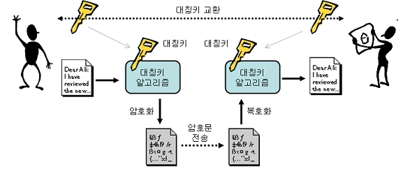
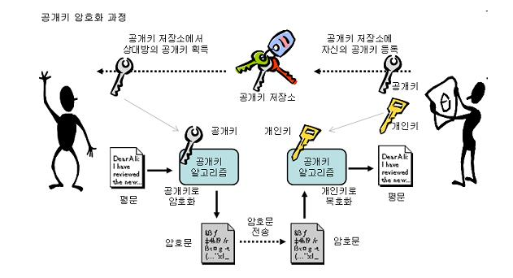
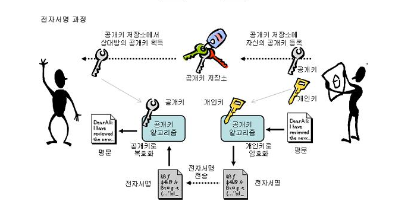
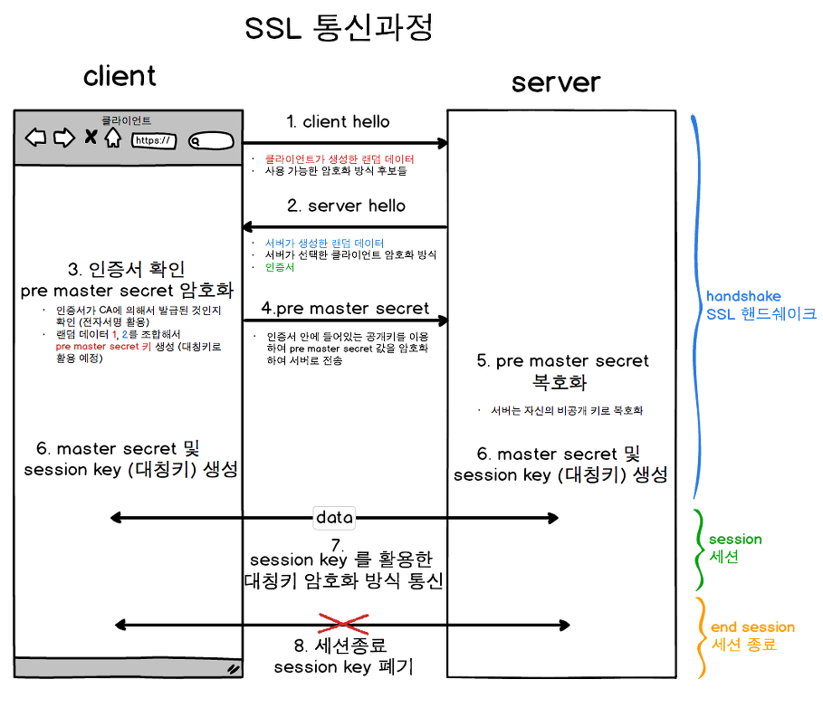
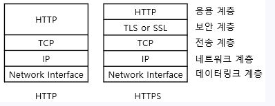
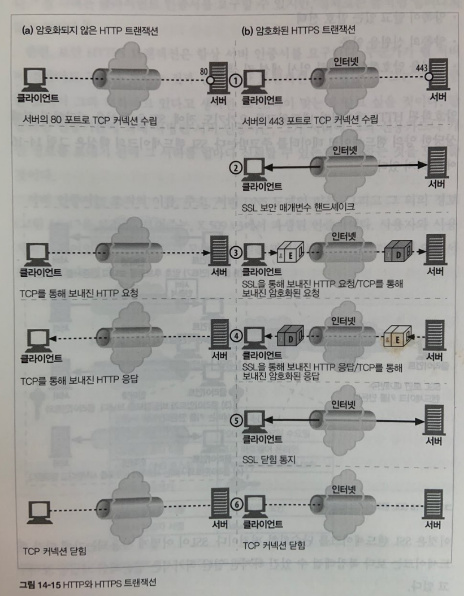
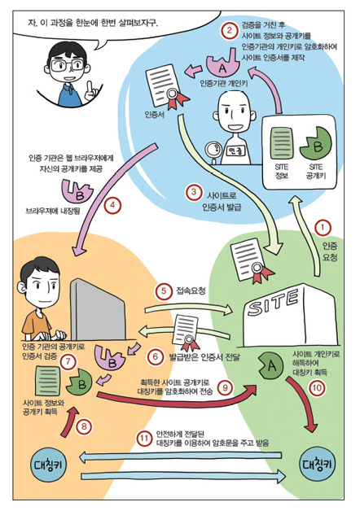

 

# 📝**암호화 기법**   

 

## 1️⃣ 대칭키 암호화 (symmetric-key algorithm)

- 대칭키 암호화 기법에서는 [암호화](https://ko.wikipedia.org/wiki/%EC%95%94%ED%98%B8%ED%99%94), [복호화](https://ko.wikipedia.org/wiki/%EB%B3%B5%ED%98%B8%ED%99%94)할 때 사용되는 키가 같다.
- 같은 키를 사용하기 때문에 '대칭키'라고 부른다.
- 대칭키 암호화 기법에서 송신자와 수신자는 대칭키를 공유한다.
- 송신자는 대칭키를 사용해서 데이터를 암호화해서 전송하고
- 수신자는 수신한 데이터를 대칭키를 사용해서 복호화 한다.

 

## 2️⃣ 공개키 암호화 (public key cryptosystem, 비대칭키 암호화)

- 공개키 암호화 기법에서는 암호화, 복호화할 때 사용되는 키가 다르다.
- 그렇기 때문에 두 개의 다른 키를 '비대칭키'라고 부른다. 
- 그럼 공개키와 개인키는 무엇일까?
- 공개키는 모두에게 공개된 키라는 뜻이다.
- 개인키는 개인이 비밀스럽게 가지고 있는 키라는 뜻이다.
- 공개키 암호화는 아래와 같이 두 가지 방식이 있다.

 

### 공개키로 데이터를 암호화하고, 개인키로 복호화 하는 방식 : 데이터 암복호화

  - 데이터를 암호화는 키는 모두에게 공개하고 
  - 데이터를 복호화는 키는 개인만 갖게 하는 방식이다.
  - 다수의 사람들은 공개키로 데이터를 암호화 한다음
  - 개인키를 가지고 있는 사람에게 데이터를 안전하게 보낼 수 있다.
  - 데이터 복호화는 개인키로만 가능하기 때문이다. 

 

#### 예시

- 호스트 A는 자신의 공개키를 모두에게 공개(배포)한다.
- 이제 송신자들은 호스트 A가 공개한 공개키를 사용하여 송신 데이터를 암호화 할 수 있다.
- 데이터에 대한 복호화는 개인키를 가지고 있는 호스트 A만이 가능하다.

 

#### 편지함 비유

- 열쇠로 잠겨있고 좁은 투입구가 있는 편지함이 있다.
- 사람들은 편지함의 투입구(공개키)를 통해 누구나 편지를 넣을 수 있다.
- 하지만 열쇠(개인키)를 가진 사람만이 편지함을 열 수 있다. 

 

### 개인키로 데이터를 암호화하고 공개키로 복호화 하는 방식 : [전자서명](https://ko.wikipedia.org/wiki/%EB%94%94%EC%A7%80%ED%84%B8_%EC%84%9C%EB%AA%85)

​     

- 데이터를 복호화는 키는 모두에게 공개하고 
  - 데이터를 암호화는 키는 개인만 갖게 하는 방식이다.
- 이것이 무엇을 의미할까?
- 특정 개인이 자신을 인증하는 용도로 사용할 수 있다.
- A라는 특정 개인은 어떤 데이터를 개인키로 암호화 한다. 그리고 공개키는 모두에게 공개한다.
- 공개키를 가진 누군가는 A로부터 받은 암호화된 데이터를 공개키로 복호화 해본다.
  - 만약에 데이터가 복호화가 된다면, 그 데이터는 A로부터 보내진 것이다. (데이터를 보낸쪽이 A임을 확신할 수 있다.)
  - 데이터가 복호화되지 않는다면, 그 데이터는 A로부터 보내진 것이 아니다.
- "공개키를 가진 누군가는 A로부터 받은 암호화된 데이터"는 인증을 위한 서명으로 사용되는 것이다. 이를 전자 서명이라고 한다.

 

#### 전자서명

- 전자 서명은 일반적으로 다음과 같이 3가지 알고리즘으로 구성된다.
  - 키 생성 알고리즘 G : 서명자의 키 쌍(공개키, 개인키)을 생성한다. 
  - 서명 생성 알고리즘 S : 메세지 m과 개인키를 통해 서명 σ를 생성한다.
  - 서명 검증 알고리즘 V : 메세지 m, 공개키, 서명 σ를  통해 인증 여부를 판별한다. 
  
- 전자 서명의 기능은 아래와 같다.
  - 전자 서명은 메세지를 작성한 저자가 누군지 알려준다. 
  - 전자 서명은 오직 저자의 개인키를 통해서만 접근할 수 있기 때문에 저자의 개인 '서명'처럼 동작한다.
  - 전자 서명은 메세지 위조를 방지한다. 
  - 만약 누군가 송신중인 메세지를 수정했다면 메세지에 대한 체크섬은 전자서명(원본 메세지에 대한 체크섬)과 다를 것이다. 
  - 체크섬 또한 저자의 개인키로 암호화 되어있기 때문에 위조할 수 없다. 
  

 

####  편지봉투 비유

- 전자 서명은 인장으로 편지 봉투를 봉인하는 것에 비유할 수 있다.
- 인장으로 봉인된 편지는 누구나 인장을 뜯어서(공개키로 복호화해서) 열어볼 수 있다.
- 하지만 인장 확인을 통해 인장을 소유한 발신자가 편지를 보냈음을 증명할 수 있다.

 

#### 그림으로 알아보기

  - 호스트 A가 호스트 B에게 메세지를 보내는 과정을 살펴보자.
  - A는 가변 길이 메세지를 고정된 길이로 요약한다.
  - A는 요약된 메세지를 개인키로 암호화해서 전자 서명을 만든다. 
  - A는 서명을 메세지의 끝에 추가하고 B에게 메세지를 전송한다.  
  - 메세지를 받은 B는 그 메세지가 진짜 A가 작성한 것인지, 중간에 메세지가 위조되지 않았는지 확인하기 위해 서명을 검증한다.  
  - B는 A의 개인키로 암호화된 메세지를 A의 공개키로 복호화 해서 메세지의 요약을 얻어낸다.
  - 이제 수신된 메세지의 요약과 서명으로부터 얻어낸 메세지 요약을 비교한다.
  - 그 결과가 다르다면 송신자가 A의 개인키를 갖고 있지 않고, 메세지가 송신 중 위조되었다는 뜻이다.
  - 따라서 메세지를 작성한 것은 A가 아님을 알 수 있다. 

 

------

# 📝 SSL(Secure Sockets Layer) 

- [SSL](https://ko.wikipedia.org/wiki/%EC%A0%84%EC%86%A1_%EA%B3%84%EC%B8%B5_%EB%B3%B4%EC%95%88)은 컴퓨터 네트워크에 통신 보안을 제공하는 프로토콜(계층)이다. 
- TLS(Transport Layer Security)라는 이름은 SSL이 표준화 되면서 바뀐 이름이다.
- SSL은 클라이언트가 서버가 주고 받는 통신 데이터에 대한 도청, 간섭, 위조를 방지해준다.
- 또한 데이터를 암호화 해주기 때문에 클라이언트 서버가 안전한 통신을 할 수 있게 해준다.  

 

## 📌 SSL 통신과정

- SSL 통신 과정은 "SSL 핸드셰이크" - "Session" - "Session 종료" 순으로 진행된다. 
- HTTPS 통신 과정을 그림과 함께 차례대로 살펴보자. (HTTPS는 SSL 위에서 동작하는 HTTP다.)

 

### SSL 핸드셰이크(1번~6번)

- 먼저 서버와 클라이언트는 어떤 암호화 알고리즘을 사용할지 결정한다.
- 결정이 됐으면, 암호화 알고리즘을 사용해서 대칭키를 만들고 서로 나누어 가진다.

#### 1번 : Client Hello

  - 클라이언트는 서버에게 클라이언트 측에서 생성한 랜덤 데이터, 클라이언트가 사용 가능한 암호화 알고리즘 후보들을 전송한다.
  - 만약 이전에 서버와 SSL 핸드셰이킹을 진행했다면, 기존의 세션을 재활용하기 위해 세션 키를 전송한다.

####  2번 : Server Hello

- 서버는 클라이언트가 보낸 암호화 알고리즘 후보들 중 사용 가능한 알고리즘을 선택한다.
- 서버는 클라이언트에게 서버 측에서 생성한 랜덤 데이터, 선택한 암호화 알고리즘, 인증서를 전송한다. 

####  3번 : 인증서 검증 및 대칭키 생성

- 클라이언트는 서버로부터 받은 인증서(전자서명)가 [CA](https://ko.wikipedia.org/wiki/%EC%9D%B8%EC%A6%9D_%EA%B8%B0%EA%B4%80)에 의해서 발급된 것인지 확인하기 위해 클라이언트 측에 저장된 CA의 공개키로 인증서를 검증한다.
- 검증이 성공했다면, 해당 서버가 CA로부터 인증 받았다는 것이 보장된다. 서버를 믿을 수 있게 된 것이다.
- 클라이언트는 클라이언트 측에서 생성한 랜덤 데이터와 서버 측에서 생성한 랜덤 데이터를 사용해서 **pre master secret**라는 대칭키를 만든다.
- **pre master secret**는 클라이언트와 서버의 암호화 통신에 사용될 대칭키다. 

####  4번 : pre master secret를 서버에게 전송 

- 클라이언트는 **pre master secret**를 안전하게 암호화해서 서버에게 전달 해야 한다. 
- 어떻게 할까? 그것은 바로 **인증서에 들어있던 서버의 공개키**로 암호화해서 전달하는 것이다. (인증서에는 서버의 공개키가 원래 들어있다.)

####  5번 : pre master secret 수신

- 서버는 자신의 개인키로 **pre master secret**를 복호화해서 얻어낸다.

#### 6번 : master secret 및 session key 생성

- 서버와 클라이언트는 일련의 과정을 거쳐서 **pre master secret**를 master secret으로 만들고 master secret으로 session key를 생성한다.

 

### Session (7번)

#### 7번 : session key를 통한 대칭키 암호화 방식 통신

- 세션은 실제로 서버와 클라이언트가 데이터를 주고 받는 단계다.
- 데이터를 상대방에게 전송하기 전에 session key를 사용해서 대칭키 방식으로 암호화해서 전송한다.
- 암호화된 데이터를 받은 상대방은 동일 session key를 사용해서 데이터를 복호화할 수 있다.

 

### End Session (8번)

#### 8번 : 세션종료 및 Session Key 폐기

- 데이터의 전송이 끝나면 SSL 통신이 끝났음을 서로에게 알려준다. 이 때 통신에서 사용한 대칭키인 세션키를 폐기한다.

 

## 📌 대칭키와 공개키 암호화 기법을 둘 다 사용하는 이유

- 우리는 두 가지 의문이 들 수 있다.

 

### 그냥 공개키 암호화 방식으로 암호화 통신을 하면 되지 않을까?

- 공개키 암호화 방식은 많은 컴퓨터 파워를 사용한다는 단점이 있다. 
- 공개키 암호화 방식을 사용하면 많은 접속이 물리는 서버는 매우 큰 비용을 지불해야한다.

 

### 그냥 대칭키 암호화 방식으로 암호화 통신을 하면 되지 않을까?

- 대칭키 암호화 방식을 사용하려면, 먼저 송신자와 수신자가 안전하게 대칭키를 공유해야한다.
- 암호화 되지 않은 채로 대칭키를 공유하기 위해 네트워크를 통해 전송하게 되면 키가 탈취될 수 있으므로 위험하다.

 

### 결론

- 속도는 느리지만 데이터를 안전하게 주고 받을 수 있는 공개키 방식으로 대칭키를 암호화해서 안전하게 공유하고
- 공유된 대칭키를 이용해서 데이터를 안전하게 주고 받는다. 

 

------

# 📝**HTTPS** (Hypertext Transfer Protocol over Secure Socket Layer)

 

## 📌 HTTPS 개요

* HTTP는 [평문](https://ko.wikipedia.org/wiki/%ED%8F%89%EB%AC%B8)(plain text)으로 메세지를 교환하기 때문에 도청이 가능하다. 
* HTTP를 사용하면서 통신 보안이 필요하다면 HTTS를 사용하면 된다. 
* HTTPS는 HTTP의 보안 버전으로 SSL(TLS) 위에서 동작하는 HTTP다.
* HTTPS를 통해 전송되는 모든 HTTP 메세지는 SSL 계층을 거쳐 암호화, 복호화 된다.

 

## 📌 HTTPS Scheme

- 보안 없는 일반적인 HTTP는 URL의 스킴 접두사가 아래와 같이 http이다.
  - http://www.naver.com
- 보안이 되는 HTTPS는 URL의 스킴 접두사가 다음과 같이 https이다.
  - https://www.naver.com
- 웹 브라우저 등의 클라이언트는 웹 리소스에 대한 트랜잭션 수행을 요청받으면 URL의 스킴을 검사한다.
- 만약 URL이 http 스킴을 갖고 있다면 클라이언트는 서버의 80번 포트로 연결하고 HTTP 요청을 한다.
- 만약 URL이 https 스킴을 갖고 있다면 클라이언트는 서버의 443번 포트로 연결하고, 서버와 바이너리 포멧으로 된 몇몇 SSL 보안 매개변수를 교환하면서 SSL 핸드셰이크를 한 뒤 암호화된 HTTP 요청을 한다.

 

## 📌 동작 과정

 

### HTTP 동작과정

- 클라이언트는 웹 서버의 80번 포트로 TCP 커넥션을 연다.
- HTTP 요청 메세지를 보낸다.
- 서버로부터 HTTP 응답 메세지를 받는다.
- TCP 커넥션을 닫는다.

 

### HTTPS 동작과정

- 클라이언트는 웹 서버의 443 포트로 TCP 커넥션을 연다.
- TCP 연결이 되면 클라이언트와 서버는 암호법 매개변수와 교환 키를 협상하면서 SSL 계층을 초기화 한다. (SSL 핸드 셰이크)
- SSL 초기화가 완료되면, 클라이언트는 HTTP 요청 메세지를 SSL 계층에 보낸다.
- SSL 계층에서 클라이언트의 HTTP 요청  메세지는 TCP로 보내지기 전에 암호화 된다.

 

## 📌 전자 인증서

- 전자 인증서는 신뢰할 수 있는 기관(CA)로부터 보증 받은 호스트의 정보를 담고 있다.

 

### **서버 인증을 위한 인증서 사용**

- HTTPS 동작 과정에서 SSL 핸드셰이크를 살펴보면, 먼저 클라이언트는 서버의 인증서를 받아서 서버를 검증하는 절차를 거친다.

- 서버가 보내온 인증서가 신뢰할 수 있는 공인 기관에 의해 서명 되었는지 공인 기관의 공개키로 검증함으로써 서버의 신뢰성을 확인하는 것이다.

- 인증서는 아래와 같은 정보를 포함한다.

  - 웹 사이트의 이름과 호스트 명
  - 웹 사이트의 공개키
  - 서명 기관의 이름
  - 서명 기관의 서명

 

### 동작 과정

- 클라이언트는 HTTPS를 통해 서버에 접속한다.
- 서버는 전자 인증서를 클라이언트에게 보낸다. (만약 서버가 인증서를 갖고 있지 않다면, 연결은 실패한다.)
- 클라이언트는 전자 인증서를 받으면 받으면 인증서에 들어있는 서명을 통해 서명 기관을 검사한다. 해당 기관이 공공연하게 신뢰할만한 서명 기관이라면 
- 클라이언트는 그것의 공개키를 알고 있을 것이고, 공개키를 사용하여 전자 서명을 검증한다.
- 만약 서명 기관이 모르는 곳이라면, 클라이언트는 그 서명 기관을 신뢰해야할지 확신할 수 없기 때문에 사용자가 해당 기관을 신뢰하는지 확인하기 위한 대화상자를 보여준다.

 

## 📌HTTPS 동작 그림으로 정리하기

1. 웹 서버(사이트)는 서버 정보와 서버의 공개키를 인증 기관에 주면서 인증 요청을 한다.
2. 인증 기관은 서버로 부터 받은 서버 정보와 공개키를 인증기관의 개인키로 암호화하여 인증서를 만든다.
3. 인증 기관은 인증서에 대한 공개키를 브라우저들에게 제공하고, 서버에 인증서를 발급한다.
4. 클라이언트가 웹 서버에 접속하면, 먼저 서버로부터 인증서를 받는다.
5. 클라이언트는 인증 기관으로부터 받은 공개키를 사용해 인증서를 검증한다. 
6. 신뢰 할만한 인증기관이라면, 대칭키를 만들고, 인증서에 들어있던 서버의 공개키를 사용해 대칭키를 암호화하여 서버에 전송한다.
7. 서버는 안전하게 클라이언트가 만든 대칭키를 받는다.
8. 이제 클라이언트와 서버는 안전하게 공유된 대칭키를 통해 암호화 통신이 가능해진다.

 

------

# 🔎 출처 & 더 알아보기

- [HTTP 완벽 가이드](https://book.naver.com/bookdb/book_detail.nhn?bid=8509980)

- [HTTPS와 인증서-생활코딩](https://opentutorials.org/course/228/4894)
- [공개키 암호화(RSA)는 암호화 시간이 얼마나 오래 걸릴까?](https://lucy7599.tistory.com/367)

