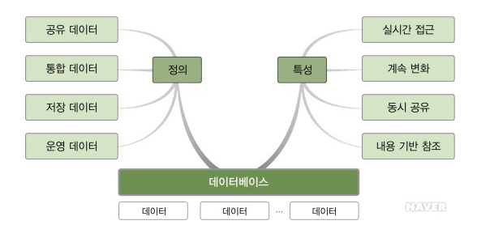
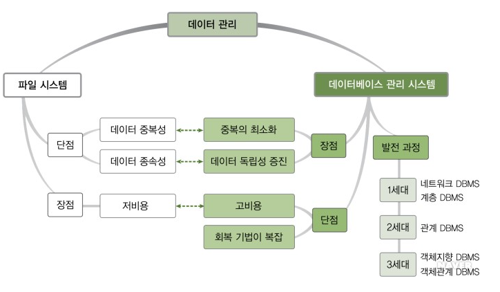
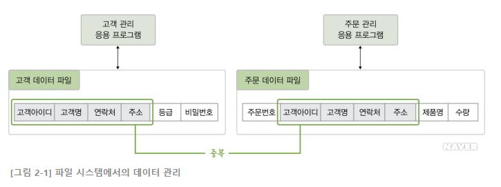
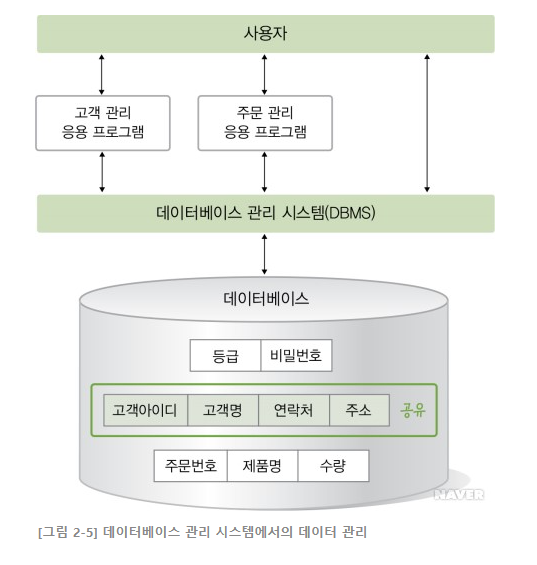

 

# 📝Database 기본 개념 

## 데이터와 정보

- 데이터 : 현실 세계에서 단순히 관찰하거나 측정하여 수집한 사실이나 값
- 정보 : 의사 결정에 유용하게 활용할 수 있도록 데이터를 처리한 결과물

## 정보 처리, 정보 시스템, 데이터베이스

- 정보 처리 : 데이터에서 정보를 추출하는 과정 또는 방법
- 정보 시스템 : 정보 시스템은 조직을 운영하기 위해 필요한 데이터를 수집하여 저장해두었다가 필요할 때 유용한 정보를 만들어 주는 수단이다.
- 데이터베이스 : 데이터베이스는 정보 시스템 안에서 데이터를 저장하고 있다가 필요할 때 제공하는 역할을 한다.

### 데이터베이스의 정의

- 특정 조직의 여러 사용자들이 **공유**해서 사용할 수 있도록 **통합**해서 **저장**한 **운영** 데이터의 집합이다.
  - 공유 데이터 : 여러 응용 프로그램들이 공동으로 사용하는 데이터
  - 통합 데이터 : 데이터 검색의 효율성을 위해 중복이 최소화된 데이터들의 모임
  - 저장 데이터 : 컴퓨터가 접근 가능한 저장 매체에 저장된 데이터
  - 운영 데이터 : 조직의 주요 기능을 수행하기 위해 반드시 필요한 운영 데이터

### 데이터베이스의 특성

- 실시간 접근성 : 사용자의 질의에 대하여 즉시 처리하여 응답하는 특징

- 계속 변화 : 삽입, 삭제, 갱신을 통하여 항상 최근의 정확한 데이터를 동적으로 유지하는 특징

- 동시 공유 : 여러 사용자가 동시에 원하는 데이터를 공용할 수 있는 특징

- 내용에 의한 참조 : 데이터베이스에 있는 데이터를 참조할 때 튜플의 주소나 위치에 의해서가 아니라 사용자가 요구하는 데이터 내용에 따라 참조하는 특징

 

# 📝데이터베이스 관리 시스템 등장 배경

## 파일 시스템(File System)

- 과거에는 데이터를 관리하기 위해 파일 시스템이라는 소프트웨어를 사용했다. 

- 파일 시스템은 데이터를 파일로 관리할 수 있도록 파일을 생성, 삭제, 수정 검색 하는 기능을 제공하고 운영체제와 함께 설치된다.
- 파일 시스템은 응용 프로그램별로 필요한 데이터를 별도의 파일로 관리한다.  이러한 특성은 아래와 같은 문제점을 가지고 있다. 

###  데이터 중복 : 같은 내용의 데이터가 여러 파일에 중복 저장된다.

- 위 그림을 보면 두 응용 프로그램에서 고객아이디, 고객명, 연락처, 주소 등의 데이터가 중복된다.
- 데이터가 중복되면 저장공간이 낭비되고 데이터의 일관성과 데이터의 무결성을 유지하기 어려워진다.
  - 일관성 문제 : 예를들어 고객 관리 응용 프로그램으로 고객 데이터 파일에 있는 어떤 고객 연락처 정보를 수정했다. 그런데 주문 데이터 파일은 수정되지 않음. 불일치 발생
  - 무결성 문제 : 예를들어 고객 아이디는 영어와 숫자가 섞이고 5자 이상이어야 하는 조건이 있을때 이것을 모든 응용 프로그램에서 확인해야한다. 데이터가 여러 파일에 중복되어 통제가 어려운 환경에서는 데이터 정확성 문제가 빈번히 발생할 수 있다. 

### 데이터 종속 : 응용 프로그램이 데이터 파일에 종속적이다.

- 응용 프로그램은 파일에 직접 접근하여 데이터를 처리해야 하므로 사용하는 파일의 데이터를 구성하는 방법에 종속된다. 
- 즉, 사용하는 파일의 구조를 변경하면 응용 프로그램도 함께 변경해야한다.(데이터 종속성)

### 데이터 파일에 대한 동시 공유, 보안, 회복 기능이 부족하다.

- 동시 사용 불가 : 일반 파일 시스템에서는 응용 프로그램 하나가 사용 중인 파일을 다른 응용 프로그램이 접근하여 사용할 수 없다. 
- 보안부족 : 파일 시스템은 보통 파일 단위로 읽기, 수정, 실행 권한을 부여하는 식으로 데이터 접근을 통제한다. 하지만 파일 안의 레코드나 필드와 같은 더 작은 단위에 대한 통제와 접근 보안이 필요하다.
- 회복부족 : 파일시스템에서 응용 프로그램이 파일을 사용하는 도중에 장애가 발생하면 데이터를 일관된 상태로 회복하기 어렵다 특히 데이터를 수정하는 도중에 장애가 발생한 경우는 더욱 어렵다.

### 응용 프로그램 개발이 쉽지 않다. 

- 파일 시스템에서는 파일에 접근하여 데이터를 관리하는 모든 작업을 응용 프로그램이 담당해야 하기 때문에 사용자 요구에 맞는 응용 프로그램을 개발하는 데 어려움이 많다. 
- 새로운 응용 프로그램을 개발하려면 파일에서 데이터 읽기, 데이터 삽입하기, 기존 데이터 삭제하기 등의 기본적인 데이터 관리 기능을 모두 포함해야 한다.

 

------

# 📝데이터베이스 관리 시스템의 정의

| *장점*                             | *단점*                                  |
| ---------------------------------- | --------------------------------------- |
| 데이터 중복을 통제할 수 있다       | 비용이 많이 든다                        |
| 데이터 독립성이 확보된다           | 백업과 회복 방법이 복잡하다             |
| 데이터를 동시 공유할 수 있다       | 중앙 집중 관리로 인한 취약점이 존재한다 |
| 데이터 보안이 향상된다             |                                         |
| 데이터 무결성을 유지할 수 있다     |                                         |
| 표준화할 수 있다                   |                                         |
| 장애 발생 시 회복이 가능하다       |                                         |
| 응용 프로그램 개발 비용이 줄어든다 |                                         |

 

------

  # 🔎 출처 & 더 알아보기

  - [2019 시나공 정보처리기사 필기](http://www.yes24.com/Product/Goods/66920765)
  - [데이터베이스 개론](https://terms.naver.com/list.nhn?cid=58430&categoryId=58430&so=st4.asc)
