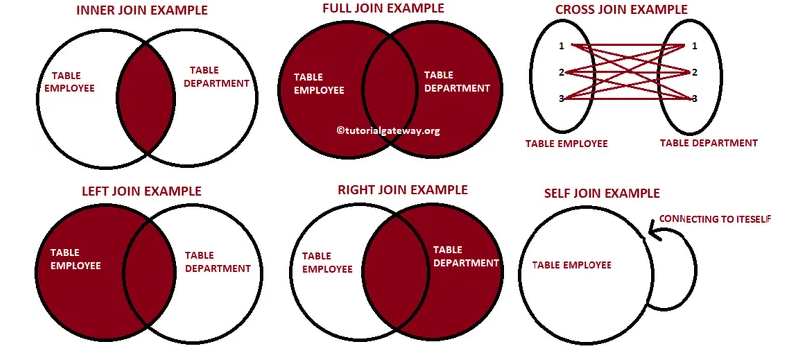
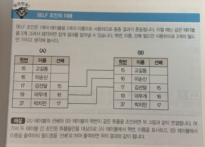

<br>

# 😂 작성 중인 글입니다. 😂


# 📝SQL(Structured Query Language)

- [SQL](https://ko.wikipedia.org/wiki/SQL)은 관계형 데이터베이스 관리 시스템(RDBMS)의 데이터를 관리하기 위해 설계된 특수 목적의 프로그래밍 언어다. 
- SQL 문법의 종류는 다음 3가지로 구분된다.
  - [데이터 정의 언어](https://ko.wikipedia.org/wiki/데이터_정의_언어) (DDL : Data Definition Language)
  - [데이터 조작 언어](https://ko.wikipedia.org/wiki/데이터_조작_언어) (DML : Data Manipulation Language)
  - [데이터 제어 언어](https://ko.wikipedia.org/wiki/데이터_제어_언어) (DCL : Data Control Language)

<br>

------


# 📝DDL

- 작성예정

<br>

------


# 📝DML

## SELECT

- 작성예정

## JOIN

- JOIN을 사용하면 2개의 테이블에 대해 연관된 튜플들을 결합하여, 하나의 새로운 릴레이션을 반환할 수 있다.
- JOIN은 크게 INNER JOIN과 OUTER JOIN으로 구분된다.

### INNER JOIN(내부조인)


- INNER JOIN은 EQUI JOIN과 NON-EQUI JOIN으로 구분된다.
- INNER JOIN은 조인 대상 테이블들의 속성 값을 비교후 조건에 맞는 튜플들만 가져오는 것이다.

#### 명시적 조인 표현

- 명시적 조인 표현은 JOIN과 ON 키워드를 사용한다.

```SQL
SELECT *
FROM EMPLOYEE E INNER JOIN DEPARTMENT D
ON E.DEPTNO = D.DEPTNO;
```

#### 묵시적(암시적) 조인 표현

- 묵시적 조인 표현은 FROM 절에서 조인 대상 테이블을 콤마로 구분하여 나열하고, 조인 조건은 WHETE절에서 결정한다.
- 아래와같이 '='(equal) 비교에 의해 같은 값을 가지는 행을 연결하여 결과를 생성하는 JOIN 방법을 **EQUI JOIN**이라고 한다.
- JOIN 조건에 '=' 조건이 아닌 '<', '>', '>=', '<=' 연산자를 사용하는 JOIN을 **NON-EQUI JOIN**이라고 한다.

```SQL
SELECT *
FROM EMPLOYEE, DEPARTMENT
WHERE E.DEPTNO = D.DEPTNO;
```

### NATURAL JOIN(자연조인)

- 자연조인은 조인 대상 테이블들에서 같은 속성 값이 존재하는 컬럼들에대해 JOIN을 수행한다.

```SQL
SELECT *
FROM EMPLOYEE NATURAL JOIN DEPARTMENT;
```

### CROSS JOIN(교차조인)

- CROSS JOIN은 카테시안 곱(Cartesian Product)이라고도 하며 조인 대상 테이블들의 곱집합을 반환한다. 
- 예를들어 n개의 열을 가진 테이블과 m개의 열을 가진 테이블을 CROSS JOIN하면 n*m개의 열을 생성한다.  

<br>

### OUTER JOIN

- OUTER JOIN은 테이블에서 JOIN 조건에 만족하지 않는 튜플도 결과로 출력하기 위한 JOIN 방법이다.

#### LEFT OUTER JOIN

- 왼쪽 테이블이 기준이 되어, 왼쪽 테이블에 있는 튜플은 모두 가져오고, 오른쪽 테이블에서는 연관된 튜플만 가져오는 JOIN 방법이다.

```SQL
SELECT *
FROM EMPLOYEE E LEFT OUTER JOIN DEPARTMENT D 
ON E.DEPTNO = D.DEPTNO;
```

#### RIGHT OUTER JOIN 


- 오른쪽 테이블이 기준이 되어, 오른쪽 테이블에 있는 튜플은 모두 가져오고 왼쪽 테이블에서는 연관된 튜플만 가져오는 JOIN 방법이다.

```SQL
SELECT *
FROM EMPLOYEE E RIGHT OUTER JOIN DEPARTMENT D 
ON E.DEPTNO = D.DEPTNO;
```

#### FULL OUTER JOIN

- LEFT OUTER JOIN과 RIGHT OUTER JOIN을 합친것이다.

```SQL
SELECT *
FROM EMPLOYEE E FULL OUTER JOIN DEPARTMENT D 
ON E.DEPTNO = D.DEPTNO;
```

<br>

### SELF JOIN

- SELF JOIN은 같은 테이블에서 2개의 속성을 연결하여 EQUI JOIN을 하는 JOIN 방법이다. 

```SQL
SELECT A.학번, A.이름, B.이름 AS 선배 #명시적 표현
FROM 학생 A JOIN 학생 B
ON A.선배 = B.학번;
```

```SQL
SELECT A.학번, A.이름, B.이름 AS 선배 #묵시적 표현
FROM 학생 A, 학생 B
WHERE A.선배 = B.학번;
```


## INSERT

- 작성예정

## UPDATE

- 작성예정 

## DELETE

- 작성예정


<br>

------


# 📝DCL

- 작성예정

<br>

------


# 📝TCL

- 작성예정

<br>

------


# 🔎 출처 & 더 알아보기

- [2019 시나공 정보처리기사 필기](http://www.yes24.com/Product/Goods/66920765)
- [[SQL] Join(조인)](https://clairdelunes.tistory.com/22)
- [SQL Tutorial](https://www.dofactory.com/sql)