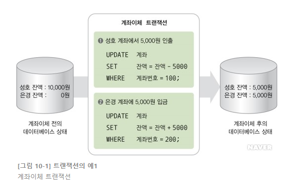

 

# 📝 Transaction(트랜잭션)

* 트랜잭션은 하나의 논리적인 작업을 처리하기 위한 일련의 연산 집합으로서 데이터베이스에서 논리적인 작업의 단위가 된다. 
* 하나의 트랜잭션은 정상적으로 종료될 경우 Commit 연산이 수행되고, 비정상적으로 종료될 경우 Rollback 연산이 수행된다.

 

## 📌 Commit 연산

- Commit 연산은 트랜잭션 처리가 정상적으로 종료되어 트랜잭션이 수행한 변경 내용을 데이터베이스에 반영하는 연산이다.
- 데이터를 변경한 트랜잭션이 완료되면, 그 트랜잭션에 의해 데이터베이스는 새롭게 일관된 상태로 변경되며, 이 상태는 시스템에 오류가 발생하더라도 취소되지 않는다. 

 

## 📌 Rollback 연산

- Rollback 연산은 하나의 트랜잭션 처리가 비정상적으로 종료되어 데이터베이스의 일관성이 깨졌을 때 트랜잭션이 행한 모든 변경 작업을 취소하고 이전 상태로 되돌리는 연산이다. 
- Rollback 연산 시 해당 트랜잭션은 받았던 자원과 잠금(Lock)을 모두 반환하고, 재시작되거나 폐기된다. 

 

## 📌 트랜잭션 예제

- 위 그림은 ""성호가 은경에게 5000원을 계좌이체하는 트랜잭션"을 나타낸다.
- 계좌이체 트랜잭션은 두 개의 SQL UPDATE문을 통해 진행된다. 
  - 1번 SQL UPDATE문 : 성호 계좌에서 5,000원을 인출
  - 2번 SQL UPDATE문 : 은경 계좌에 5,000원을 입금
- 1번, 2번 SQL UPDATE문의 실행 순서는 상관없지만 두 개다 반드시 실행되어야 한다.
- 만약 1번만 수행되고 2번은 수행되지 않았다면, 성호가 보낸 5,000원은 없어지게 된다. 
- 이런 경우 rollback 연산을 통해 1번 SQL UPDATE으로 변경된 결과를 이전 상태로 복구한다.
- 1번, 2번이 모두 정상적으로 수행되었을 경우 commit 연산을 통해 데이터베이스에 반영한다. 

 

## 📌 Transaction의 특성 (ACID)

- 트랜잭션이 갖춰야할 특성은 4가지가 있다. ACID라고 줄여표현하는데, 하나씩 살펴보자

 

### 원자성(Atomicity)

- 트랜잭션의 연산은 데이터베이스에 모두 반영되던지 아니면 전혀 반영되지 않아야한다.
- 트랜잭션 내의 모든 명령어는 반드시 완벽히 수행되어야 하며, 모두가 완벽히 수행되지 않고 어느 하나라도 오류가 발생하면 그 트랜잭션은 모두 취소 되어야한다.
- 예를들어 A계좌에서 B계좌로 5,000원을 이체하는 트랜잭션이 완벽히 수행되면 commit 연산을 수행해서 DB에 반영하고, 
- 트랜잭션 중간에 오류가 발생한다면, rollback 연산을 수행하여 그 떄까지 수행된 트랜잭션 연산을 모뒤 취소하여 원래의 상태로 만들어야 한다. 

 

### 일관성(Consistency)

- 트랜잭션 수행이 성공적으로 완료되면 언제나 일관성 있는 데이터베이스 상태로 변환한다.
- 시스템이 가지고 있는 고정 요소는 트랜잭션 수행 전과 수행 완료 후의 상태가 같아야한다.
- 동시에 실행되는 트랜잭션이 없는 고립 상태에서의 트랜잭션 수행은 데이터 베이스의 일관성을 유지해야한다.
- 예를들어, A계좌와 B계좌의 합이 25,000원이라면 A계좌에서 B계죄로 5,000원을 이체하는 트랜잭션을 수행한 후에도 A계좌와 B계좌의 합은 25,000이 되어야한다. 

 

### 격리성(Isolation)

- 한 트랜잭션이 데이터를 갱신하는 동안 이 트랜잭션이 완료되기 전에는 갱신중인 데이터를 다른 트랜잭션들이 접근하지 못하도록 해야 한다.
- 여러 트랜잭션들이 동시에 수행되어도 그 결과는 순차적으로 실행된 결과와 같아야한다.
- 여러 트랜잭션이 동시에 실행되더라도 DBMS는 트랜잭션 T1과 T2 각 쌍에 대해 T1이 시작되기 전에 T2가 실행을 끝내던지, 아니면 T1이 끝난 뒤에 T2가 실행되도록 보장해야한다.
- 예를들어,  A계좌에서 B계좌로 5,000원을 이체하는 트랜잭션을 수행하는 동안에는 다른 트랜잭션이 A계좌와 B계좌에 접근할 수 없어야 한다.

 

### 지속성(Durability)

- 트랜잭션의 실행이 설공적으로 실행 완료된 후에는 시스템에 오류가 발생하더라도 트랜잭션에 의해 변경된 내용은 계속 보존되어야 한다.
- 성공적으로 완료된 트랜잭션의 결과는 영구적으로 반영되어야 한다.
- 예를들어, A계좌에서 B계좌로 5,000원을 이체하는 트랜잭션이 성공적으로 완료된 후에는 항상 이체가 완료된 상태를 유지해야한다. 

 

## 📌 병행 제어

- 병행 제어란 동시에 여러 개의 트랜잭션을 병행 수행할 때 실행되는 트랜잭션들이 데이터베이스의 일관성을 파괴하지 않도록 트랜잭션 간의 상호 작용을 제어하는 기술이다.
- 병행성이란 여러 개의 트랜잭션들이 동시에 인터리빙하게 실행되는 것을 의미한다.

### 병행 제어의 목적

- 데이터베이스의 공유를 최대화한다.
- 시스템의 활용도를 최대화한다.
- 사용자에 대한 응답 시간을 최소화한다.
- 단위 시간당 트랜잭션 처리 건수를 최대화 한다.
- 데이터베이스의 일관성을 유지한다.

### 병행 제어의 필요성

- 병행 제어 없이 트랜잭션들이 데이터베이스에 동시에 접근하도록 허용할 경우 다음과 같은 문제점이 발생한다.

| 문제점                          | 의미                                                         |
| ------------------------------- | ------------------------------------------------------------ |
| 갱신 분실( Lost Update)         | 2개 이상의 트랜잭션이 같은 데이터를 공유하여 갱신할 때 갱신 결과의 일부가 없어지는 현상(덮어쓰기) |
| 모순성(불일치성, Inconsistency) | 복수의 사용자가 동시에 같은 데이터를 갱신할 때 데이터베이스 내의 데이터들이 상호 일치하지 않아 모순된 결과가 발생하는 현상 |
| 연쇄 복귀(Cascading Rollback)   | 병행 수행되던 트랜잭션들 중 어느 하나에 문제가 생겨 Rollback되는 경우 다른 트랜잭션들도 Rollback되는 현상 |

 

## 📌 Transaction Isolation level(트랜잭션 격리 수준)

- Isolation level이란 트랜잭션에서 일관성이 없는 데이터를 허용하는 수준을 이야기한다. 
- 동시에 여러 트랜잭션이 처리될 때 특정 트랜잭션이 다른 트랜잭션에서 변경하거나 조회하는 데이터를 볼 수 있도록 허용할지 말지를 결정하는 것이다. 
- 레벨이 높아질 수록 처리에 대한 비용이 증가하게 된다.
- 트랜잭션 격리수준을 살펴보기 전에 트랜잭션 중 발생할 수 있는 문제들에 대해 먼저 알아보자.

 

### 낮은 트랜잭션 격리 수준에서 발생 가능한 문제점(수정 필요)

#### Dirty Read

- 선행 트랜잭션에서 A 테이블을 SELECT 한 후 후행 트랜잭션에서 A 테이블을 UPDATE 하는 상황에서
- 후행 트랜잭션이 UPDATE 후에 commit을 하지 않았는데, 선행 트랜잭션 SELECT에서 변경된 데이터를 읽을 수 있게 되는 상황

#### Non-Repeatable Read

- T1이 A 테이블에서 SELECT를 하고 있다. 
- 이때 T2가 A 테이블에 접근하여 데이터를 변경 또는 삭제한 후 commit을 한다면
- 이후 T1이 다시 A 테이블에서 SELECT 한다면 T2에 의해 변경 또는 삭제된 데이터를 찾게된다.

#### Phantom Read

- 트랜잭션 1이 A 테이블에서 데이터를 SELECT 하고 난 후
- 트랜잭션 2에서 A테이블에 데이터를 INSERT 또는 DELETE 하는 상황에서
- 트랜잭션 1이 다시 A 테이블에서 데이터를 SELECT 할 경우 데이터가 추가되거나 사라지는 현상이 발생한다. 

 

#### Level 0 : Read Uncommitted

- 트랜잭션이 완료(Commit)되지 않은 상황에서 다른 트랜잭션이 변경한 데이터 SELECT가 가능한 레벨이다.
- 트랜잭션에서 처리 중인 아직 커밋되지 않은 데이터의 변경을 다른 트랜잭션이 SELECT 하는 것을 허용한다. 
- 트랜잭션이 접근하는 데이터에 Lock이 걸리지 않는다. 
- 쉽게 말해 완료되지 않은 트랜잭션의 작업 결과를 읽을 수 있는 레벨이다. 
- 데이터베이스의 일관성을 유지할 수 없는 레벨이다.
- Dirty Read, Non-Repeatable Read, Phantom Read 현상이 발생한다. 

 

#### Level 1 : Read Committed

- 트랜잭션이 완료(Commit)되지 않은 상황에서 다른 트랜잭션이 변경한 데이터 SELECT가 가능하지 않는 레벨이다.
- 트랜잭션에서 처리 중인 아직 커밋되지 않은 데이터의 변경을 다른 트랜잭션이 SELECT 하는 것을 허용하지 않는다. (어떤 데이터에 대해 트랜잭션이 수행되고 있으면 다른 트랜잭션은 접근할 수 없고 대기한다.)
- 하지만 트랜잭션이 완료된 즉, Commit된 데이터에 한해서 SELECT 가능하다. 
- Dirty Read 현상이 발생하지 않고, 대부분의 DBMS가 기본모드로 채택하고 있다.

- Non-repeatable read, Phantom read 현상이 발생한다.

 

#### Level 2 : Repeatable Read

- 트랜잭션 범위 내에서 접근한 데이터의 내용이 항상 동일함을 보장해주는 LEVEL이다.
- 접근중인 데이터에 대해 다른 트랜잭션에서 변경을 하고 commit을 했건 안했건 현재 트랜잭션에서는 그 내용이 반영되지 않는다.  
- 하지만 다른 트랜잭션이 새로운 데이터를 삽입했을 때 현재 트랜잭션에서 새로운 데이터에 대한 조회가 가능하다. 
- 따라서 한 트랜잭션 안에서 작업을 수행하다가 갑자기 새로운 데이터(유령 Phantom 데이터)가 조회될 수 있다.
- Phantom Read 현상이 발생한다.

 

#### Level 3 : Serializable

- 모든 동작이 직렬화 되어 작동한다. 
- 트랜잭션이 접근 중인 데이터에 대해 다른 트랜잭션의 모든 접근이 불가능 하다.
- 트랜잭션이 접근 중인 데이터에 대해 다른 트랜잭션이 변경, 삭제하지 못할 뿐만 아니라 새로운 데이터 삽입도 불가능하다.
- 완벽한 일관성을 제공한다. 

 

------

# 🔎 출처 & 더 알아보기

- [트랜잭션의 개념](https://terms.naver.com/entry.nhn?docId=3431258&cid=58430&categoryId=58430)
- [2019 시나공 정보처리기사 필기](http://www.yes24.com/Product/Goods/66920765)
- [Isolation level 이해하기](https://medium.com/@wonderful.dev/isolation-level-%EC%9D%B4%ED%95%B4%ED%95%98%EA%B8%B0-94e2c30cd8c9)
- [트랜잭션 격리 수준(Isolation Level)](https://doooyeon.github.io/2018/09/29/transaction-isolation-level.html)
- [트랜잭션 고립화 레벨(Transaction Isolation Level)](https://goodgid.github.io/Transaction-Isolation-Level/#comments)

