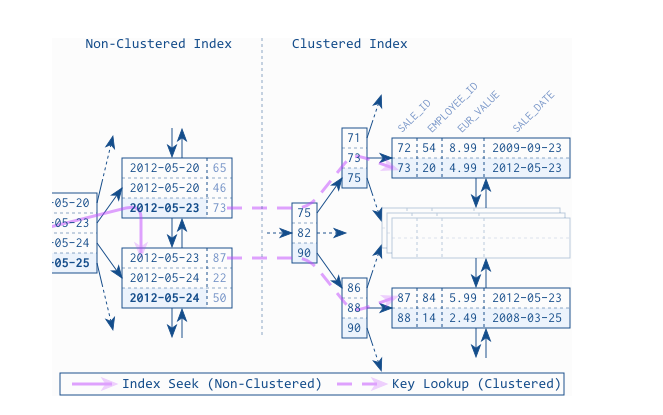
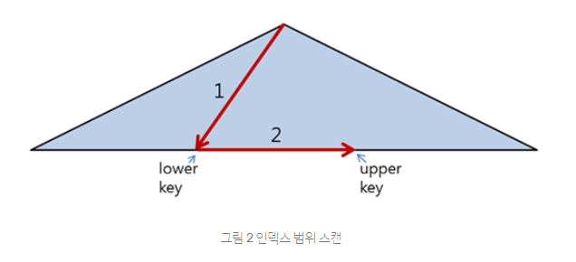

 

# 📝 Index(인덱스)

* 인덱스는 "임의의 규칙대로 부여된 임의의 대상을 가리키는 무언가"다.
* 영어 단어 사전의 인덱스를 떠올려보자.   

- 책 맨 뒷페이지에 있는 "찾아보기"를 떠올려보자. 
- 배열의 인덱스를 생각해보자. 
- 이와 같이 우리는 인덱스라는 것을 사용하면서 원하는 정보를 빠르게 조회하는 것에 익숙하다.
- 데이터베이스에서도 마찬가지다. 정보(레코드 또는 튜플)를  빠르게 조회하기 위해 컬럼에 인덱스를 설정할 수 있다.
- 책 맨 뒤 페이지에 있는 "찾아보기"가 인덱스고, 책의 내용은 데이터 파일이라고 볼 수 있다.
- 예를들어 위 그림의 "찾아보기"에서 보이는 "디자인 패턴_267"에서 "디자인 패턴"은 컬럼의 값, "267"은 해당 값을 지니고 있는 튜플(레코드)의 주소. 즉, 인덱스에 비유할 수 있다.
- "디자인 패턴_267"이라는 인덱스를 보고 "디자인 패턴에 대한 내용은 책의 267 페이지에 있구나"라는 것을 빠르게 알 수 있다. 
- 또한 위 3가지 그림에서 인덱스들은 정렬되어 있다는 공통점이 있다. 인덱스를 특정 기준으로 정렬해두면 인덱스를 빠르게 찾을 수 있기 때문이다. (` 영어 사전 : a, b, c ...`,  `책의 찾아보기 : ㄱ, ㄴ, ㄷ ...` ,  `배열 : 1, 2, 3 ...`)
- 마찬가지로 데이터베이스 인덱스도 정렬되어 있다.  인덱스는 튜플(레코드)의 주소라고 했다. 인덱스가 가리키는 튜플들이 정렬되어 있을 수도 아닐 수도 있다. 
- 정리하자면, 데이터베이스 인덱스는 특정 튜플을 빠르게 조회하기 위한 목차이다. 
- 인덱스는 키, 튜플은 값으로 볼 수 있다. 

 

## 📌 Clustered Index / Non-Clustered Index

### Clustered Index

- 클러스터드 인덱스는 인덱스 자체도 정렬되어 있고, 인덱스에 해당하는 튜플(레코드)도 정렬되어 있는 방식이다. 또한 인덱스와 튜플이 저장되는 공간이 같다. 
- 인덱스들과 각 인덱스에 해당하는 튜플이 미리 정렬되어 있으므로 빠르게 튜플을 찾을 수 있다. 특히 범위 조회시 유리하다. 
- 튜플들을 정렬해서 관리하기 때문에 튜플을 INSERT, DELETE, UPDATE 할 때 재정렬 오버헤드가발생한다. (배열에 새로운 원소를 삽입하거나 삭제하려면, 기존 원소들을 한칸씩 옮겨줘서 원소들을 재배치 하는 것과 같다.)   
- 클러스터드 인덱스는 프라이머리 키에 대해서만 적용되는 개념이다. 
- 위 그림 오른쪽을 보면 인덱스는 프라이머리 키로 정렬되어 있다. 프라이머리 키에 해당하는 튜플 역시 정렬되어 있는 것을 볼 수 있다. 

### Non-Clustered Index

- 넌 클러스터드 인덱스는 인덱스 자체는 정렬되어 있지만, 인덱스에 해당하는 튜플(레코드)은 정렬되어 있지 않다. 또한 인덱스와 튜플이 저장되는 공간이 다르다.
- 위 그림 왼쪽을 보면 날짜 컬럼이 인덱스로 잡혀있으며, 날짜 컬럼 인덱스들이 정렬되어 있는 것을 볼 수 있다. 하지만 날짜에 해당하는 실제 튜플의 주소는 정렬되어 있지 않는 것을 볼 수 있다.
- 또한 날짜 컬럼 인덱스를 통해 원하는 날짜에 해당하는 튜플의 프라이머리 키(주소)를 알아내고, 프라이머리 키를 통해 튜플에 접근하는 것을 볼 수 있다.

 

## 📌 인덱스 컬럼 기준

- 어떤 컬럼을 인덱스로 잡아야할까? 카디널리티가 높은 컬럼을 인덱스로 잡는 것이 좋다.
- 컬럼 값들의 중복도가 낮으면 카디널리티는 높다고 표현한다.
- 컬럼 값들의 중복도가 높으면 카디널리티는 낮다고 표현한다.
- 즉, 중복된 값이 적은 컬럼을 인덱스로 선정해야한다.
- 예를들어 남, 녀 2가지로 구분되는 성별은 카디널리티가 낮기 때문에 인덱스로 만들어봤자 효율이적다.
- 하지만 주민등록번호, 계좌번호 등은 각각 유일한 값을 가지므로 카디널리티가 높다 따라서 인덱스를 설정할 경우 효율적으로 데이터를 찾을 수 있다. 

 

# 📝 인덱스의 종류

## 📌 B-Tree 인덱스

- B-Tree는 데이터베이스의 인덱싱 알고리즘 가운데 가장 먼저 도입되고 가장 일반적으로 사용되는 알고리즘이다. (B는 Balaned를 의미한다.)

- B-Tree의 변형인 B+Tree 또는 B*-Tree는 일반적으로 DBMS에서 사용된다. 

### 구조 및 특성

- B-Tree는 트리 구조이다. [트리 구조](https://ko.wikipedia.org/wiki/%ED%8A%B8%EB%A6%AC_%EA%B5%AC%EC%A1%B0)는 루트 노드, 브랜치(내부) 노드, 리프 노드로 구성된다. 

- 트리의 리프 노드는 실제 데이터 레코드(튜플)를 찾아가기 위한 주소 값(키 값)을 가지고 있다. 

- 인덱스의 키 값은 빠른 검색을 위해 정렬 되어있다. 

- 키 값에 대응하는 레코드(튜플)는 정렬 되어 있을 수도 있고 아닐 수도 있다. 

- 대부분 RDBMS에서 레코드는 정렬되지 않고 저장된다. 하지만 InnoDB 테이블에서 레코드는 클러스터 되어 저장되므르 기본적으로 프라이머리 키 순서대로 정렬되어 저장된다.

### 인덱스 레인지 스캔

- 인덱스 레인지 스캔은 검색해야 할 인덱스의 번위가 결정됐을 때 사용하는 방식이다. 
- B-tree의 인덱스는 정렬되어 있기 때문에 특정 위치에서 검색을 시작해서 검색 조건이 일치하지 않는 값을 만나는 순간 검색을 멈출 수 있다.
- 반면, 인덱스 없이 테이블에서는 처음부터 끝까지 모든 레코드를 읽어야 완전한 결과 집합을 얻을 수 있다. 
- 인덱스 범위 스캔은 위 그림과 같이 2단계로 진행된다.
- 첫 번째 단계는 루트에서부터 트리를 순회하여 리프노드에서 하위 키를 찾는다.
- 두 번째 단계는 첫 번째 단계에서 찾은 키에서부터 상위 키까지 순차적으로 레코드를 읽어 처리한다. 

 

## 📌 해시(Hash) 인덱스

- 해시 인덱스는 동등 비교 검색에 최적화 되어있다. 하지만 범위 검색이나 정렬된 결과를 가져오는 목적으로 사용할 수 없다.
- 일반적인 DBMS에서 해시 인덱스는 메모리 기반의 테이블에 주로 구현되어 있으며 디스크 기반의 대용량 테이블용으로는 거의 사용되지 않는다.

### 구조 및 특성

- 해시 인덱스의 큰 장점은 실제 키값과는 관계없이 인덱스 크기가 작고 검색이 빠르다는 점이다.
- 검색하고자 하는 값을 주면 해시 함수를 거쳐서 찾고자 하는 키값이 포함된 버킷을 알아내고 버킷안에서 실제 레코드가 저장된 위치를 찾을 수 있다.
- 그래서 트리 내에서 여러 노드를 읽어야만 하는 레코드의 주소를 알아 낼 수 있는 B-Tree보다 상당히 빨리 결과를 가져올 수 있다.

------

 

# 🔎 출처 & 더 알아보기

- [2019 시나공 정보처리기사 필기](http://www.yes24.com/Product/Goods/66920765)
- [[MySQL] 클러스터링 인덱스](https://12bme.tistory.com/149)
- [[10분 테코톡] 👨‍🏫안돌의 INDEX](https://www.youtube.com/watch?v=NkZ6r6z2pBg)
- [[mysql] 인덱스 정리 및 팁](https://jojoldu.tistory.com/243)
- [[MySQL] B-Tree 인덱스](https://12bme.tistory.com/138?category=682920)
- [[MySQL] Hash 인덱스](https://12bme.tistory.com/141)
- [성능 향상을 위한 SQL 작성법](https://d2.naver.com/helloworld/1155)

