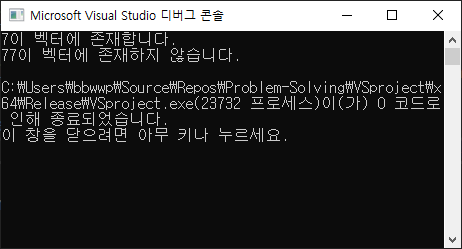
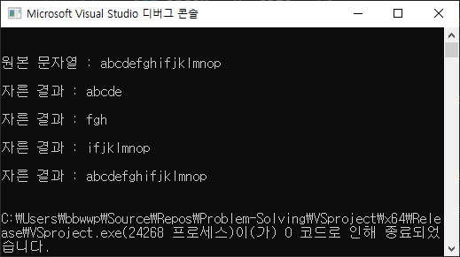

# 📝 &#60;algorithm&#62;

## 📌 find 

- 범위 안에 원하는 값을 찾아준다. 
- ex) 벡터 내에 특정 값이 있는지 확인할 때 사용.
- 찾고자하는 값이 있으면, 해당 위치를 가리키는 이터레이터 반환.
- 찾고자하는 값이 없으면, 원소의 끝을 가리키는 end() 반환.

```c++
#include<iostream>
#include<algorithm>
#include<vector>
using namespace std;

int main() {
	vector<int> v = { 1, 2, 3, 4, 5, 6, 7, 8, 9, 10 };

	int num = 7;

	if (find(v.begin(), v.end(), num) != v.end())
		cout << num << "이 벡터에 존재합니다.\n";
	else
		cout << num << "이 벡터에 존재하지 않습니다.\n";

	num = 77;

	if (find(v.begin(), v.end(), num) != v.end())
		cout << num << "이 벡터에 존재합니다.\n";
	else
		cout << num << "이 벡터에 존재하지 않습니다.\n";

	return 0;
}
```


<br>

## 📌 sort

## 📌 reverse

<br>

# 📝 &#60;string&#62;

## 📌 substr

- substr을 사용하면, 문자열을 원하는 크기로 자를 수 있다.

```c++
#include<iostream>
#include<string>
using namespace std;

int main() {
	string str = "abcdefghifjklmnop";

	cout << "원본 문자열 : " << str + "\n\n";

	// 인덱스 0부터 5개만큼 자른다.
	int index = 0, size = 5; 
	cout << "자른 결과 : " << str.substr(index, size) + "\n\n";

	// 인덱스 5부터 3개만큼 자른다.
	index = 5, size = 3; 
	cout << "자른 결과 : " << str.substr(index, size) + "\n\n";

	// 이렇게 인덱스만 주면, 인덱스부터 끝까지 자른다.
	index = 8; 
	cout << "자른 결과 : " << str.substr(index) + "\n\n";

	// size가 문자열 크기를 초과하면, 끝까지 자른다.
	index = 0, size = 99999999; 
	cout << "자른 결과 : " << str.substr(index, size) + "\n\n";

	return 0;
}
```



## 📌 find 

## 📌 erase

## 📌 stoi, stol, stoll

## 📌 getline

## 📌 replace

# 📝 &#60;set&#62;

- 중복된 원소를 담지 않는 자료구조다.
- cpp set은 min heap으로 구현되어있다.

```c++
#include<iostream>
#include<set>

using namespace std;

int main(){
	set<int> s;
    
    s.insert(-1);
    s.insert(11);
    s.insert(-34);
    s.insert(122);
    s.insert(83);
    
    cout << *s.begin() << endl; // 내부구조가 min heap이므로 -34 출력
    cout << *s.rbegin() << endl; // 내부구조가 min heap이므로 122 출력
    
}
```


# 🔎 출처 & 더 알아보기

- [모두의 코드 씹어먹는 C++](https://modoocode.com/135)

