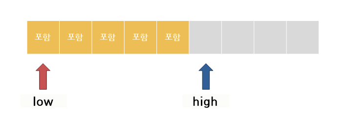

# 📝Two Pointer (투 포인터)


## 📌 핵심 요약

`"1차원 배열상에서 맨 앞과 맨 뒤를 가리키고 있는 2개의 포인터를 조작하면서 원하는 구간을 탐색하는 기법"`


## 📌 설명

* 2020 상반기 기준 코딩테스트에서 자주 보이는듯 하다.
* 백준 문제(https://www.acmicpc.net/problem/2003)를 풀며 익혀보자.


## 📌 문제 풀이

* 해당 백준 문제는 N개의 원소를 포함하는 1차원 배열상에서 연속된 구간합이 M이 되는 구간이 몇 개인지 구하는 문제다.


## 📌 알고리즘



* 투 포인터는 맨 앞, 맨 뒤를 가리키는 두 개의 포인터를 사용한다.
  * low : 맨 앞을 가리키는 포인터, 가르키는 원소를 구간에 포함한다.
  
  * high : 맨 뒤를 가리키는 포인터, 가르키는 원소를 구간에 포함하지 않는다.
  
* 투 포인터는 [low , high) 반 열린 구간을 표현한다.
  
* 알고리즘은 아래와 같다.

  1. low , high변수를 0으로 초기화 한다.
  2. 현재 구간 값이 조건 이상이라면, low를 증가시켜 구간을 줄여본다.
  3. 현재 구간 값이 조건 미만이라면, 
  	 3-1. high가 배열 범위를 초과한다면, 투 포인터 탐색을 중지한다.(더 이상 만족하는 구간이 없는 경우)
      3-2. high가 배열 범위를 초과하지 않는다면, high를 하나 증가 시켜서 구간을 늘려본다.
  4. 현재 구간 [low, high) 이 조건을 만족하면, 이에 따른 처리를 한다.
  
  
  
* 코드는 다음과 같다.

  ```c++
  #include <iostream>
  using namespace std;
   
  int main(){
      int n, m, arr[10000];
      cin >> n >> m;
      for(int i=0; i<n; i++)
          cin>>arr[i];
      
      int low = 0, high = 0,ret = 0, sum = 0;
      
      while(1){
          if(sum >= m) // 현재 구간합이 조건 값 이상이라면,
              sum -= arr[low++]; // 맨 앞 포인터를 증가시켜 구간을 줄여본다.
          else if(high == n) // 현재 구간 값이 조건 값 미만이고 맨 뒤 포인터가 범위를 초과하면,
              break; // 구간 탐색을 중지한다.
          else // 현재 구간 값이 조건 값 미만이면, 맨 뒤 포인터를 하나 증가시켜 구간을 늘려본다.
              sum += arr[high++];
          
          if(sum == m) // 현재 구간 값이 조건에 만족하는 경우 카운트한다.
              ret++;
      }
      cout << ret;
  }
  ```


## 🤔 참고

https://m.blog.naver.com/kks227/220795165570