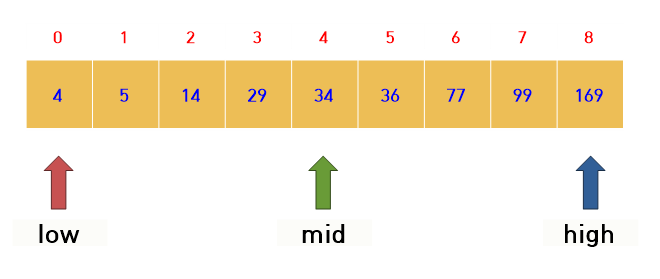
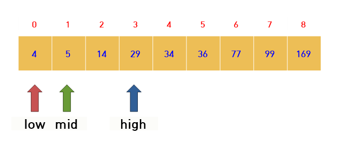
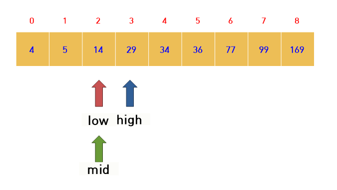

# 📝Binary Search (이분탐색)

## 📌 설명

- 오름차순으로 정렬된 리스트에서 특정한 값의 위치를 찾는 알고리즘이다.
- 탐색 범위를 반씩 줄여가면서 탐색하기 때문에 O(logN) 시간이 걸린다.


## 📌 알고리즘



* low는 탐색하고자 하는 대상에서 가장 작은 값(왼쪽)을 가리킨다.
* high는 탐색하고자 하는 대상에서 가장 큰 값(오른쪽)을 가리킨다.

- mid는 탐색하고자 하는 대상의 중간 위치를 가리킨다. (`mid = (low+high) / 2`)
- 위 배열에서 14를 찾는다고 하자
  - 현재의 mid 값과 찾고자하는 원소의 값 14와 비교한다.
  - mid값이 더 크다면, high를 mid - 1로 바꾼다.
  - 
  - 다시 과정을 반복한다.
  - 현재 mid값 5보다 찾고자 하는 14가 더 크다.
  - mid값이 더 작다면, low를 mid + 1로 바꾼다. 
  - 
  - 다시 현재 mid 값과 low 값을 비교한다. 찾고자 하는 값 14가 mid 위치에 있으므로 탐색을 종료한다.


* 소스코드는 다음과 같다.

  ```c++
  int binarySearch(int num, int low, int high) {
  	while (low <= high) {
  		int mid = (low + high) / 2;
  		if (arr[mid] == num) //arr에 num이 존재한다면, index 반환
  			return mid;
  		else if (arr[mid] > num) {
  			high = mid - 1;
  		}
  		else if (arr[mid] < num) {
  			low = mid + 1;
  		}
  	}
  	return -1; //arr에 num이 존재하지 않는다면, -1 반환
  }
  ```

<br>