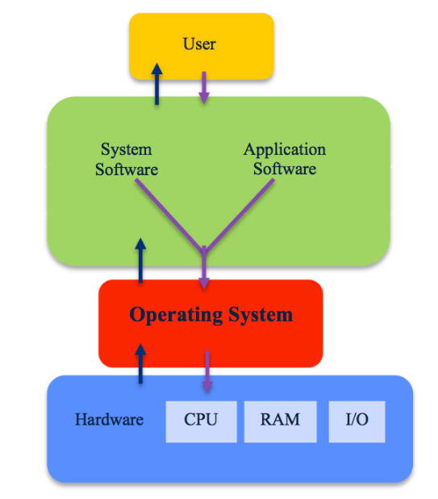
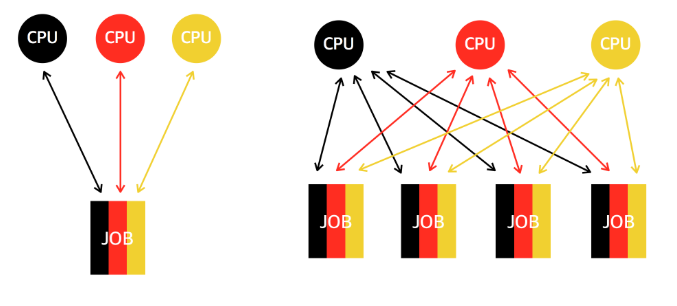

 

# 📝운영체제 개요

## 📌 운영체제의 정의

* **운영체제(Operating system)**는 컴퓨터 하드웨어 바로 윗단에 설치되는 소프트웨어다.
* 운영체제는 하드웨어와 다른 모든 소프트웨어 및 사용자를 연결 해주는 소프트웨어 계층이다. 
* 운영체제는 소프트웨어이기 때문에 실행되기 위해서는 메모리에 올라가야한다.
* 이때 메모리에 상주하는 운영체제의 핵심적인 부분을  [커널(Kernel)](https://ko.wikipedia.org/wiki/%EC%BB%A4%EB%84%90_(%EC%BB%B4%ED%93%A8%ED%8C%85))이라고 부른다.

## 📌 운영체제의 기능

* **컴퓨터 시스템 내의 자원(resource)을 효율적으로 관리**
  * 자원이란 CPU, 메모리, 하드디스크, 소프트웨어 자원을 통칭한다. 
  * OS는 자원들을 효율적으로 관리하여 가장 좋은 성능을 내도록 한다.
  * 사용자 및 프로그램들 간에 자원을 형평성 있게 분배하는 역할도 한다.
* **컴퓨터 시스템을 편리하게 사용할 수 있는 환경을 제공**
  * 하드웨어를 직접 다루는 복잡한 부분은 OS가 대행한다.
  * 사용자 및 프로그램은 그에 대한 자세한 내용을 알지 못해도 프로그램을 실행할 수 있도록 해준다.
* **악성 프로그램에 대해 사용자와  운영체제 자신을 보호**

## 📌 운영체제의 분류 

* **일괄처리 (batch processing)**
  * 작업 요청의 일정량을 모아서 한꺼번에 처리하는 시스템
  * 작업이 완전히 종료될때까지 기다려야한다.
  * ex) 천공 카드 처리 시스템
* **시분할(time sharing)**
  * 여러 작업을 수행할 때 컴퓨터 처리 능력을 일정한 시간 단위로 분할하여 사용하는 시스템
  * 일괄처리 시스템에 비해 짧은 응답 시간을 가진다.
* **실시간(Realtime OS)**
  * 정해진 시간 안에 어떠한 작업이 반드시 종료되는 것이 보장되어야 하는 실시간 시스템을 위한 OS
  * ex) 원자로 제어, 미사일 제어, 반도체 장비 제어 등

## 📌 Multi- 

* **Multi-Processing (멀티 프로세싱)**
  
  * 다수의 CPU(프로세서)가 협력적으로 작업들을 동시에 처리하는 것
  * 각 프로세서는 다수의 프로세스를 처리하고, 각 프로세스는 다수의 프로세서에 의해 처리된다.
  * 하나의 프로세서가 고장나도 작업이 멈추지 않는다는 장점이 있다. 
  * 멀티 프로세싱에는 SMP와 AMP 두 종류가 있다.
* **Multi-Programming (멀티 프로그래밍)**
  * 메모리 공간을 분할해 여러 프로그램들을 동시에 메모리에 올려놓고 처리하는 것
  * 예를들어 A라는 프로세스를 처리하던중 I/O 이벤트가 발생하여 대기하는 경우 대기 하는동안 메모리에 적재된 다른 프로세스를 처리한다.
  * 프로세서를 효율적으로 사용할 수 있다.
* **Multi-Tasking  (멀티 태스킹)**
  * 다수의 작업을 운영체제 스케줄링에 의해 번갈아가며 처리하는 것
  * 시분할 시스템에서 사용되며, 사용자에게 다수의 작업이 동시에 처리되는 것처럼 느끼게 할 수 있다.
* **Multi-Threading  (멀티 쓰레딩)** 
  * 프로세스의 작업을 여러 개의 쓰레드로 나누어 병렬로 처리하는 것

 

------

# 🔎 출처 & 더 알아보기 

  * [운영체제 · 멀티 프로세싱, 멀티 프로그래밍, 멀티 태스킹](https://rebas.kr/850?category=785307)

  * [스레드와 프로세스, 멀티프로그래밍,멀티태스킹,멀티스레딩,멀티프로세싱](https://doorbw.tistory.com/26)

  * [멀티 프로그래밍(위키백과)](https://ko.wikipedia.org/wiki/다중_프로그래밍)

  * [멀티 프로세싱이란?](https://donghoson.tistory.com/15#:~:text=%EB%B0%94%EB%A1%9C%20%EB%8C%80%EC%B9%AD%ED%98%95%20%EB%A9%80%ED%8B%B0%20%ED%94%84%EB%A1%9C%EC%84%B8%EC%8B%B1(SMP,%EC%9D%84%20%EC%88%98%ED%96%89%ED%95%98%EB%8A%94%20%EA%B2%83%EC%9D%84%20%EB%A7%90%ED%95%A9%EB%8B%88%EB%8B%A4.))

  * [멀티 프로세싱의 종류 : SMP와 AMP](https://myfreechild.tistory.com/entry/SMPSymmetric-MultiProcessing-vs-AMPAsymmetric-MultiProcessing)

    

