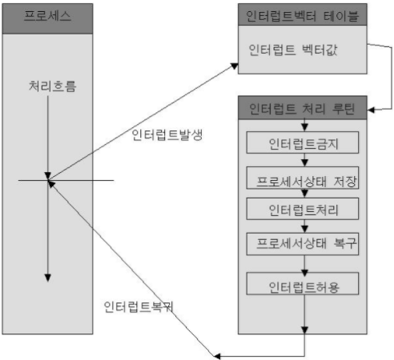

 

# 📝Computer System Structure

## 📌 컴퓨터 시스템의 구조

* 컴퓨터 시스템 구조는 CPU, 메모리와 I/O 장치인 디스크, 키보드, 마우스, 모니터, 네트워크 장치 등으로 구성된다.
* 메모리 및 I/O 장치 등의 각 하드웨어 장치에는 컨트롤러가 붙어있다.
* 컨트롤러는 일종의 작은 CPU로서 각 장치를 제어한다.
  * ex) 메모리 컨트롤러, 디스크 컨트롤러
* 프로그램이 수행되려면 그 프로그램은 메모리에 올라가있어야 한다.
* 운영체제 중 항상 메모리에 올라가 있는 부분은 전체 운영체제 중 핵심적인 부분에 한정되며, 이 부분을 **커널(Kernel)**이라고 한다.

## 📌 CPU 연산과 I/O 연산

- I/O 장치의 연산은 I/O 장치 컨트롤러가 수행한다.
- 컴퓨터 내에서 수행되는 연산은 CPU가 담당한다.
- 입출력 장치와 CPU는 동시 수행이 가능하다.
- 각 장치에 붙어있는 장치 컨트롤러는 장치로 들어가고 나오는 데이터를 임시 저장하기 위한 작은 메모리를 가지고 있다. 이를 로컬 버퍼(local buffer)라고 부른다.
- 디스크나 키보드 등에서 데이터를 읽어오는 경우, 우선 로컬버퍼에 데이터가 임시로 저장된 후 메모리에 전달된다. 
- 예를들어 프로그램 B가 수행중에 디스크에서 데이터를 읽어 오라는 명령을 내리면, 디스크 컨트롤러가 물리적인 디스크에서 내용을 읽어드려 이를 로컬 버퍼에 저장한다.
- 원하는 데이터를 읽어오면 CPU는 다음 일을 수행할 수 있다.
- 이때 로컬 버퍼로 데이터를 읽어오는 작업이 끝나면 장치에 있는 컨트롤러가 **인터럽트**를 발생 시켜 CPU에게 보고한다.
- CPU는 명령 하나를 수행할 때마다 인터럽트 라인을 확인하며 인터럽트가 발생했는지 확인하고, 발생했으면 다음 명령을 수행하기 전에 인터럽트 처리를 한다.

 

##  📌 인터럽트의 일반적 기능

- 인터럽트는 컴퓨터 작업 도중 CPU의 서비스가 필요할 때 이를 통보하는 것을 말한다.
- 예를들어 외부 입출력 장치가 요청 받은 데이터를 모두 로컬버퍼로 옮겼을 때, 인터럽트를 발생시켜 CPU에게 보고한다.
- 인터럽트가 발생하면 CPU 옆에 위치하는 인터럽트 라인이 세팅된다.
- CPU는 매 시점 메모리에서 명령을 하나씩 읽어와서 수행할때마다 자신의 옆에있는 인터럽트 라인을 확인하는데, 이때 인터럽트 라인이 세팅 되어있으면 인터럽트가 발생한 것을 알아 차린다.

- 운영체제 커널에는 인터럽트가 발생했을때 해야할 일이 미리 다 프로그래밍되어 있다.
- 운영체제 커널 내에 있는 인터럽트 처리루틴은 다양한 인터럽트에 대해 각각 처리해야 할 업무들을 정의하고 있다.
- 예를들어 디스크 컨트롤러가 인터럽트를 발생시키면, CPU는 하던일을 잠시 멈추고, 이 인터럽트가 발생했을 때 수행하도록 정의된 코드를 찾아서 수행한다. 이를 **인터럽트 처리루틴** 또는 **인터럽트 핸들러**라고 한다.
- 하드웨어 인터럽트는 하드웨어 장치 컨트롤러가 CPU의 인터럽트 라인을 세팅하지만, 소프트웨어 인터럽트는 소프트웨어가 직접 인터럽트 라인을 세팅한다.
- 인터럽트가 발생하면 CPU는 하던 일을 멈추고 운영체제 커널의 인터럽트 벡터에서 해당 인터럽트에 대한 인터럽트 처리 루틴을 찾는다.
- **인터럽트 벡터**란 인터럽트와 인터럽트에 대한 처리 루틴 정보를 가지고 있는 일종의 테이블이다.
- 인터럽트 처리 루틴을 통해 인터럽트를 처리하면, 원래 수행하던 작업으로 돌아가 작업을 수행한다.
- 통상적으로 인터럽트는 하드웨어 인터럽트를 의미한다. 소프트웨어 인터럽트는 트랩(trap)이라고 불린다.
- 소프트웨어 인터럽트의 예로는 예외상황(exceptio)이나 시스템 콜(system call)등이 있다.
- 인터럽트를 아래와 같이 분류해볼 수 있다. 

### 외부 인터럽트(Hardware Interrupt)

- 전원 이상 인터럽트(Power fail interrupt) : 정전, 파워 이상 등
- 기계 착오 인터럽트(Machine check interrupt) : CPU의 기능적인 오류
- 외부 신호 인터럽트
  - 타이머 인터럽트
  - 키보드로 인터럽트 키를 누른 경우(Ctrl + Alt  + Del)
  - 외부장치로부터 인터럽트 요청이 있는 경우
- 입출력 인터럽트(I/O Interrupt)
  - 입출력장치가 데이터 전송을 요구하거나 전송이 끝나 다음 동작이 수행되어야 할 경우
  - 입출력 데이터에 이상이 있는 경우 

### 내부 인터럽트(Exception)

- 잘못된 명령이나 잘못된 데이터를 사용할때 발생하며 Trap이라 부른다.
- 프로그램 검사 인터럽트 
  - Division by zero
  - Overflow/Underflow
  - 기타 Exception

### S/W 인터럽트

- System call(Supervisor call) 호출시

### 인터럽트 동작 절차

 

## 📌 인터럽트 핸들링

- 프로그램 A가 실행되고 있을 때 인터럽트가 발생하면 A의 현재 상태를 먼저 저장한다.
- CPU에서 명령이 실행될 때는  CPU 내부에 있는 임시 기억장치인  레지스터(register)에 데이터를 읽거나 쓰면서 작업을 하는데, 인터럽트가 발생하기전에 레지스터 상태를 저장해야한다.
- 운영체제는프로세스의 상태를 PCB라는 자료구조에 메모리 주소, 레스터 값, 하드웨어 상태 등을 저장한다.

## 📌 입출력 구조

- 입출력(I/O)이란 컴퓨터 시스템이 외부 I/O 장치들과 데이터를 주고 받는 것을 말한다.
- 입출력 방식에는 **동기식 입출력**과 **비동기식 입출력**이 있다.
- 동기식 입출력(synchronous I/O)은 어떤 프로그램이 입출력 요청을 했을 때 입출력 작업이 완료된 후에 그 프로그램이 다음 작업을 수행할 수 있는 방식을 말한다. 
- 동기식 입출력을 요청한 프로그램은 입출력이 완료될 때까지 다음 명령을 수행할 수 없기 때문에 그동안 CPU가 낭비된다. 
- CPU의 효율적인 사용을 위해 입출력이 수행되는 동안 해당 프로그램은 block 시키고 다른 프로그램에게 CPU를 양도한다. 
- 이렇게 되면 동시에 다수의 입출력이 발생할 수 있는데, 동기화를 해줘야한다. 장치마다 큐를 두어 요청된 순서대로 처리할 수 있도록 한다.
- 비동기식 입출력(asynchronous I/O)은 입출력 연산을 요청한 후에 연산이 끝나기를 기다리는 것이 아니라 CPU의 제어권을 입출력 연산을 호출한 그 프로그램에게 곧바로 부여한다. 프로그램은 I/O 연산이 필요없는 부분을 먼저 수행한다.
- 일반적으로는 운영체제에게 입출력을 요청할 경우 해당 프로그램의 입출력이 완료될 때까지 그 프로그램을 block 시키는 동기식 입출력을 사용한다. 

## 📌 DMA

- 장치의 컨트롤러가 CPU에게 인터럽트를 발생시키면 CPU는 장치 컨트롤러의 로컬버퍼와 메모리 사이에서 데이터를 옮기는 일을 한다.
- 한편 모든 메모리 접근 연산이 CPU에 의해서만 이루어질 경우, 입출력 장치가 메모리 접근을 원할 때마다 인터럽트에 의해  CPU의 업무가 방해를 받게 되어 CPU 사용의 효율성이 떨어지는 문제가 생긴다.
- 이러한 비효율을 극복하기 위해  CPU 이외에 메모리 접근이 가능한 장치를 한 더 두는데, 이를 DMA라고 부른다.
- DMA는 일종의 컨트롤러로서, CPU가 입출력 장치들의 메모리 접근 요청에 의해 자주 인터럽트 당하는 것을 막아준다. 
- DMA는 로컬버퍼에서 메모리로 데이터를 읽어오는 작업을 CPU가 담당하는 것이 아니라 DMA가 대행한다. 
- DMA는 바이트(byte) 단위가 아니라 블록(block)이라는 큰 단위로 메모리로 정보를 읽어온 후, CPU에게 인터럽트를 발생시켜 해당 작업의 완료를 알려준다.
- 이처럼 DMA를 사용하면, CPU에 발생하는 인터럽트의 빈도를 줄여 CPU를 좀 더 효율적으로 관리하고 입출력 연산을 빠르게 수행할 수 있게 된다.

## 📌 저장장치의 구조

- 주기억장치
  - 주기억장치는 보통 메인 메모리라고 부르며 전원이 나가면 저장되었던 내용이 모두 사라지는 휘발성(volatile)의 RAM을 매체로 사용하는 경우가 대부분이다.
- 보조기억장치 
  - 보조기억장치는 전원이 나가도 저장된 내용을 기억할 수 있는 비휘발성(unvolatile)의 마그네틱 디스크를 주로 사용한다.
  - 보조기억장치의 용도는 크게 두 가지로 구분된다.
    - 파일 시스템용 : 전원이 나가도 유지해야할 정보가 있으면 그것을 파일 형태로 보조기억장치에 저장하기된다. 
    - 메모리의 연장 공간 : 메모리는 크기가 한정되고 비싸다. 그러므로 다수의 프로그램이 메모리에 올라가 동시에 수행되는 현대의 컴퓨터 환경에서는 메모리 공간이 부족한 경우가 흔히 발생한다. 이 경우 OS는 프로그램 수행에 당장 필요한 부분만 메모리에 올려놓고 그렇지 않은 부분은 디스크의 스왑영역에 내려놓게 된다. 이처럼 디스크에 내려놓는 일을 스왑 아웃(swap out)시킨다고 말한다. 스왑 아웃된 부분이 필요할 때는 다시 메모리 영역으로 올린다.

## 📌 저장장치의 계층구조

- 컴퓨터 시스템을 구성하는 저장 장치는 빠른 저장장치부터 느린 저장장치까지 단계적인 계층 구조로 이루어진다. 
- 빠른 저장장치는 가격이 비싸기 때문에 적은 용량을 사용하고, 느린 저장장치는 가격이 저렴해 대용량을 사용한다.
- 따라서 당장 필요한 정보를 빠른 저장장치에 넣어두어 수행 속도를 높이고 그렇지 않은 정보는 상대적으로 느린 저장장치에 보관하게된다. 
- 저장장치 계층은 최상위의 CPU 내부에 존재하는 레지스터(register)부터 캐시 메모리(cache memory), 메인 메모리(main memory) 등의 휘발성 저장장치로 구성되는 부분이 상위 계층에 존재하며 이 부분에 저장되는 정보는 전원이 나가면 그 내용이 사라진다.
- 반면 하위 계층을 구성하는 비휘발성 저장장치다.
- 상위 저장장치는 접근 속도가 월등히 빠르지만 용량은 상대적으로 적다. 하지만 당장 필요한 정보만을 선별적으로 저장하면 하위에 있는 큰 용량의 저장장치를 가지고 있는 것과 비슷한 성능 효과를 낼 수 있다.
- 예를 들어 캐시 메모리는 레지스터와 메인 메모리 사이에 존재하며, 여러 가지 캐싱 기법을 이용해 적은 용량의 캐시 메모리를 사용해도 메인 메모리와 같이 큰 용량을 가진 것처럼 효율적으로 동작하도록 관리할 수 있다.
- **캐싱 기법**이란 상대적으로 느린 저장장치에 있는 내용 중 당장 사용되거나 빈번히 사용될 정보를 빠른 저장장치에 선별적으로 저장함으로써 두 저장장치의 사이의 속도를 완충 시키는 것이다.
- 이와 같은 캐싱 기법이 적은 용량으로도 효과를 거둘 수 있는 것은 컴퓨터 내의 데이터나 프로그램을 구성하는 모든 부분이 균일하게 사용되는 것이 아니라 일부분만이 집중적으로 사용되고 특정 부분은 거의 사용되지 않기 때문이다.
- 예를 들어 프로그램 코드 중에는 많은 횟수 동안 반복되는 코드와, 한 번 수행되고 끝나는 부분이 있을 수 있다. 이런 경우 반복되는 코드를 빠른 저장장치에 올려놓으면 적은 저장공간만으로도 전체 시스템의 평균적인 성능을 향상시킬 수 있다. 

## 📌 하드웨어 보안

- 우리가 흔히 사용하는 운영체제는 여러 프로그램이 동시에 실행될 수 있는 다중 프로그래밍(multi-programming) 환경에서 동작한다. 
- 그러므로 다른 프로그램이 다른 프로그램의 실행을 발해하거나 프로그램 간에 충돌을 일으키는 문제를 막기 위해 하드웨어에 대한 각종 보안 기법이 필요하다.
- 하드웨어적인 보안을 유지하기 위해서 운영체제는 기본적으로 **커널모드**와 **사용자모드** 두 가지 모드를 지원한다.
- 어떤 프로그램이 이상한 명령을 수행하여 다른 프로그램의 메모리 영역이나 파일 영역을 침범하는 경우가 발생할 수 있다.
- 따라서 중요한 정보에 접근해 위험한 상황을 초래할 수 있는 연산은 커널모드에서만 실행되도록 하여 일반 사용자 프로그램이 직접 위험한 명령을 수행하지 못하게 하고, 그렇지 않은 일반적인 연산만 사용자모드에서 사용자 프로그램이 수행하도록 통제하여 보안성을 확보하게 된다.
- 커널모드는 운영체제가 CPU의 제어권을 가지고 운영체제 코드를 실행하는 모드로써, 이 모드에서는 모든 종류의 명령을 다 실행할 수 있다. 
- 반면 사용자 모드에서는 일반 사용자 프로그램이 실행되며 제한적인 명령만 수행할 수 있다.
- 시스템에 중요한 영향을 미치는 연산은 커널모드에서만 실행 가능하도록 함으로써 하드웨어의 보안을 유지하는 것이다. 
- 컴퓨터 시스템은 CPU 내부에 모드비트(mode bit)를 두어 사용자 프로그램을 감시한다. 모드비트가 0으로 세팅되어 있으면 커널모드로서 모든 명령을 수행할 수 있고, 모드비트가 1로 세팅되어 있으면 사용자 모드로서 제한된 명령만을 수행할 수 있다. 
- 사용자 프로그램이 수행되다가 하드웨어 접근 등 보안이 필요한 중요한 명령을 수행해야할 경우, **시스템 콜**을 통해 운영체제가 대신해줄 것을 요청한다. 그러면 CPU 의 제어권은 다시 운영체제로 넘어가게 된다. 
- 인터럽트가 발생할 때 사용자 프로그램의 모드 비트는 자동으로 0이되고, 운영체제는 서비스에 필요한 모든 종류의 명령을 다 수행할 수 있게된다. 요청된 작업이 모두 끝난 후에는 모드비트를 다시 1로만들어 사용자 프로그램에게 CPU를 넘겨준다. 
- 사용자 프로그램이 디스크에 저장된 파일에 자유롭게 접근할 수 있다면 보안상 문제가 발생할 수 있다. 자신의 소유가 아닌 다른 사람의 파일에 접근할 수 있기 때문이다. 
- 따라서 모든 입출력 명령은 특권명령으로 규정해서 사용자 프로그램이 직접 입출력을 하는 것을 차단한다. 그리고 입출력이 필요할 때는 운영체제에 요청하여 운영체제가 입출력 명령을 대신 수행하게 한다.

## 📌 메모리 보안

- 디스크뿐 아니라 메모리의 경우에도 보안이 필요하다. 이는 여러 프로그램이 메모리에 동시에 올라가서 실행되기 때문에 하나의 사용자 프로그램이 다른 사용자 프로그램이나 운영체제가 위치한 메모리 영역을 침범할 수 있기 때문이다. 
- 예를들어 어떤 사용자 프로그램이 C 언어의 포인터 등 메모리 주소 참조 연산을 잘못 사용해 다른 사용자 프로그램의 메모리 영역이나 운영체제 커널이 위치한 영역을 참조하려는 시도를 할 수 있다. 따라서 적어도 인터럽트 벡터와 인터럽트 처리루틴이 있는 곳은 각별한 보안이 필요하다.
- 사용자 프로그램이 인터럽트 처리루틴을 접근하거나 변경할 수 있을 경우 운영체제만 수행할 수 있는 특권명령을 보안성이 침해되는 이상한 명령으로 변형할 수 있기 때문이다.
- 이러한 문제를 해결하기 위해 2개의 레지스터를 사용해서 프로그램이 접근하려는 메모리 부분이 합법적인지 체크함으로써 메모리를 보호할 수 있다. 
- 이때 사용되는 2개의 레지스터는 기준 레지스터(base register)와 한계 레지스터(limit register)이다. 
- 사용자 프로그램은 기준 레지스터에 있는 주소부터 기준 레지스터+한계 레지스터 값사이의 주소 영역에만 접근할 수 있으며, 접근하려는 주소가 이 범위 안에 없으면 불법적인 메모리 접근이므로 예외상황이라는 일종의 소프트웨어 인터럽트를 발생시켜 CPU의 제어권을 해당 프로그램으로부터 운영체제로 이양시키고, 운영체제는 예외상황을 발생시킨 프로그램을 강제 종료시킨다.
- 기준 레지스터는 어떤 프로그램이 수행되는 동안 그 프로그램이 합법적으로 접근할 수 있는 가장 적은 주소를 보관하고 있고, 한계 레지스터는 그 프로그램이 기준 레지스터값부터 접근할 수 있는 메모리의 범위를 보관하고 있다.
- 메모리 접근 연산은 사용자 프로그램이 CPU를 가지고 있는 동안 수행할 수 있는 연산이므로 특권명령은 아니다. 다만 사용자 프로그램이 메모리에 접근하기 전에 하드웨어적으로 그 접근이 합법적인지를 체크하여 메모리를 보호하게 된다.  하지만 기준 레지스터와 한계 레지스터의 값을 세팅하는 연산은 특권 명령이다.

## 📌 CPU 보호

- CPU가 하나의 프로그램에 의해 독점되는 것을 막기 위해 운영체제는 타이머(timer)라는 하드웨어를 사용한다. 
- 타이머는 정해진 시간이 지나면 인터럽트를 발생시켜 운영체제가 CPU의 제어권을 획득할 수 있도록 하는 역할을 수행한다. 
- 타이머에 의해 발생되는 인터럽트 처리루틴의 역할은 지금 CPU를 점유하고 명령을 실행 중인 프로그램으로부터 CPU를 빼앗아 다른 프로그램에게 CPU를 이양하는 것이다. 
- 타이머는 시분할 시스템에서 현재 시간을 계산하기 위해서도 사용된다. 

## 📌 시스템 콜을 이용한 입출력 수행

- 입출력에 관련된 명령은 모두 특권 명령이므로 사용자 프로그램이 직접 수행할 수 없다. 이러한 입출력 명령은 운영체제 코드에 구현되어 있으며, 사용자 프로그램은 직접 입출력을 수행하는 대신 운영체제에게 시스템 콜이라는 서비스 대행 요청을 하여 입출력을 수행한다.
- 시스템 콜은 일종의 소프트웨어적인 인터럽트로서 사용자 프로그램이 시스템 콜을 할 경우 트랩이 발생해 CPU의 제어권이 운영체제로 넘어가게된다. 그러면 운영체제는 해당 시스템 콜을 처리하기 위한 루틴으로 가서 정의된 명령을 수행한다. 
- 예를 들어 시스템 콜이 디스크 입출력 요청이었다면, 디스크 컨트롤러에게 입출력 요청을 수행하도록 명령하고, 추후에 디스크 컨트롤러가 입출력 수행을 마치면 CPU에게 인터럽트를 발생시켜 입출력이 완료되었음을 알려줌으로써 해당 프로그램이 다시 CPU를 할당 받을 수 있도록 한다. 

 

------

# 🔎 출처 & 더 알아보기 

  * [운영체제와 정보기술의 원리(개정판)](https://book.naver.com/bookdb/book_detail.nhn?bid=16345019)
  * [KOCW 운영체제-반효경](http://www.kocw.net/home/search/kemView.do?kemId=1046323)
  * [인터럽트의 종류](https://jhnyang.tistory.com/167)
  * [인터럽트 종류와 처리과정과 우선순위](https://medium.com/@lazypanda43/%EC%9D%B8%ED%84%B0%EB%9F%BD%ED%8A%B8-%EC%A2%85%EB%A5%98%EC%99%80-%EC%B2%98%EB%A6%AC%EA%B3%BC%EC%A0%95%EA%B3%BC-%EC%9A%B0%EC%84%A0%EC%88%9C%EC%9C%84-c95c26909472)

