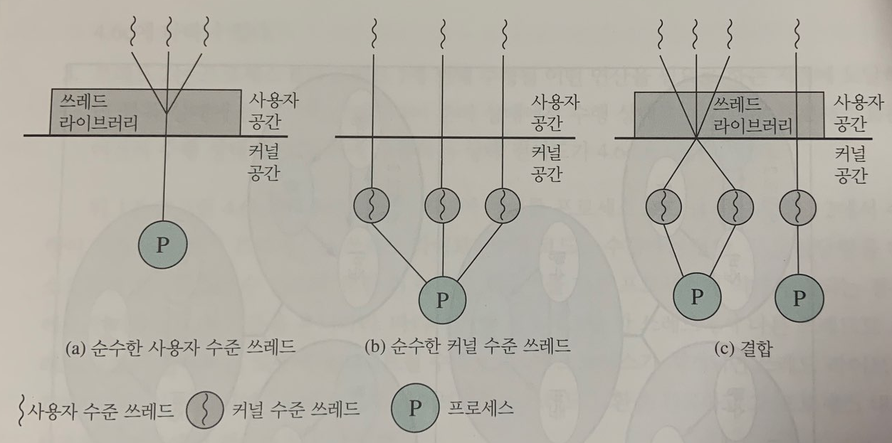

<br>

# 📝Program

- [프로그램](https://ko.wikipedia.org/wiki/%EC%BB%B4%ED%93%A8%ED%84%B0_%ED%94%84%EB%A1%9C%EA%B7%B8%EB%9E%A8)은 특정 작업을 수행하는 일련의 명령어들의 모음이다. 
- 대부분의 프로그램은 하드디스크 등의 매체에 바이너리 형식의 파일로 저장되어 있다가 사용자가 실행 시키면 메모리로 적재되어 실행된다. 

<br>

# 📝Process

- 프로세스는 아래와 같이 정의된다.
  - 메모리에 적재되어서 실행중인 프로그램
  - 운영체제로부터 자원을 할당 받는 작업의 단위 (자원의 예로는 CPU를 할당받는 시간, Code, Data, Stack, Heap 등이 있다.)
  - 명령들의 순차 수행, 현재 상태, 연계된 시스템 자원들의 집합 등에 특정 지어지는 활성화 단위
- 프로세스는 독립적인 개체이며, 하나의 프로그램을 여러번 실행 시키면 여러개의 프로세스가 메모리에서 실행된다.

<br>

## 📌 프로세스 주소공간


<br>

### Code(Text) 영역 : 컴파일 타임에 할당

- 프로그램의 소스코드가 위치하는 영역이다.
- 형태는 Hex 또는 binary로 기계어다.  
- CPU는 코드 영역에 위치한 명령어를 하나씩 가져와서 처리한다.

<br>

### Data 영역 : 컴파일 타임에 할당

- 전역(global) 변수와 정적(static) 변수가 위치하는 영역이다.

- 프로그램의 시작과 동시에 할당되고 프로그램이 종료되어야 메모리에서 소멸된다.

- 데이터 영역에는 BSS(Block Stated Symbol)라는 영역이 존재한다.

- 초기화 되지 않거나, 초기화를 0으로 하거나, 초기화를 NULL로한 전역 변수와 정적 변수는 BSS 영역에 위치한다.

- BSS라는 영역이 왜 존재할까? 이는 공간을 효율적으로 활용하기 위해서다.

- 아래 코드를 보자. 배열 a의 크기는 400000 바이트다. 하지만 선언만하고 값이 들어있지 않기에 굳이 400000 바이트라는 공간을 할당할 필요가 없다. 따라서 a 배열의 크기와 이름에 대한 정보는 BSS에 올려서 공간을 효율적으로 활용한다. 

- ```c
  int a[100000]; // 전역으로 선언되었다고 가정하자.
  ```

<br>

### Heap 영역 : 런타임에 할당

- 프로그래머에 의해 메모리 공간이 동적으로 할당되고 해제되는 영역이다.
- C언어의 malloc(), free() 등의 함수를 생각해보자.
- 힙 영역은 메모리의 낮은 주소에서 높은 주소의 방향으로 할당된다.

<br>

### Stack 영역 : 런타임에 할당

- 지역(local) 변수와 매개 변수(parameter)가 위치하는 영역이다.
- 함수의 호출과 동시에 할당되고 함수의 호출이 완료되면 메모리에서 소멸된다.
- 함수가 호출되면 push 되고 함수가 종료되면 pop 되는 것이다.
- 스택 영역은 메모리의 높은 주소에서 낮은 주소의 방향으로 할당된다. 

<br>

> 컴파일 타임은 소스코드가 컴파일이라는 과정을 통해 기계어 코드로 변환되어 실행 가능한 프로그램이 되는데 걸리는 시간이다.
>
> 런타임은 컴파일 과정을 마친 기계어 형태의 프로그램이 실행되는 시간이다. 즉, 프로그램이 동작되는 시간이다.

<br>

## 📌 프로세스의 문맥(Context)

- 프로세스의 문맥이란 프로세스의 수행 상태에 대한 정보를 의미한다.
- 프로세스의 문맥은 어디에 쓰일까?
- 여러개의 프로세스가 번갈아가며 수행되는 시분할 시스템에서 각 프로세스는 짧은 시간동안 CPU를 사용하고 다른 프로세스에게 CPU를 넘겨주는 식으로 실행된다.
- 이때 CPU를 다른 프로세스로부터 넘겨 받아, 이전에 수행했던 작업을 이어서 수행하기 위해서 필요한 정보가 프로세스의 문맥이다.
- 프로세스의 문맥은 아래와 같이 3종류가 있다.
  - **하드웨어 문맥** : CPU의 수행 상태를 나타내는 것으로 프로그램 카운터값과 각종 레지스터에 저장하고 있는 값
  - **주소 공간** : Code, Data, Stack, Heap으로 구성되는 프로세스만의 독자적인 주소 공간
  - **커널상의 문맥** : 프로그램이 실행되어 프로세스가 되면 운영체제는 프로세스를 관리하기 위한 자료구조를 유지한다. 커널 스택과 PCB가 이에 해당한다. 
- **문맥 교환(context switch)**란 다음에 실행시킬 프로세스를 변경하기 위해 원래 수행 중이던 프로세스의 문맥을 저장하고 새로운 프로세스의 문맥을 세팅하는 과정을 뜻한다.

<br>

##  📌 프로세스의 상태

- New : 프로세스가 시작되어 그 프로세스를 위한 각종 자료구조는 생성되었지만 아직 메모리 획득을 승인받지 못한 상태
- Running : 프로세스가 CPU를 보유하고 기계어 명령을 실행하고 있는 상태
- Ready : CPU를 보유하면 당장 명령을 실행할 수 있지만 CPU를 할당 받지 못한 프로세스의 상태
- Bloked(wait, sleep) : CPU를 할당 받더라도 당장 명령을 실행할 수 없는 프로세스의 상태 (예를들어, 프로세스가 요청한 입출력 작업이 진행중이어서 대기해야하는 경우)
- Terminated : 프로세스가 종료되었으나 운영체제가 그 프로세스와 관련된 자료구조를 완전히 정리하지 못한 상태 
- 준비 상태에 있는 프로세스 들중 하나가 CPU를 할당 받는 과정을 **CPU 디스패치**라고 한다.  

<br>

## 📌 프로세스 제어블록(Process Control Block, PCB)


- 프로세스 제어블록이란 운영체제가 시스템 내의 프로세스들을 관리하기 위해 프로세스마다 유지하는 정보를 담는 커널 내의 자료구조이다.
- PCB는 다음과 같은 요소로 구성되어 있다.
  - 프로세스의 상태
  - 프로그램 카운터의 값
  - CPU 레지스터의 값
  - CPU 스케줄링 정보
  - 메모리 관리 정보
  - 자원 사용 정보
  - 입출력 상태 정보

<br>

## 📌 문맥 교환(Context Switch)


- 문맥교환이란 하나의 사용자 프로세스로부터 다른 사용자 프로세스로 CPU 제어권이 이양되는 과정을 뜻한다.
- 문맥교환중에 원래 CPU를 할당받고 있었던 프로세스는 프로그램 카운터, 레지스터 값 등 프로세스 문맥을 자신의 PCB에 저장한다.
- 새롭게 CPU를 할당받을 프로세스는 자신의 PCB로부터 이전의 문맥을 실제 하드웨어로 복원시키는 과정을 거친다. 
- 문맥 교환은 문맥을 PCB에 저장하고, 문맥을 PCB로부터 불러 오는 두 가지 과정이 필요하므로 모드 변경에 비해 훨씬 큰 오버헤드를 갖는다.
- **문맥 교환 과정**
  - 시스템 콜이나 인터럽트가 발생하여 커널의 호출이 필요한 상황이 나타난다.
  - 프로그램 카운터와 레지스터 값 등 문맥 정보를 커널에 있는 해당 프로세스의 PCB에 저장한다.
  - 현재 프로세스의 상태를 바꿔준다. (running -> blocked or ready or exit)
  - 프로세스의 상태에 따라 PCB를 적절한 큐에 넣어준다. (블록큐, 레디큐 등)
  - 다음에 수행시킬 다른 프로세스를 선택한다.
  - 선택된 프로세스의 상태를 running으로 바꿔준다.
  - 선택된 프로세스의 문맥 정보를 복구한다.
  - CPU는 새롭게 선택된 프로세스를 수행한다.

<br>

## 📌 모드 변경(Mode Switch)


- 프로세스가 실행 상태일 때 시스템 콜이나 인터럽트가 발생하면 CPU의 제어권이 운영체제로 넘어와 원래 실행 중이던 프로세스의 업무를 잠시 멈추고 운영체제 커널의 코드가 실행된다.  이를 모드 스위치 이라고 한다.
- 이 경우에도 프로세스의 문맥 중 일부를 PCB에 저장하지만 이는 문맥 교환이 아니다. 
- 이는 프로세스의 실행 모드만이 사용자모드에서 커널모드로 바뀌는 것일 뿐 CPU를 점유하는 프로세스가 다른 사용자 프로세스로 변경되는 과정이 아니다. 
- 모드 스위칭만 하고 문맥 교환을 하지 않는 경우 현재 프로세스의 문맥 저장과 간단한 복원만 일어나기 때문에 오버헤드가 적다.
- **모드 스위칭 과정**
  - 시스템 콜이나 인터럽트가 발생하여 커널의 호출이 필요한 상황이 나타난다.
  - 현재 프로세스의 문맥중 일부를 PCB에 저장한다. 
  - 프로그램 카운터를 커널의 인터럽트 핸들러 프로그램의 시작 주소로 설정한다.
  - 사용자 모드를 커널 모드로 전환시켜서 인터럽트 핸들러를 수행하도록 한다.
  - 커널에 의해 인터럽트 처리가 완료되면, 이전에 수행중이던 프로세스로 복귀한다.

<br>

## 📌 프로세스를 스케줄링하기 위한 큐

- 운영체제는 Ready 상태에 있는 프로세스들을  Ready Queue에 줄 세워 놓고 차례대로 CPU를 할당한다.
- 준비 큐에 프로세스를 줄 세우는 방법은 CPU 스케줄링 방법에 따라 달라진다.
- 이외에도 운영체제는 특정 자원을 기다리는 프로세스들을 줄 세우기 위해 자원별로 장치 큐(device queue)를 준다. 
- 예를 들어 디스크에 입출력 서비스를 요청한 프로세스들은 디스크 입출력 큐(disk I/O queue)에 줄 서게 된다.
- 그러면 디스크 컨트롤러는 디스크 입출력 큐에 줄 서 있는 순서대로 프로세스들의 입출력 작업을 수행한다. 
- 프로세스별 입출력 작업이 완료되면 디스크 컨트롤러가 CPU에 인터럽트를 발생시키고, 인터럽트 처리 루틴에 의해 디스크 입출력이 완료된 프로세스는 입출력 큐에서 빠져나와  CPU를 기다리는 준비 큐에 줄 서게 된다.
- 공유자원에 대한 프로세스 동기화도 큐에 프로세스들을 줄세우는 방식을 취한다. 
- 이와 같이 프로세스의 상태 관리는 커널의 주소 영역 중 데이터 영역에 다양한 큐(queue)를 두어 수행하게 된다. 

<br>

## 📌 스케줄러

- 스케줄러란 어떤 프로세스에게 자원을 할당할지를 결정하는 운영체제 커널의 코드를 지칭한다.

- 스케줄러에는 장기 스케줄러, 중기 스케줄러, 단기 스케줄러가 있다.

<br>

### **장기 스케줄러**

​    

- 디스크 내의 작업을 어떤 순서로 메모리에 가져올지 결정한다.
- 디스크와 같이 저장장치에 작업들을 저장해놓고, 필요할 때 실행할 작업을 작업 큐에서 꺼내어 준비큐를 통해 메인 메모리에 적재한다. 
- 어떤 프로세스를 준비 큐에 진입시킬지 결정한다. 즉, 프로세스에게 메모리를 할당하는 문제에 관여한다.
- 현대의 시분할 시스템에서 사용되는 운영체제에서는 일반적으로 장기 스케줄러를 사용하지 않는다.
- 장기 스케줄러는 과거에 적은 양의 메모리를 사용하던 시절에 사용됐었다.

<br>

### **중기 스케줄러**

​    

- 현대의 시분할 시스템용 운영체제에서는 장기 스케줄러 대신 중기 스케줄러를 둔다.
- 중기 스케줄러는 너무 많은 프로세스에게 메모리를 할당해 시스템 성능이 저하되는 경우 이를 해결하기 위해 메모리에 적재된 프로세스의 수를 동적으로 조절하는 역할을 한다. 
- Swapping 기법을 활용한다. 
- 너무 많은 프로세스가 메모리에 적재되어 프로세스당 보유 메모리가 극도로 적어지면 중기 스케줄러는 메모리에 올라와 있는 프로세스 중 일부를 디스크로 swap out 시킨다.

<br>

### **단기 스케줄러**

​    

- CPU 스케줄러라고도 하며, 준비 큐(메모리)에 있는 여러 프로세스들 중 어떠한 프로세스에게 CPU를 할당할 것인가를 결정한다. 
- 단기 스케줄러가 프로세스를 선정하면 디스패처가 CPU를 해당 프로세스에게 할당한다.

<br>

## 📌 프로세스의 생성

- 운영체제가 모든 프로세스를 생성한다고 생각할 수 있지만 사실은 그렇지 않다.
- 시스템이 부팅된 후 최초의 프로세스는 운영체제가 직접 생성하지만 그 다음부터는 이미 존재하는 프로세스가 다른 프로세스를 복제하여 생성하게 된다. 
- 왜 복제해서 생성할까? 이는 프로세스를 새로 생성하고 새롭게 자원을 할당하는데 오랜 시간이 걸리기 때문이다. 따라서 이미 생성된 프로세스으로부터 자원을 물려받는 복제 형태로 생성한다.
- 이때 프로세스를 생성한 프로세스를 부모 프로세스라고 하고, 새롭게 생성된 프로세스를 자식 프로세스라고 한다. 
- 프로세스가 생성되면 자신만의 독자적인 주소 공간을 갖게된다. 
- 부모 프로세스가 자식 프로세스를 생성하면 자식 프로세스는 별도의 주소 공간을 갖게 되는데, 처음 주소 공간을 생성할 때는 부모 프로세스의 주소 공간 내용을 그대로 복사해서 생성한다. 
- 이후 자식 프로세스가 다른 프로그램을 수행하기 위해서는 생성된 주소 공간 위에 새로운 프로그램의 주소 공간을 덮어씌워 실행한다.
- 관련된 몇 가지 유닉스 시스템 콜 함수를 살펴보자
  - fork() : 자식 프로세스를 생성할 때 부모 프로세스의 내용을 그대로 복제 생성한다. 프로세스 ID를 제외한 모든 정보(커널 정보, 주소 공간 정보)를 그대로 복사한다.
  - exec() : 새로운 프로그램으로 주소 공간을 덮어씌운다.
  - exit() : 운영체제에게 자신이 종료됨을 알린다. 
  - abort() : 부모 프로세스가 자식 프로세스의 수행을 강제 종료 시킨다.
  -  wait() : 자식 프로세스가 종료되기를 기다리며 부모 프로세스를 block 시킨다. 

<br>

### C언어 fork 예제 1

```c
#include <stdio.h>
#include <unistd.h>

int main() {
	int x;
	x = 0;

	fork();

	x = 1;
	printf("PID : %ld,  x : %d\n", getpid(), x);

	return 0;
}

```

- 위 코드의 실행 결과는 아래와 같다. (리눅스 환경에서 gcc로 컴파일 했다.)

```text
PID : 2076,  x : 1

PID : 2077,  x : 1
```

- 자식 프로세스는 부모 프로세스와 동일한 주소 공간의 복사본을 가지게 된다.

<br>

### C언어 fork 예제 2

```c
#include <stdio.h>
#include <unistd.h>
#include <sys/types.h>

int main() {

	pid_t pid;

	int x;
	x = 0;

	pid = fork();

	if (pid > 0) {  // 부모 코드
		x = 1;
		printf("부모 PID : %ld,  x : %d, pid : %d\n", (long)getpid(), x, pid);
	}
	else if (pid == 0) {  // 자식 코드
		x = 2;
		printf("자식 PID : %ld,  x : %d, pid : %d\n", (long)getpid(), x, pid);
	}
	else {  // fork 실패
		printf("fork Fail! \n");
		return -1;
	}

	return 0;

}
```

- fork 함수는 부모 프로세스에게는 자식 프로세스의 PID를 반환한다.
- fork 함수는 자식 프로세스에게는 0을 반환한다. 
- 결과는 아래와 같다.

```text
부모 PID : 2093,  x : 1, pid : 2094

자식 PID : 2094,  x : 2, pid : 0
```

<br>

## 📌 프로세스간의 협력

- 원칙적으로는 하나의 프로세스가 다른 프로세스의 수행에 영향을 미칠 수 없다.
- 하지만 경우에 따라서 독립적인 프로세스들이 협력할 때 업무의 효율성이 증진될 수 있다. (부분적인 처리 결과나 정보를 공유, 처리속도의 향상 등)
- 따라서 운영체제는 프로세스간의 협력 메커니즘을 제공해 하나의 프로세스가 다른 프로세스의 수행에 영향을 미칠 수 있게 한다. 
- 프로세스 간의 협력 메커니즘을 위해 운영체제가 제공하는 대표적인 메커니즘은 IPC(Inter-Process Communication)이 있다. 
- IPC란 하나의 컴퓨터 안에서 실행 중인 서로 다른 프로세스 간에 발생하는 통신을 말한다. 
- 이러한 통신에서는 공유 데이터에 대해 동기화를 해줘야한다.
- IPC는 프로세스들 간의 통신과 동기화를 이루기 위한 메커니즘을 뜻한다.
- IPC의 대표적인 방법으로 **메세지 전달 방식**과 **공유 메모리 방식**이 있다.
- **메세지 전달 방식**
    - 메세지 통신을 하는 시스템은 커널에 의해 send와 receive라는 두 가진 연산을 제공받는다. 
      - 이 두 연산을 통해 프로세스는 전달할 메세지를 운영체제에게 시스템 콜 방식으로 요청해 전달할 수 있다.

      - 통신을 원하는 두 프로세스는 커뮤니케이션 링크를 생성한 후 send()와 receive()를 이용해 메세지를 주고 받는다. 

      - 메세지 전달 방식은 직접통신과 간접통신으로 나뉜다.

    - **직접통신**
      - 직접통신에서는 통신하려는 프로세스의 이름을 명시한다.
      
      - send(p, message) : 프로세스 p에게 메세지를 전송하는 것을 의미한다.
      
      - receive(Q, message) : 프로세스 Q로부터 메세지를 전달 받는 것을 의미한다.
    - **간접통신**
        - 간접통신에서는 메세지를 메일 박스 또는 포트로부터 전달 받는다.
        - 각 메일박스에는 고유 ID가 있으며 메일 박스를 공유하는 프로세스들만 서로 통신할 수 있다. 
        - 간접 통신에서 사용되는 커뮤니케이션 링크는 여러 프로세스 간에 메일 박스를 공유하는 경우에만 생성된다.
        - 하나의 링크가 여러 프로세스들에게 할당될 수 있고, 각 프로세스의 쌍은 여러 링크를 공유할 수 있다.
        - send(A, message) : A라는 메일박스에 메세지를 전송한다.
        - receive(A, message) : A라는 메일박스로부터 메세지를 전달 받는다.
- **공유 메모리 방식**
  - 공유 메모리 방식에서는 프로세스들이 주소 공간의 일부를 공유한다. 
  - 운영체제에는 공유메모리를 사용하는 시스템 콜을 지원하여 주소 공간을 공유할 수 있게한다. 
  - 공유 메모리 방식은 프로세스간의통신을 수월하게 만드는 인터페이스를 제공하지만 서로의 데이터에 일관성 문제가 발생할 수 있다.
  - 이에 대해서는 커널이 책임지지 않기 때문에 프로세스들끼리 동기화 문제를 책임져야 한다. 

<br>

# 📝Thread


## 📌 정의

- 쓰레드는 프로세스 내에서 실행되는 흐름의 단위다.
- 쓰레드는 프로세스의 특정한 수행 경로이다.
- 쓰레드는 프로세스가 할당받은 자원을 이용하는 실행의 단위이다.
- 쓰레드는 프로세스의 자원과 메모리를 공유한다.
  - 쓰레드간 효율적이 통신이 가능한다.
  - 쓰레드 생성이 빠르다.

<br>

## 📌 쓰레드 제어블록(Thread Control Block, TCB)


- 각 쓰레드는 별도의 스택과 쓰레드 제어블록을 가지고 있다.
- 쓰레드 제어블록에는 쓰레드 상태 정보, 레지스터 값, 우선순위 등의 정보를 포함한다.

<br>

## 📌 쓰레드의 장점과 멀티쓰레딩

- 장점 1 : 쓰레드끼리는 자원을 공유하기 때문에 쓰레드간 교환은 프로세스간 교환보다 더 빠르고이고 효율적이다.

  - **왜 더 빠를까?**
    - 쓰레드간에는 공유 데이터가 존재하기 때문에 빠르다. 공유되지 않는 부분만 교환하면 되기 때문이다.
  - **왜 더 효율적일까?**
    - 프로세스간 문맥 교환이 일어났을 경우 이전에 캐쉬에 저장되어 있던 데이터는 의미가 없게된다. 
    - 프로세스간에는 공유 데이터가 없기 때문이다. (A 프로세스의 캐쉬 데이터는 B 프로세스에서 무용지물이다.)
    - 하지만 쓰레드는 프로세스의 자원을 공유한다.
    - 쓰레드간 문맥교환이 일어났을 경우 이전 쓰레드의 공유자원에 대한 캐쉬 데이터는 의미 있는 정보다. (A 쓰레드의 캐쉬 데이터는 B 쓰레드에서도 의미가 있다.)
    - 정리하자면 쓰레드간에는 공유하는 데이터가 있기 때문에 문맥 교환이 일어났을 경우, 새롭게 교환되는 쓰레드가 이전의 캐쉬 데이터에 대한 이점을 볼 수 있다.

- 장점 2  : 프로세스간 통신은 커널이 개입 되어야 하지만 같은 프로세스 내의 쓰레드들은 메모리와 파일을 공유하기 때문에 커널호출 없이 효율적으로 서로 통신 할 수 있다.

- 장점 3 : 프로세스 생성(종료) 보다 쓰레드 생성(종료)가 더 빠르다. 

  - 프로세스 fork는 모든 정보를 자식에게 복사하는 반면, 쓰레드는 프로세스의 많은 부분을 공유하기 때문에 일부분만 복사해서 생성할 수 있다.

  - 아래는 fork()를 이용한 프로세스 생성과 pthread_create()를 이용한 thread 생성간의 비용을 비교한 표다.

   

- 이와 같은 장점으로 여러 개의 프로세스로 해야하는 작업을 하나의 프로세스에서 여러 개의 쓰레드로 나누어 수행한다. 이를 **멀티쓰레딩**이라고 한다.

- 하지만 프로세스의 공유 자원을 사용하는 쓰레드간에 race condition이 발생할 수 있기 때문에 쓰레드간 동기화가 필요하다. 또한 멀티쓰레딩은 디버깅이 까다롭다는 단점이 있다.

<br>

## 📌 쓰레드의 종류



<br>

### 사용자 레벨 스레드 (User-Level Thread)

- 프로그래머는 쓰레드 라이브러리를 사용해서 멀티쓰레딩 프로그램을 작성할 수 있다.
- 커널은 프로세스의 존재만 인식할 뿐, 프로세스 내의 쓰레드들의 존재를 알지 못한다.
- 쓰레드 라이브러리는 쓰레드의 생성과 제거, 쓰레드간 메세지와 데이터 전달, 쓰레드 스케줄링, 쓰레드간 교환 등에 대한 코드를 포함한다. 
- 쓰레드간 교환에서 커널은 프로세스 단위로 스케줄링을 한다. 
- 쓰레드간 context switching를 쓰레드 라이브러리에서 제공한다. 따라서 커널의 개입이 필요없다.
- 만약 한 프로세스의 특정 쓰레드가 입출력과 관련된 시스템 콜을 해서 block이 되면, 커널은 프로세스를 통째로 block 한다. 이때 나머지 쓰레드들도 block되는 단점이 있다.

<br>

### 커널 레벨 스레드 (Kernel-Level Thread)

- 커널은 쓰레드를 인식할 수 있고, 쓰레드 관리와 관련된 모든 작업이 커널에서 이루어진다.
- 쓰레드 단위로 스케줄링할 수 있는 장점이 있다. 멀티프로세서 환경에서 여러 쓰레드를 동시에 처리하게 할 수 있다. 
- 스케줄링은 커널이 쓰레드 단위로 진행하고, 이로인해 쓰레드간 context switch가 빈번하게 발생하는 오버헤드가 존재한다.

<br>

------


# 🔎 출처 & 더 알아보기 

  * [운영체제와 정보기술의 원리(개정판)](https://book.naver.com/bookdb/book_detail.nhn?bid=16345019)

  * [컴퓨터 프로그램 - 위키백과](https://ko.wikipedia.org/wiki/%EC%BB%B4%ED%93%A8%ED%84%B0_%ED%94%84%EB%A1%9C%EA%B7%B8%EB%9E%A8)

  * [프로세스 - 위키백과](https://ko.wikipedia.org/wiki/프로세스)

  * [프로세스와 쓰레드의 차이](https://github.com/WeareSoft/tech-interview/blob/master/contents/os.md#프로세스와-스레드의-차이)

  * [프로세스와 쓰레드에서의 컨텍스트 스위칭](https://agh2o.tistory.com/12)

  * [유저 레벨 쓰레드 / 커널 레벨 쓰레드](https://genesis8.tistory.com/242)

  * [쓰레드는 무엇이며, 왜 이용하는가](https://www.joinc.co.kr/w/Site/Thread/Beginning/WhatThread)

  * [2. Process](https://medium.com/ioxio/study-os-2-process-update-%EC%A4%91-c6fe324329be)

  * [메모리의 구조](http://tcpschool.com/c/c_memory_structure)

  * [컴파일 & 링킹 & 로더 과정](http://yimoyimo.tk/Linker-and-Loader/)

  * 이미지

      * [Memory Layout of C Programs](https://www.geeksforgeeks.org/memory-layout-of-c-program/)


   

