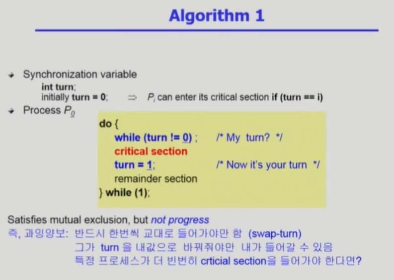

# 📝synchronization(동기화)

- 동기화는 여러 작업을 동시에 작동 시키기 위해 작업들 사이의 수행 시기를 맞추는 것이다.

<br>

# 📝Parallelism(병렬성)

- 실제로 동시에 작업이 처리가 되는 것이다.
- 멀티 프로세서 시스템에서 가능하다. 

<br>

# 📝Concurrency(병행성)

- 동시에 작업이 실행되는 것 처럼 느끼게 해주는 것이다.
- 한 개의 CPU가 다수의 프로세스들을 서로 번갈아 가며 수행시킨다. 이를 인터리빙이라고 한다.
- 매우 빠른 CPU의 처리 속도로 인해 인터리빙이 빠르게 이루어지기 때문에 사용자가 여러 프로그램이 동시작동 하는 것 처럼 느끼게 해준다. 

## 병행성의 문제점

- 컴퓨터에서 자주 쓰이는 변수 또는 함수는 모든 프로세스들이 접근 가능한 전역 메모리에 적재하여 공유한다.
- 하지만 병행성으로 인하여 이러한 프로세스간 메모리 공유는 문제를 야기할 수 있다.

### 예시


- 프로세스 P1 이 echo 함수를 호출한다. getchar 함수를 호출하여 사용자로부터 문자 'x'를 입력 받는다. 그리고 out 변수에 저장한다.

- 프로세스 P2가 P1을 선점하여 CPU를 뺐었다. P2는 echo 함수를 호출한다. getchar 함수를 호출하여 사용자로부터 'y'를 입력 받은 후 out 변수에 저장하고 putchar 함수를 호출하여 화면에 'y'를 출력한다.

- 다시 P1이 CPU를 할당받아 이전에 수행중이던 부분부터 다시 수행한다. putchar를 수행할 차례인데 이 시점에서 out 변수에는 'x'가 아닌 ' y'가 저장되어 있고 결국 'y'값이 화면에 출력된다. 

- 이 예시에서 입력받은 'x'는 유실되는 문제가 발생한다. 
- 이 문제는 두 개의 프로세스가 하나의 전역 변수 out을 공유하기 때문에 발생한다.
- 병행성 문제는 '특정 시점에 오직 하나의 프로세스만이 echo 함수를 호출할 수 있다'는 원칙으로 해결 가능하다.
- 즉, 공유 자원에 대한 접근을 제어하는 것이다. 이와 같이 프로세스간 동기화를 통해 병행성 문제를 막을 수 있다.
- 다수의 프로세스나 쓰레드가 공유 자원을 동시에 읽거나 쓰려고 하는 상태를  race condition이라고 한다. 

<br>

# 📝Process Synchronization (프로세스 동기화)

- Concurrency Control(병행 제어)라고 부르기도 한다. 
- 공유 데이터에 대한 동시 접근은 데이터의 불일치 문제를 발생시킬 수 있다. (접근 순서에 따라 연산 결과가 달라짐)
- 공유 데이터의 일관성 유지를 위해 프로세스간 실행 순서를 정해주는 매커니즘이 필요하다.

<br>

# 📝Race Condition (경쟁상태)

- Race Condition은 여러 프로세스들이 동시에 공유 데이터에 접근하는 상황이다. 
- 공유 데이터의 최종 연산 결과는 마지막에 공유 데이터를 다룬 프로세스가 누구인지에 따라 달라진다.
- Race Condition을 막기 위해서는 공유 데이터에 대한 동시 접근을 동기화 해야한다. 

## 🤔 Race Condition이 발생하는 예

**📌 공유 메모리를 사용하는 프로세스 사이에서**

**📌 커널 모드 수행 중 interrupt가 발생하여 인터럽트 처리루틴이 수행되는 경우**

- 인터럽트 처리 루틴(Interrupt Service Routine, ISR)도 결국 커널 코드다.
- 따라서 커널 모드 수행 중 interrupt가 발생하면 커널 영역의 공유 데이터에 동시(중복) 접근이 일어나는 race condition 상황이 발생한다. 

**📌 프로세스가 시스템콜을 하여 커널 모드로 수행중인데 context switch가 일어나는 경우**

- A 프로세스가 시스템 콜을 하여 커널 모드로 수행 중인 상황이다. (커널 영역의 공유 데이터를 처리하고 있다고 가정)
- 그런데 A 프로세스 작업 중간에 B 프로세스가 CPU를 선점하고, B 프로세스가 시스템 콜을 통해 커널 영역의 공유 데이터에 접근하면 race condition 상황이다. 
- 커널 모드에서 수행 중일 때는 CPU를 선점하지 않도록 해서 위 현상을 막을 수 있다. 커널 모드에서 사용자 모드로 돌아갈 때 선점하도록 한다. 

**📌 Multi-processor에서 shared memory 내의 kernel data에 동시 접근하는 경우**

- 해결방법은 한번에 하나의 CPU만 커널에 들어갈 수 있게 하거나
- 커널 내부에 있는 각 공유 데이터에 접근할 때마다 그 데이터에 대한 lock / unlock을 수행한다.

<br>

# 📝Critical Section (임계구역)

- 두 개 이상의 프로세스가 동시에 사용할 수 없는 공유자원을 임계자원(Critical Resource)이라고 하며, 임계자원에 접근하는 프로그램 코드의 일부분을 임계영역(Critical Section) 이라고 한다.
- 하나의 프로세스가 Critical Section에 있다면, 다른 모든 프로세스는 Critical Section에 진입할 수 없도록 해야 동기화 문제가 발생하지 않는다. 

<br>

# 📝Mutual Exclusion (상호배제)

- 다수의 프로세스가 동작하는 병행 시스템에서 어떤 프로세스가 공유 데이터에 접근하고 있으면, 다른 프로세스는 그 공유 데이터에 접근할 수 없도록 하는 방법이다.
- 즉, 상호 배제란 특정 한 시점에 단 하나의 프로세스만이 Critical Section에 접근할 수 있는 것을 의미한다.
- 예를들어 어떤 프로세스가 순차적으로 데이터를 읽는 작업을 하는 도중에 다른 프로세스가 해당 데이터를 변경해버리면 읽어오는 값이 달라진다. 따라서 상호배제를 통한 동기화 작업을 해줘야한다.

<br>

# 📝Mutual Exclusion Solutions

- **SW solutions**
  - Dekker’s algorithm (Peterson’s algorithm)
  - Dijkstra’s algorithm, Knuth’s algorithm, Eisenberg and McGuire’s algorithm, Lamport’salgorithm
- **HW solution**
  - TestAndSet(TAS) instruction
- **OS supported SW solution**
  - Spinlock
  - Semaphore
  - Eventcount/sequencer
- **Language-Level solution**
  - Monitor

<br>

# 📝Process Synchronization 문제를 풀기 위한 조건(= Mutual Exclusion를 위한 조건)

- **Multual Exclusion(상호배제)** 
  - 어떤 프로세스가 Critical Section(CS)에 진입해서 작업을 수행 중이면 다른 모든 프로세스들은 CS에 진입할 수 없다.
- **Progress(진행)**
  - CS에 진입한 프로세스가 없고 CS에 진입하려는 프로세스가 있으면, CS 진입을 허용한다. 
- **Bounded Waiting(유한대기)**
  - CS에 들어가기 위해서 무한대기 하는 프로세스가 존재하면 안 된다.
  - 즉, Starvation 현상이 발생하면 안된다.
  - 프로세스가 CS 진입을 요청하고, 그 요청이 허용될 때까지 다른 프로세스들이 CS에 진입하는 횟수에 한계가 있어야한다.
- **동일속도**
  - 프로세스들의 상대적인 속도에 대해서는 어떠한 가정도 하지 않는다.

<br>

# 📝Process Synchronization을 위한 알고리즘 1


- 변수 turn은 프로세스의 번호이며, CS 진입에 대한 차례를 표현한다.
- 위 슬라이드의 코드에서 turn 변수는 0으로 초기화 되었다. 
- 따라서 0번 프로세스는 while 문을 곧장 탈출하여 CS에 진입할 수 있다. 
- CS에서 작업을 수행후 나오면서 turn 변수를 1로 바꾼다.
- 이제 1번 프로세스가 CS에 진입할 수 있다.
- 위 알고리즘은 Progress 조건을 만족하지 못한다. 
- 위 코드에서는 CS가 비어있더라도 프로세스는 CS에 진입하지 못한다.
- CS에 진입중인 프로세스가 turn을 바꿔줘야지 다른 프로세스의 CS 진입 허용이 되기 때문이다.

<br>

# 📝 Process Synchronization을 위한 알고리즘 2


- flag 변수는 프로세스가 CS에 진입하겠다는 의사를 표현한다.
- i번 프로세스가 CS에 진입하기 위해서는 먼저 flag를 올리고 다른 프로세스( ex) j번 프로세스 )의 flag를 확인 해야한다.
- 만약 j번 프로세스의  flag가 올려져 있다면, j번 프로세스가 CS 이미 진입한 것이고 i번 프로세스는 while문에서 busy waiting 한다. 
- j번 프로세스가 CS에서 작업을 수행한 후 나오면서 자신의 flag를 내리면, 그제서야 i번 프로세스는 while문을 탈출하고 CS에 진입한다. 
- i번 프로세스 또한 CS에서 나오면서 자신의 flag를 내린다.
- 위 알고리즘은 Bounded Waiting 조건을 만족하지 못한다.
- 모든 프로세스의 flag가 올려져있다면, 모든 프로세스는 while문에서 무한 대기하며 CS에 진입할 수 없다.

<br>

# 📝 Process Synchronization을 위한 알고리즘 3


- turn과 flag 변수를 둘 다 사용하는 알고리즘이다.
- i번 프로세스는 CS에 진입 하기전에 flag를 올려서 진입 의사를 표현한다.
- 그리고 turn을 다른 프로세스( ex) j번 프로세스 ) 로 바꿔준다.
- 만약 j번 프로세스가 flag를 들고 있으면서, turn이 j번 프로세스인 경우 while문에서 busy waiting 한다.
- 만약 i번 프로세스와 j번 프로세스 둘 다 flag를 올리고 있으면, turn으로 CS 진입을 결정한다.
- 위 알고리즘은 모든 경우의 수에서 Process Synchronization 문제를 풀기 위한 조건 3가지를 만족한다. 
- 위 알고리즘의 문제점은 CS에 이미 진입한 다른 프로세스가 있을 때, Busy Waiting(Spin Lock)을 하며 while문에서 반복 대기를 해야하는 것이다.
-  Busy Waiting은 지속적으로 CPU와 Memory를 사용하기 때문에 비효율적인 방법이다.

<br>

# 📝Synchronization Hardware(TAS)


- 고급 언어의 한 문장은 여러개의 CPU 명령어도 이루어져 있고, Context Switch는 CPU 명령어 단위로 이루어진다.
- 즉,  고급 언어의 한 문장을 실행하는 도중에 프로세스 교환이 발생할 수 있다. 
- 이러한 상황을 가정했기에 앞서 살펴본 3개의 프로세스 동기화 알고리즘은 복잡했다.
- 하지만 이러한 고급 언어의 한 문장(예를들어 read와 write를 수행하는 한 문장)을 하드웨어적으로 Atomic하게 처리할 수 있다.
- 즉, 일련의 read write 명령 수행을 하드웨어적으로 Atomic하게 수행할 수 있다. 
- 위 슬라이드의 Test_and_Set 함수를 사용하여 CS 진입전에 Lock을 걸고, CS 수행 후 Lcok을 푸는 작업을 간결하게 수행할 수 있다.
- 즉, boolean 타입의 Lock 변수를 읽고(read), Lock 변수를 세팅(write)하는 일련의 과정이 원자적으로 수행되기 때문에 간결하게 프로세스 동기화를 구현할 수 있다.

<br>

# 📝 Semaphores

```c++
// Synchronization variable
semaphore s; // 1로 초기화 한다. 즉, 1개의 프로세스가 CS에 진입할 수 있다. 

// Process Pi
do {
    P(s); // 세마포어 변수가 양수라면, 하나 감소 시키고 CS에 진입한다.음수라면 busy waiting 한다.
    // critical section
    V(s); 
}while(1);
```

- 세마포어는 프로세스 동기화 기능을 간편하게 제공하는 추상 자료형이다.
- 세마포어 변수는 정수 값을 가지는데, 이는 자원의 개수를 표현한다.
- 세마포어의 P 연산은 세마포어 변수를 하나 감소 시킨다. 이는 1개 공유 자원의 획득을 뜻한다.
- 세마포어의 V 연산은 세마포어 변수를 하나 증가 시킨다. 이는 1개 공유 자원의 반납을 뜻한다.
- critical section 진입 전에는 P연산으로 자원을 획득하고, critical section 수행후에는 V연산으로 자원을 반납한다.
- 프로그래머는 위와 같이 P와 V연산으로 프로세스 동기화를 수행할 수 있다.

## 📌 Busy wating(Spin-Lock)으로 구현한 Semaphores

```c++
semaphore S // integer variable

void P(S){ // 세마포어 변수가 양수라면 세마포어 변수를 하나 감소하고, 공유 자원을 획득한다.
	while(S<=0) 
    	do no-op; // i.e. wait 세마포어 변수가 음수라면 대기한다.(busy-wating)
	S--;    
}

void V(S){ // 세마포어 변수를 하나 증가 시킨다. (공유 자원의 반납.)
    S++;
}
```

- busy-waiting은 효율적이지 않다. (block & wake up 방식으로 세마포어를 구현할 수도 있다.)

## 📌 Block and Wake up(Sleep-Lock)으로 구현한 Semaphores

```c++
typedef struct{
	int value; // 세마포어 변수
    struct process *L; // 프로세스 대기 큐(queue)
}semaphore;
```

- block & wake up 세마포어는 위와 같이 정의된다.
- block : kernel은 block을 호출한 프로세스를 suspend 시킨다. 그리고 해당 프로세스의 PCB를 세마포어의 프로세스 대기 큐에 넣는다.
- wakeup(P) : block 된 프로세스 P를 wake up 시킨다. 해당 프로세스의 PCB를 read queue로 옮긴다.

```c++
void P(S){
	S.value--; // 세마포어 변수를 하나 감소 시킨다.
    if(S.value < 0){ // 세마포어 변수가 음수라면,
        block(); // 해당 프로세스를 block 시킨다. (S.L에 해당 프로세스를 넣는다.)
    }
}

void V(S){
    S.value++; // 세마포어 변수를 하나 증가 시킨다.
    if(S.value <= 0){ // 해당 프로세스를 wake up 한다. (S.L에서 해당 프로세스를 제거한다.)
        wakeup(P);
    }
}
```

- block & wake up 세마포어의 P, V연산은 위와 같이 정의된다.
- P연산 수행시 자원의 여분이 없으면, 프로세스를 block 시킨다.
- V연산은 자원을 반납한다. 이때 자원을 기다리고 있는 block된 프로세스가 존재하면, wake up 해준다.

## 📌 어떤 구현방식의 세마포어가 좋은가?

- Busy-waiting VS Block & wakeup
- Critical Section의 길이가 긴 경우 Block & wakeUp이 적당하다
- Critical Section의 길이가 매우 짧은 경우 Block & wakeup 오버헤드가 busy-wait 오버헤드보다 클 수 있다.
- 일반적으로는 Block & wakeUp 세마포어가 더 좋다.

## 📌 세마포어의 종류

### Counting semaphore

- 세마포어 변수는 0이상인 임의의 정수 값
- 주로 resource counting에 사용한다.

### Binary semaphore

- 세마포어 변수가 0 또는 1의 값만 가질 수 있는 세마포어이다.
- 주로 mutual exclusion (lock/unlock)에 사용한다.

## 📌 Semaphore의 문제점

### Deadlock & Starvation


- 데드락은 둘 이상의 프로세스가 서로 상대방에 의해 충족될 수 있는 event를 무한히 기다리는 현상이다.
- Starvation은 프로세스가 suspend된 이유에 해당하는 samaphore 큐에서 빠져나갈 수 없는 현상
- 위 슬라이드를 참고하자 프로세스 P0와 P1은 S와 Q 두 자원이 모두 필요하다. 하지만 S, Q를 각각 하나씩 가지고 있는 상태다. 이런 경우 무한 대기가 발생하는 데, 이를 Dead Lock이라고 한다. (Starvation이라고 말할 수도 있겠다.)
- 세마포어를 잘 사용하면 문제가 없지만, 프로그래머의 실수로 위와 같이 P,V연산을 잘못쓰면 데드락이 발생한다.
- 이러한 실수가 발생하면 디버깅이 어렵다.

<br>

# 📝 Mutex

- 뮤텍스는 공유 자원에 대해 lock와 unlock을 함으로써 상호배제를 보장하는 기법이다. 
- 뮤텍스는 이진 세마포어와 비슷하다.
- 차이점은 뮤텍스에서는 lock을 설정한 프로세스만이 unlock을 할 수 있다.
- 하지만 이진 세마포어에서는 lock을 설정한 프로세스와 unlock을 하는 프로세스가 서로 다를 수 있다.

<br>

# 📝 전통적인 동기화 문제

- Bounded-Buffer Problem (Producer-Consumer Problem)

- Readers and Writers Problem

- Dining-Philosophers Problem
- (작성 예정)

<br>

# 📝 Monitor


- 모니터는 프로그래밍 언어 레벨에서 동기화 기능을 제공한다.
- 모니터 내부에는 단 한 개의 프로세스만이 존재할 수 있다.
- 모니터 내부에는 공유 자원이 있고, 이 공유 자원에 접근은 모니터 내부에 정의된 프로시저를 통해서만 가능하다. (모니터 내부의 프로시저는 동시에 실행되지 않고, 동시 접근을 하지 못하도록 만들어져 있다.)
- 모니터를 사용하면 프로그래머는 공유 자원에 대해  직접 lock/unlock을 하지 않아도 된다. 
- **장점**
  - 사용하기가 쉽다.
  - 데드락 등의 에러 발생 가능성이 낮다.
- **단점**
  - 지원하는 언어에서만 사용 가능하다.
  - 컴파일러가 OS를 이해하고 있어야 한다. (Critical Section 접근을 위한 코드 생성)

## Monitor의 구조

- **Entry queue (진입큐)**
  - 모니터 내의 procedure 수만큼 존재
- **Mutual exclusion**
  - 모니터 내에는 항상 하나의 프로세스만 진입 가능
- **Information hiding (정보은폐)**
  - 공유 데이터는 모니터 내의 프로세스만 접근가능
- **Condition queue (조건큐)**
  - 모니터 내의 특정 이벤트를 기다리는 프로세스가 대기
  - wait() 명령으로 큐에 대기시킬 수 있음
  - signal() 명령으로 큐에서 뺄 수 있음
- **Signaler queue (신호제공자 큐)**
  - 모니터에 항상 하나의 신호제공자 큐가 존재
  - signal() 명령을 실행한 프로세스가 임시 대기

## Monitor 동기화 예제


- R_Available : 자원
- requestR() : 자원을 요청하는 함수
- releaseR() : 자원을 반납하는 함수 
- R_Free : 자원을 할당받기 위해 대기하는 큐
- signaler queue : R_Free 큐에서 대기하는 프로세스들을 깨우는 큐 


- procedure requestR() 
  - 자원이 있는지 확인한다.
  - 자원이 없으면 R_Free Condition 큐에서 기다리게 한다.
  - 자원이 자원을 받는다. (R_Available에 false 표시)  
- procedure releaseR()
  - 자원을 반납한다. (R_Available에 true 표시)
  - R_Free Condition 큐에서 기다리는 프로세스를 깨운다.


- R은 모니터밖에 있다. 
- R_Available : 자원의 개수는 1개


- 최초에 프로세스 Pj가 requestR entry 큐에 들어온다.

- 현재 모니터에는 프로세스가 없으므로 모니터로 진입한다. (R_Available 표시)

- 프로세스 Pj가 모니터 안에서 자원 R을 요청한다.

- Pj는 모니터밖으로 나와 R을 사용한다.


- requestR entry 큐에 프로세스 Pk가 도착한다.
- 모니터 내부에는 현재 아무도 없으므로(Pj는 모니터 외부에서 자원 R을 사용중)
- Pk는 모니터 내부로 진입하여 requestR() 프로시저를 실행한다.
- 하지만 자원이 없으므로 (R_Available은 0), Pk는 R_Free Condition 큐에 들어가 대기한다.
- Pm도 마찬가지로, 도착했는데, 자원이 없으므로 큐에서 대기한다.


- Pj는 자원 R을 다 사용하고 반납하러간다. (releaseR entry큐에 들어간다.
- 현재 모니터 내부에는 프로세스가 없으므로 
- Pj는 모니터 내부로 진입하여 releaseR을 수행한다.
- R_Available은 1이된다.
- 그리고 Pj는 signaler 큐로 들어가고, R_Free에 있는 프로세스를 하나 깨운다.
- 대기하던 Pk는 모니터 내부로 진입하고 requestR 프로시저를 실행한다. 


- Pj가 모니터 안으로 돌아와서 남은 작업을 수행한다. 

<br>

# 🔎 출처 & 더 알아보기 

  * [KOCW 운영체제-반효경](http://www.kocw.net/home/search/kemView.do?kemId=1046323)

  * [운영체제 - 상호배제와 동기화(뮤텍스,TAS,세마포어,모니터)](https://coding-start.tistory.com/201)

  * [Operating System (CPA310)](https://sites.google.com/view/hpclab/courses/operating-system)

    

