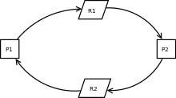
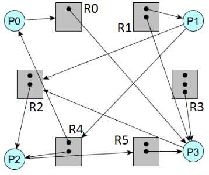
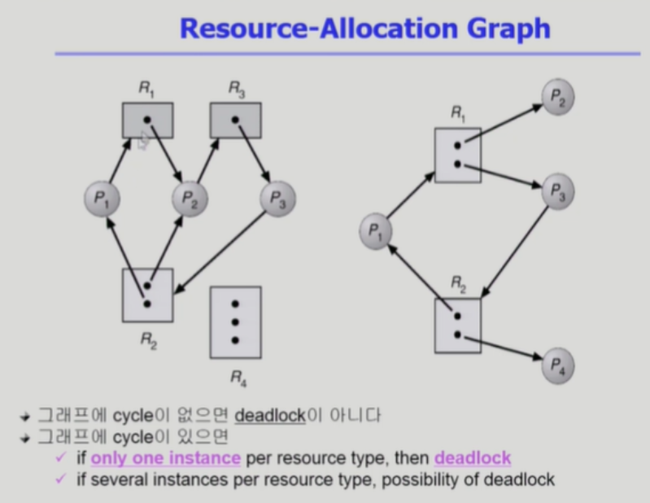
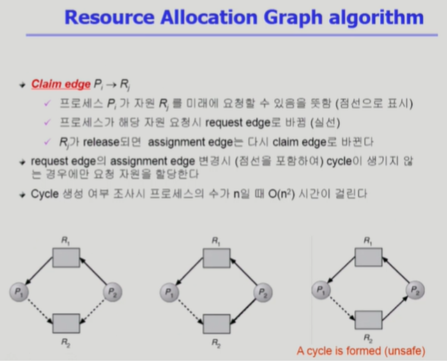
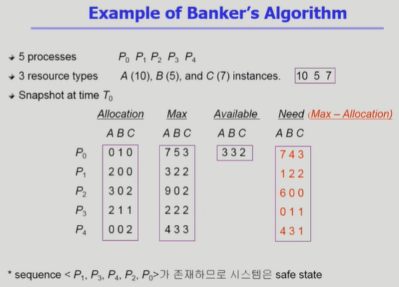
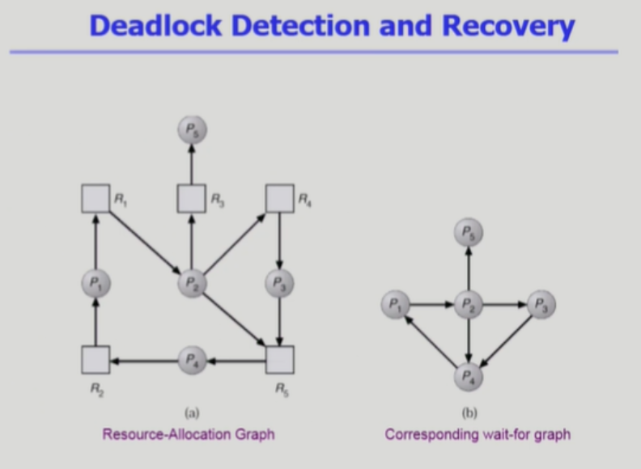
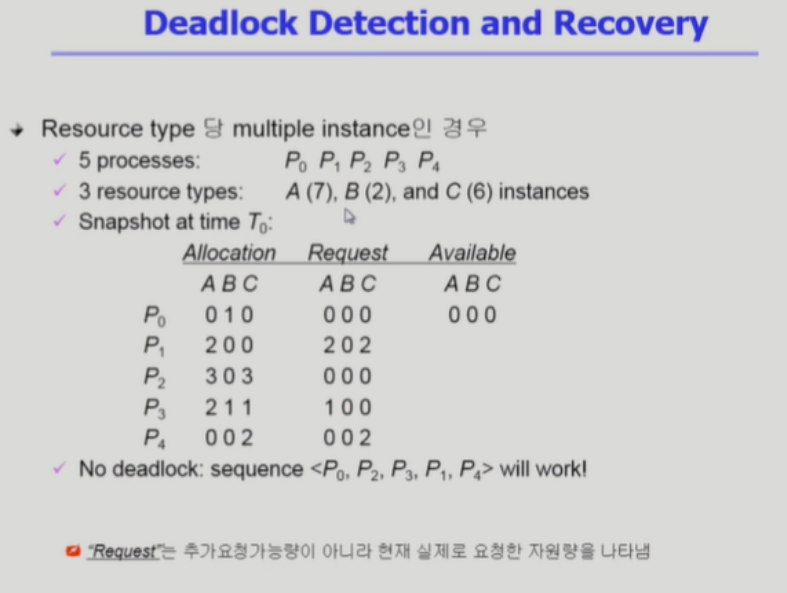

# 📝Deadlock

## 📌 The Deadlock Problem

- **Deadlock** 

  - 일련의 프로세스들이 서로가 가진 자원을 기다리며 무한정 block된 상태

- **Reource(자원)**

  - 자원은 하드웨어가 또는 소프트웨어가 될 수 있다.
  - 예를들어 I/O device, CPU cycle, memory space, semaphore 등이 있다.
  - 프로세스는 자원을 요청(Request)하고, 할당(Allocate) 받고, 사용(Use)하고, 해제(Release)한다.

- **Deadlock Example 1**

  - 시스템에 2개의 자원 R1, R2가 있다.
  - 프로세스 P1과 P2는 2개의 자원을 모두 할당 받아야 작업을 수행할 수 있다.
  - 하지만 P1, P2는 각각 하나의 자원를 보유한 채 다른 하나를 기다리고 있다. 
  - 두 프로세스는 데드락 상황이다.

- **Deadlock Example 2**

  - 공유자원 A, B가 있고, 프로세스 동기화에 이진 세마포어를 사용하는 시스템에서

  - 아래와 같이 세마포어를 잘못쓰면, 데드락 상황이 발생한다.

  - 같은 시점에서 P0은 자원 A를 얻었고, P1은 자원 B를 얻었다.

  - 이후 P0은 P1이 가지고 있는 자원 B를 원하고

  - P1은 P0이 가지고 있는 자원 A를 원한다. 이는 데드락 상황이다. 

    ```
     P0        P1
    P(A);     P(B);
    P(B);     P(A);
    ```

## 📌 Deadlock 발생의 4가지 조건 

- **Mutual exclusion(상호배제)**

  - 매 순간 오직 하나의 프로세스만이 자원을 사용할 수 있는 조건

- **No preemption(비선점)**

  - 프로세스는 할당받은 자원을 강제로 빼앗기지 않는다는 조건

- **Hold and wait(점유대기)**

  - 프로세스가 어떤 자원을 할당 받고 있으면서, 다른 자원을 요청하며 기다린다는 조건

- **Circular wait(환형대기)**

  - 자원을 기다리는 프로세스간에 사이클이 형성되어야 한다는 조건<br>

    

- 위 4가지 조건을 모두 동시에 만족해야 Deadlock이 발생한다.
- 위 4가지 조건을 위배함으로써 Deadlock을 예방할     수 있다.

## 📌 Resource-Allocation Graph ( 자원 할당 그래프 )


- 자원 할당 그래프는 프로세스의 자원 할당 상태를 표현한다.

- 동그라미는 프로세스, 네모는 자원을 나타낸다. 네모속의 까만 점은 해당 자원의 인스턴스를 의미한다.

- 프로세스 -> 자원 :  프로세스가 해당 자원을 요청하는 것을 의미한다.

- 자원 -> 프로세스 : 프로세스가 해당 자원을 할당받은 것을 의미한다. <br>

  

- 자원 할당 그래프에 싸이클이 존재하는 경우
  - 자원당 인스턴스가 한 개라면, 데드락 상황이다.
  - 자원당 인슨턴스가 여러개라면, 데드락일 수도 아닐 수도 있다.
- 자원 할당 그래프에 싸이클이 존재하지 않는경우
  
  - 데드락 상황이 아니다.
- 왼쪽 그래프는 싸이클이 보인다. 유심히 살펴보면, 모든 프로세스가 서로의 자원을 요구하며 무한정 대기하는 데드락 상황이다.
- 오른쪽 그래프도 싸이클이 보인다. 하지만 서로의 자원을 요구하며 무한정 대기하는 데드락은 아니다. P2, P4가 할당받은 자원 R1, R2를 해제한다면, 데드락이 발생하지 않는다. 

## 📌 Deadlock을 막는 방법(요약)

### 🛡️ 데드락을 사전에 방지하는 방법

- **Deadlock Prevention(데드락 예방)**
  - 자원 할당 시 Deadlock 발생의 4가지 필요조건 중 어느 하나가 만족되지 않도록 하는 것이다.
- **Deadlock Avoidance(데드락 회피)**
  - 자원 요청에 대한 부가적인 정보를 이용해서 deadlock의 가능성이 없는 경우에만 자원을 할당하는 방법이다.
  - 하지만 자원 이용률과 성능이 낮아진다. 또한 Starvation이 발생할 수 있다.<br>

### ⚔️ 데드락이 발생한뒤 처리하는 방법

- **Deadlock Detection(데드락 발견)**
  - 데드락 발생은 허용하되 그에 대한 detection 루틴을 두고, 데드락 발생시 회복한다.
  - 데드락을 검출하는 로직에서 시스템 오버헤드가 존재한다.
- **Dealock Ignorance(데드락 무시)**
  - 데드락을 시스템이 책임지지 않는다.
  - 데드락이 발생하면 아무것도 하지 않는다. 사용자가 알아서 Deadlock을 처리한다.
  - 유닉스를 포함한 대부분의 현대 OS가 채택하는 방법이다.
  - 사실 데드락은 자주 발생하는 상황이 아니다.<br>

## 📌 Deadlock을 막는 방법(자세히 알아보기)

### 1️⃣ DeadLock Prevention  (데드락 예방)

- 데드락 예방은 앞서 살펴본 데드락 발생의 4가지 필수 조건을 위배하여 데드락 발생을 방지하는 방법이다.
- **Mutual Exclusion(상호배제) 조건 위배하기** 
  - 프로세스들은 공유자원을 동시에 사용할 수 없다.
  - 다수의 프로세스들이 공유자원을 동시에 사용한다면 데이터에 최종 접근 순서에 따라 연산결과가 달라진다.
  - 따라서 다수의 프로세스가 공유자원에 접근하는 것에 대한 상호배제 조건은 애초에 위배할 수 없다.  
- **Hold and Wait(점유대기) 조건 위배하기**
  - 프로세스가 자원을 소유하면서 다른 자원을 요청하지 못하게 한다.
  - 프로세스가 자원을 요청할 때 다른 어떤 자원도 가지고 있지 않게 한다.
    - 프로세스 시작 시 모든 필요한 자원을 할당 받게하거나
    - 프로세스가 다른 자원을 요청할 경우 현재 보유중인 자원을 모두 놓고 다시 요청한다.
- **No Preemption(비선점) 조건 위배하기**
  - 프로세스가 어떤 자원을 요청하고 기다려야 하는 경우 현재 보유 중인 자원을 선점 당하고
  - 모든 필요한 자원을 얻을 수 있을 때 그 프로세스는 다시 시작된다.
- **Circular Wait(환형대기) 조건 위배하기**
  - 모든 자원 유형에 할당 순서를 정하여 정해진 순서대로만 자원을 할당한다.
  - 예를들어 순서가 3인 자원 Ri를 보유 중인 프로세스가 순서가 1인 자원 Rj를 할당받기 위해서는 먼저 자원 Ri을 반납(해제)해야한다.
- **데드락 예방의 단점**
  - Utilization 저하, throughput 감소, starvation 문제

### 2️⃣ DeadLock Avoidance (데드락 회피)

- 데드락 회피는 자원 요청에 대한 정보를 이용해서 요청에 대한 자원 할당이 데드락으로부터 안전(safe)한지를 동적으로 조사해서 안전한 경우에만 자원을 보수적으로 할당하는 방법이다.
- 즉, 어떤 프로세스가 자원을 요청했을때 그 프로세스가 요청할 수 있는 최대 자원 요구량보다 현재 가용 자원량이 클경우에만 자원을 할당한다.
- 프로세스들이 필요로 하는 각 자원별 최대 사용량을 미리 선언해서 정보로 활용한다.
- **safe state**
  - 시스템 내의 프로세스들에 대한 safe sequence가 존재하는 상태
  - 데드락이 발생하지 않는 상태이다.
- **unsafe sate**
  - 데드락이 발생할 가능성이 있는 상태이다.
- **safe sequence**
  - 프로세스의 sequence<P1, P2, ... , Pn>이 safe 하려면 Pi(1<= i <= n)의 자원 요청이 "가용자원 + 모든 Pj(j<i)의 보유자원"에 의해 충족 되어야 한다.
  - 조건을 만족하면 다음 방법으로 모든 프로세스의 수행을 보장한다.
    - Pi의 자원 요청이 즉시 충족될 수 없으면 모든 Pj(j<i)가 종료될 때까지 기다린다.
    - Pi-1이 종료되면 Pi의 자원요청을 만족시켜 수행한다.

### 2가지 회피 알고리즘

- **자원 유형당 인스턴스가 하나일 경우**

- 자원할당 그래프 알고리즘을 사용하여 데드락을 피한다.
  - 가장 오른쪽 자원할당 그래프에서 프로세스 P1이 자원 R2를 요청한다면, 싸이클이 형성되고 데드락 상황이 된다.
  - 그래프의 싸이클이 형성되지 않도록 자원 할당을 하면서 데드락을 막는 방법이다.

- **자원 유형당 인스턴스가 여러개일 경우**
  
  - 뱅커스 알고리즘을 사용하여 데드락을 피한다.
    - Allocation : 현재 프로세스에 할당되어 있는 자원의 개수
    - Max : 프로세스가 요구할 수 있는 최대 자원의 개수
    - Available :  현재 시스템에서 가용한 자원의 개수
    - Need : 프로세스가 현재 추가로 요구할 수 있는 자원의 개수(Max-Allocation)
  - 위 슬라이드의 매트릭스를 보며 알고리즘 동작 과정을 살펴보자.
  - 프로세스 P0은 현재 추가적으로 자원을 순서대로 <7, 4, 3>개 요청할 수 있는 상황이다.
  - 이러한 상황에서 프로세스 P0이 <2, 2, 2> 와 같이 자원을 요청했다면, 시스템은 자원을 할당해주지 않는다.
  - P0가 추가로 요구할 수 있는 최대 자원량은 <7, 4, 3> 이다. 하지만 현재 시스템 가용 자원량은 <3, 3, 2> 이므로 자원을 할당해주지 않는다.
  - <P1, P3, P4, P2, P0> 순서로 자원을 요청한다면, 모든 요청을 충족할 수 있다. 이러한 순서가 존재할 때를 safe 상태라고 한다.

### 3️⃣ DeadLock Detection and Recovery (데드락 발견과 회복)

- 데드락 발견은 데드락 발생을 허용하고, 데드락이 발생하면 프로세스를 종료시키거나 자원을 빼앗아 처리하는 방법이다.

### 2가지 발견 알고리즘

- **자원 유형당 인스턴스가 하나일 경우**

  

  - 왼쪽 그래프에서 자원을 생략하면, 오른쪽 그래프 처럼된다. 이를 wait for graph라고 한다.
  - wait for graph에서 싸이클이 존재한다면, 데드락이다.
  - DFS 또는 BFS 알고리즘을 활용하여 싸이클을 찾을 수 있다.<br>

- **자원 유형당 인스턴스가 여러개일 경우(은행원 알고리즘과 유사)**
  
  ​                  
  - 데드락 발견에서는 어떤 프로세스가 자원을 요청하면 그냥 준다.
  - 현재 자원을 요청하고 있지 않는 프로세스들이 보유하는 자원은 반환된 자원이라고 가정한다.
  - 현재 P0, P2는 자원을 요청하고 있지 않다. 따라서 P0과 P2가 보유한 자원은 반환되었으며 가용한 자원이라고 계산한다.
  - 위와 같이 계산하면 <P0, P2, P3, P1, P4> 순서로 자원할당이 가능하므로 데드락이 아니다.
  - 만약 P0만 자원을 요청하고 있지 않는 상황이라면, 가용자원은 현재 P0이 보유 중인 자원 + 시스템 가용자원인 B 1개밖에 없다.
  - B 1개로는 모든 프로세스들의 요청을 수용할 sequence가 존재하지 않는다. 따라서 이런경우는 데드락이라고 판단한다. 

### 데드락 발견후 회복하는 방법

- 데드락이 발견되면 회복을 해야한다. 
- **프로세스 종료**
  - 데드락에 연루된 모든 프로세스를 한 번에 종료하거나
  - 데드락이 없어질 때까지 연루된 프로세스들을 하나씩 종료하는 방법이 있다.
- **자원 선점**
  - 프로세스들이 보유한 자원을 빼았는다.(선점한다.)
  - 자원을 선점하는 패턴은 조금씩 바꿔야한다.
  - 방금 죽인 프로세스가 또다시 같은 자원을 가져가는 경우가 생길 수 있기 때문이다.
  - 또한 특정 프로세스의 자원만 뺏으면 Starvation이 발생할 수도 있다.

### 4️⃣ DeadLock Ignorance (데드락 무시)

- 데드락 무시는 데드락이 발생하면 아무 처리를 하지 않는 방법이다.
- 데드락은 실제로 매우 드물게 발생하므로 데드락에 대한 조치 자체가 더 큰 오버헤드일 수 있다.
- 만약, 시스템에 데드락이 발생한 경우 시스템이 비정상적으로 동작하는 것을 사람이 느낀 후 직접 프로세스를 종료하는 방법으로 대처한다.
- 유닉스, 윈도우 등 대부분의 범용 OS가 채택하는 방법이다.

# 🔎 출처 & 더 알아보기

- [KOCW 운영체제-반효경](http://www.kocw.net/home/search/kemView.do?kemId=1046323)
- [은행원 알고리즘 쉬운 예시](https://jhnyang.tistory.com/102)