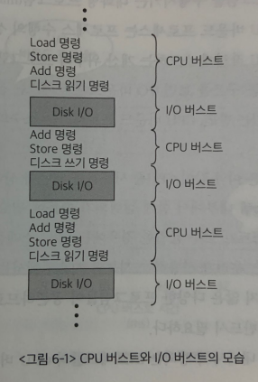
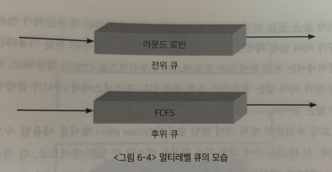
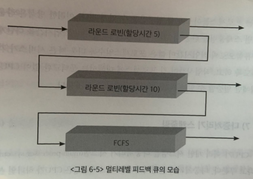

# 📝CPU Scheduling
## 📌 정의

- 사용자 프로그램이 수행되는 과정은 CPU 작업(CPU 버스트)과 I/O 작업(I/O 버스트)의 반복으로 구성된다.

  - CPU 버스트 : 사용자 프로그램이 CPU를 직접 가지고 빠른 명령을 수행하는 단계다.
  - I/O 버스트 : I/O 요청이 발생해 커널에 의해 입출력 작업을 진행하는 비교적 느린 단계이다.
- CPU 버스트와 I/O 버스트가 차지하는 비율에 따라 프로세스를 아래와 같이 구분할 수 있다.

  - CPU 바운드 프로세스

    -  I/O 작업을 거의 수행하지 않아 CPU 버스트가 길게 나타나는 프로세스
    - 프로세스 수행의 상당 시간을 I/O 작업 없이 CPU 작업에 소모하는 계산 위주의 프로그램이 해당된다.
    - 소수의 긴 CPU로 버스트로 구성된다. 

  - I/O 바운드 프로세스

    - I/O 요청이 빈번해 CPU 버스트가 짧게 나타나는 프로세스
    - 주로 사용자와 인터랙션을 계속 주고받으며 프로그램을 수행시키는 대화형 프로그램이 해당된다.
    - 짧은 CPU 버스트를 많이 가지고 있다.
- 우리가 사용하는 시분할 시스템에서는 이와 같이 CPU 버스트가 균일하지 않은 다양한 프로그램들이 공존하므로 효율적인 CPU 스케줄링 기법이 반드시 필요하다.
- CPU 버스트가 짧은 프로세스에게 우선적으로 CPU를 할당 해줘서응답시간을 높이고 I/O 장치의 효율성을 높일 수 있다.

## 📌 CPU 스케줄러

- CPU 스케줄러는 준비(ready) 상태에 있는 프로세스들 중 어떠한 프로세스에게 CPU를 할당할지 결정하는 운영체제의 코드이다.
- CPU 스케줄링 방식에는 비선점형(nonpreemptive) 방식과 선점형(preemptive) 방식이 있다.
- 비선점형(nonpreemptive) 방식
  - CPU를 획득한 프로세스가 스스로 CPU를 반납하기 전까지는 CPU를 빼앗기지 않는 방법을 말한다.
- 선점형(preemptive)
  - 프로세스가 CPU를 계속 사용하기를 원하더라도 강제로 CPU를 빼앗을 수 있는 스케줄링 방법을 말한다. 
- CPU 스케줄링이 필요한 상황들
  1. 실행 상태에 있던 프로세스가 I/O 요청등에 의해 block 상태로 바뀌는 경우 (비선점 스케줄링)
  2. 실행 상태에 있던 프로세스가 타이머 인터럽트 발생에 의해 준비 상태로 바뀌는 경우 (선점 스케줄링)
  3. I/O 작업이 완료된 프로세스가 인터럽트 당한 프로세스보다 우선순위가 높아서 I/O 작업이 완료된 프로세스에게 CPU를 할당해주는 경우 (선점 스케줄링)
  4. CPU에서 실행 상태에 있는 프로세스가 종료되는 경우 (비선점 스케줄링)

##  📌 디스패처

- CPU 스케줄러에 의해 새롭게 선택된 프로세스가 CPU를 할당받고 작업을 수행할 수 있도록 환경설정을 하는 운영체제의 코드를 디스패처라고 부른다. 
- 디스패처는 현재 수행 중이던 프로세스의 문맥을 그 프로세스의 PCB에 저장하고
- 새롭게 선택된 프로세스의 문맥을 PCB로부터 복원한 후 그 프로세스에게 CPU를 넘기는 과정을 수행한다. 
- 디스패처가 하나의 프로세스를 정지시키고 다른 프로세스에게 CPU를 전달하기까지 걸리는 시간을 디스패치 지연시간이라고 한다.
- 디스패치 지연시간의 대부분은 문맥교환 오버헤드에 해당한다. 

## 📌 스케줄링의 성능평가

- 스케줄링 기법의 성능을 평가하기 위해 여러 지표들이 사용된다.
- 시스템 관점의 지표
  - CPU 이용률, 처리량
- 사용자 관점의 지표
  - 소요시간, 대기시간, 응답시간
- CPU 이용률(CPU utilization)
  - 전체 시간 중에서 CPU가 일을 한 시간의 비율
- 처리량(throughput)
  - 주어진 시간 동안 ready 큐에서 기다리고 있는 프로세스 중 몇 개를 끝맞쳤는지를 나타낸다. (CPU 버스트를 완료한 프로세스의 개수)
- 소요시간(turnaround time)
  - 프로세스가 CPU를 요청한 시점부터 자신이 원하는 만큼 CPU를 다쓰고 CPU 버스트가 끝날 때까지 걸린 시간
  - 즉, ready 큐에서 기다린 시간과 실제로 CPU를 사용한 시간의 합을 뜻한다. 
- 대기시간(waiting time)
  - CPU 버스트 기간 중 프로세스가 ready 큐에서 CPU를 얻기 위해 기다린 시간의 합을 뜻한다.
  - 시분할 시스템에서는 한 번의 CPU 버스트 중에도 reay큐에서 기다린 시간이 여러번 발생할 수 있다.
- 응답시간(response time)
  - 프로세스가 준비 큐에 들어온 후 첫 번째 CPU를 획득하기까지 기다린 시간을 뜻한다. 

## 📌 스케줄링 알고리즘

### 📅 선입선출(First-Come First-Served, FCFS)

- 선입선출(FCFS) 스케줄링은 프로세스가 준비 큐에 도착한 시간 순서대로 CPU를 할당하는 방식을 말한다.
- FCFS는먼저 온 요청을 먼저 처리하기 때문에 합리적인 것 같지만 경우에 따라 비효율적인 결과를 초래한다.
- 예를들어 CPU 버스트가 긴 프로세스가 CPU 버스트가 짧은 프로세스 여러 개보다 먼저 도착하는 상황이라면
- 다수의 프로세스들이 앞의 긴 작업 하나 때문에 계속 기다려야한다. 
- 짧은 프로세스들에게 잠깐씩만 CPU를 할당하면 이 프로세스들이 CPU 버스트를 마친 뒤 I/O 작업을 연이어 수행할 수 있는데, CPU 버스트가 긴 프로세스 하나 때문에 대기시간은 물론 I/O 장치들의 이용률까지도 동반 하락하게 된다. 

### 📅 최단작업 우선 스케줄링(SJF, SRTF)

#### Shortest-Job Fisrt(SJF)

- 최단 작업 우선(SJF) 스케줄링 알고리즘은 CPU 버스트가 가장 짧은 프로세스에게 제일 먼저 CPU를 할당 하는 방식이다. 

#### Shortest Remaining Time First(SRTF)

- SRTF는 SJF가 선점형 방식으로 구현된 것이다.
- CPU에서 실행 중인 프로세스의 남은 CPU 버스트 시간보다 더 짧은 CPU 버스트 시간을 가지는 프로세스가 도착할 경우 CPU를 빼앗아 준다. 

#### 프로세스의 CPU 버스트 시간은 어떻게 계산할까?

- 프로세스의 CPU 버스트 시간은 미리 알 수 없다.
- 그래서 예측을 통해 CPU 버스트 시간을 구한다.
- CPU 버스트 시간의 예측은 과거의 CPU 버스트 시간을 통해 이루어진다.

#### CPU 버스트가 짧은 프로세스가 계속 도착할 경우?

- CPU 버스트가 짧은 프로세스가 계속 도착한다면
- CPU 버스트가 긴 프로세스는 영원히 CPU를 할당받지 못할 수 있다.
- 이러한 현상을 **기아 현상(starvation)**이라고 한다. 

### 📅 우선순위 스케줄링(RR, MLQ, MFQ)

#### 라운드 로빈(Round Robin, RR)
- 라운드 로빈 스케줄링에서는 각 프로세스가 CPU를 연속적으로 사용할 수 있는 시간이 특정 시간(time quantum)으로 제한된다.
- 이 시간이 경과하면 해당 프로세스로부터  CPU를 회수해 준비 큐에 줄 서 있는 다른 프로세스에게 CPU를 할당한다. 
- time quantum이 너무 길면 FCFS와 같은 결과를 나타내고, 너무 짧으면 문맥교환의 오버헤드가 커지는 단점이 있다.

#### 멀티레벨 큐(Multi-Level Queue, MLQ)

- 멀티레벨 큐란 준비 큐를 여러 개로 분할해 관리하는 스케줄링 기법을 말한다.
- 즉, 프로세스들이 CPU를 기다리기 위해 한 줄로 서는 것이 아니라 여러 줄로 서는 것이다.
- 어떤 큐에 줄 서 있는 프로세스를 우선적으로 스케줄링할지, 프로세스가 도착했을 때 어느 큐에 줄 세워야할지 결정하는 메커니즘이 필요하다.
- 일반적으로 멀티레벨 큐에서 준비 큐는 대화형 작업을 담기 위한 전위 큐와
- 계산 위주의 작업을 담기 위한 후위 큐로 분할하여 운영된다. 
- 전위 큐에서는 응답시간을 짧게하기 위해 RR 스케줄링을 사용하고, 계산 위주 작업을 위한 후위 큐에서는 응답시간이 크게 의미를 갖지 않기 때문에 FCFS 스케줄링 기법을 사용하여 문맥교환 오버헤드를 줄인다.
- 프로세스에 대한 스케줄링 뿐만 아니라 큐 자체에 대한 스케줄링도 필요하다. 어느 큐에 먼저 CPU를 할당할 것인지 결정해야하는 스케줄링이 필요하다.
- 큐에 대한 스케줄링은 고정 우선순위 방식과 타임 슬라이스 방식을 사용할 수 있다.
- 고정 우선순위 방식
  - 큐별로 고정 우선순위를 부여하여 우선순위에 따른 스케줄링을 하는 방법이다.
  - 우선순위가 낮은 큐는 우선순위가 높은 큐가 비어있을 때에만 서비스한다.
- 타임 슬라이스 방식
  - 큐에대한 기아 현상을 방지할 수 있는 방식으로, 각 큐에 CPU 시간을 적절한 비율로 할당한다.
  - 예를들어 전위큐에는 80%, 후위큐에는 20%를 할당해서 스케줄링한다. 

#### 멀티레벨 피드백 큐(Multi-level Feedback Queue, MFQ)

- 멀티레벨 피드백 큐는 CPU를 기다리는 프로세스를 여러 큐에 줄 세운다는 측면에서 멀티레벨 큐와 동일하나 프로세스가 하나의 큐에서 다른 큐로 이동가능하다는 점이 다르다.
- 노화 기법을 적용하여 우선순위가 낮은 큐에서 오래 기다렸으면 우선순위가 높은 큐로 보낸다.
- 위 그림에서 상위에 있는 큐일수록 우선순위가 높다.
- 프로세스가 준비 큐에 도착하면 우선순위가 가장 높은 큐에 줄을 선다. 만약 프로세스가 CPU 사용시간이 짧은 대화형 프로세스는 우선순위가 가장 높은 RR큐에서 빠르게 서비스 받고 작업을 마칠 수 있다.
- 하지만 CPU 버스트 시간이 긴 프로세스들은 5만큼의 시간 동안 CPU를 사용하고도 작업을 완료할 수 없기 때문에 할당 시간이 10인 하위 RR큐로 내려가서 줄 서게 된다.
- 이후 할당시간 10을 추가로 사용하고도 작업이 완료되지 않으면, 프로세스는 CPIU를 오래 사용하는 계산 위주의 프로세스로 간주되어 최하위 FCFS 스케줄링을 하는 큐로 내려가서 줄 서게 된다.
- 이러한 방식은 라운드 로빈 스케줄링을 한층 더 발전시켜, 프로세스의 CPU 작업 시간을 다단계로 분류함으로써
- 작업시간이 짧은 프로세스일수록 더욱 빠른 서비스가 가능하도록하고
- 작업시간이 긴 프로세스에 대해서는 문맥교환 없이 CPU 작업에만 열중할 수 있는 FCFS 방식을 체택할 수 있다.

## 📅 다중처리기(멀티프로세서) 스케줄링

- CPU가 여러 개인 시스템을 다중처리기 시스템이라고 한다.
- 다중 처리기 시스템에서의 CPU 스케줄링은 더 복잡하다.
- 프로세스를 준비 큐에 한 줄로 세워서 각 CPU가 알아서 다음 프로세스를 꺼내가도록 할 수 있다.
- 그러나 반드시 특정 CPU에서 수행되어야 하는 프로세스가 있는 경우에는 문제가 더욱 복잡해진다.
- 이런 상황에서는 한 줄이 아니라 각 CPU 별로 줄 세우기를 할 수도 있다. 특정 CPU로만 작업이 편중되는 것을 막기 위해 각 CPU별 부하가 적절히 분산 되도록 하는 부하균형 메커니즘을 필요로 한다. 
- 다중처리기 스케줄링 방식은 대칭형 다중처리와 비대칭형 다중처리로 나눌 수 있다.
  - 대칭형 다중처리(Symmentric Multi-Processing)
    - 각 CPU가 각자 알아서 스케줄리을 결정하는 방식
  - 비대칭형 다중처리(Asymmentric Multi-Processing)
    - 하나의 CPU가 다른 모든 CPU의 스케줄링 및 데이터 접근을 책임지고 나머지 CPU는 거기에 따르는 방식 

 

# 🔎 출처 & 더 알아보기 

  * [운영체제와 정보기술의 원리(개정판)](https://book.naver.com/bookdb/book_detail.nhn?bid=16345019)

    

