# 📝Memory Management

- 메모리는 주소를 통해 접근하는 저장장치다.
- 우리가 흔히 사용하는 컴퓨터 시스템은 32비트 혹은 64비트 주소 체계를 사용한다.
- 32비트 주소 체계에서는 2^32가지의 서로 다른 메모리 위치를 구분할 수 있다.
- 64비트 주소 체계에서는 2^64가지의 서로 다른 메모리 위치를 구분할 수 있다.
- 컴퓨터에서는 byte 단위로 메모리 주소를 부여한다. 
- 메모리는 효율적인 운영을 위해 일련의 영역을 묶어서 사용한다.
- 보통 4KB(2^12byte) 단위로 묶는데, 이를 페이지(page)라고 한다.

## 📌 주소 바인딩

- **논리적 주소(가상 주소)**
  - 프로그램이 실행을 위해 메모리에 적재되었을때 그 프로세스를 위한 독자적인 주소 공간을 뜻한다.
  - CPU는 프로세스마다 독립적으로 갖는 논리적 주소에 근거해 명령을 실행한다.
  - 논리적 주소는 0번지부터 시작된다.
- **물리적 주소**
  - 무리적 메모리에 실제 위치를 말한다.
  - 보통 물리적 메모리가 낮은 주소 영역에는 운영체제가 올라가고
  - 높은 주소 영역에는 사용자 프로세스들이 올라간다.
- **주소 바인딩**
  - 프로그램이 실행되기 위해서는 해당 프로그램이 물리적 메모리에 올라가 있어야 한다.
  - 또한 CPU가 기계어 명령을 수행하기 위해 논리적 주소를 통해 메모리 참조를 하게 되면 논리적 주소가 물리적 메모리의 어느 위치에 매핑 되는지 확인해야 한다.
  - 이렇게 프로세스의 논리적 주소를 물리적 메모리 주소로 연결시켜주는 작업을 주소 바인딩이라고 한다. 
- **주소 바인딩의 종류** 
  - **컴파일 타임 바인딩**
    - 컴파일을 하는 시점에 해당 프로그램의 물리적 메모리 주소가 결정된다.
    - 프로그램이 절대주소로 적재된다는 뜻에서 이와 같이 주소 바인딩 방식을 절대코드를 생성한느 바인딩 방식이라고 한다.
    - 물리적 메모리의 위치를 변경하고 싶다면 재컴파일 해야하는 수고가 필요하다.
    
  - **로드 타임 바인딩**
    - 프로그램의 실행이 시작될 때 물리적 주소가 결정된다.
    - 로더의 책임하에 물리적 메모리 주소가 부여되고, 프로그램이 종료될 때까지 물리적 메모리상에 위치가 고정된다.
    - 로더란 사용자 프로그램을 메모리에 적재시키는 프로그램을 말한다.
    - 컴파일러가 재배치 가능 코드를 생성한 경우에 가능한 바인딩 방식이다.
    
  - **실행시간 바인딩**
    - 프로그램이 실행을 시작한 후에 그 프로그램이 위치한 물리적 메모리상의 주소가 변경될 수 있는 바인딩 방식이다.
    - CPU가 주소를 참조할 때마다 해당 데이터가 물리적 메모리의 어느 위치에 존재 하는지 주소 매핑 테이블을 이용해 바인딩을 점검해야 한다. 
    - 기준 레지스터(base register)와 한계 레지스터(limit register)를 포함하여 MMU(Memory Management Unit : 메모리 관리 유닛)라는 하드웨어적인 자원이 필요하다.
    - MMU는 논리적 주소를 물리적 주소로 매핑하는 하드웨어 장치다.
  
- **MMU 기법**
    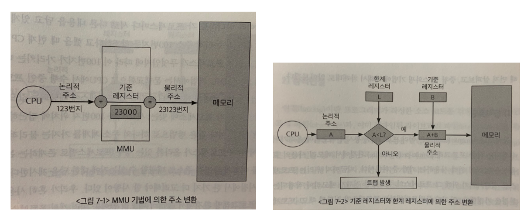
    - CPU가 특정 프로세스의 논리적 주소를 참조하려고 할 때 MMU 기법은 그 주소 값에 기준 레지스터의 값을 더해 물리적 주소값을 얻어낸다.
    - 이때 기준 레지스터는 재배치 레지스터(relocation register)라고도 부르며 그 프로세스의 물리적 메모리 시작 주소를 가지고 있다.
    - MMU 기법에서 사용자 프로그램이나 CPU는 논리적 주소만을 다룰 뿐, 실제 물리적 주소는 알지 못하며 알아야할 필요도 없다.
    - 위 그럼에서 논리적인 주소 123번지는 물리적 메모리의 시작 위치인 재배치 레지스터값으로부터 요청된 위치가 얼마나 떨어져 있는지를 나타내는 오프셋(offset)으로 생각할 수 있다.
    -  MMU 기법에서는 문맥교환으로 CPU에서 수행 중인 프로세스가 바뀔 때마다 기준 레지스터(재배치 레지스터)의 값을 그 프로세스에 해당되는 값으로 재설정한다. 
    - 다른 프로세스 주소 공간 영역에 침범하는 것을 막기 위해 한계 레지스터(limit register)라는 또 하나의 레지스터를 사용한다.
    - 한계 레지스터는 자신의 주소 공간을 넘어서는 메모리 참조를 하려고 하는지 체크하는 용도로 사용된다.
    - 한계 레지스터는 현재 CPU에서 수행 중인 프로세스의 논리적 주소의 최댓값, 즉 그 프로세스의 크기를 담고 있다. 

## 📌 메모리 관리와 관련된 용어

- **동적로딩(dynamic loading)**

  - 여러 프로그램이 동시에 메모리에 올라가서 수행되는 다중 프로그래밍 환경에서 메모리 사용의 효율성을 높이기 위해 사용하는 기법 중 하나이다. 
  - 동적로딩은 프로세스가 시작될 때 그 프로세스의 주소 공간 전체를 메모리에 다 올려놓는 것이 아니라 메모리를 좀 더 효율적으로 사용하기 위해 해당 부분이 불릴 때 그 부분만을 메모리에 적재하는 방식이다.
  - 동적로딩은 거의 사용되지 않는 많은 양의 코드(오류 처리 코드 등)가 메모리에 올라가는 것을 막아 메모리를 좀 더 효율적으로 사용할 수 있게 한다. 
  - 즉, 같은 크기의 물리적 메모리에 더 많은 프로그램을 적재할 수 있다.
- **정적연결**

  - 정적 연결에서는 프로그래머가 작성한 코드와 라이브러리 코드가 모두 합쳐져서 실행파일이 생성된다. 따라서 실행 크기가 상대적으로 크다.
  - 또한 동일한 라이브러리를 각 프로세스가 개별적으로 메모리에 적재 되므로 물리적 메모리가 낭비된다. 
- **동적연결**

  - 연결(linking)이란 프로그래머가 작성한 소스 코드를 컴파일하여 생성된 목적 파일(object file)과 이미 컴파일된 라이브러리 파일(library file)들을 묶어 하나의 실행파일을 생성하는 과정이다.
  - 동적 연결은 목적 파일과 라이브러리 파일 사이의 연결을 프로그램의 실행 시점까지 지연시키는 방법이다.
  - 동적 연결은 라이브러리가 실행 시점에 연결된다. 즉 실행 파일에 라이브러리 코드가 포함되지 않으며, 프로그램이 실행되면서 라이브러리 함수를 호출할 떄가 되어서야 라이브러리에 대한 연결이 이루어진다.
  - 동적 연결을 가능하게 하기 위해 실행파일의 라이브러리 호출 부분에 스텁(stub)이라는 작은 코들르 둔다.
  - 라이브러리 호출 시 스텁을 통해 해당 라이브러리가 메모리에 이미 존재하는지 살펴보고 그럴 경우 그 주소의 메모리 위치에서 직접 참조하며, 그러지 않을 경우 디스크에서 동적 라이브러리 파일을 찾아 메모리로 적재한 후 수행한다.
  - 동적 연결은 다수의 프로그램이 공통으로 사용하는 라이브러리를 메모리에 한 번만 적재하므로 메모리 사용의 효율성을 높일 수 있다.
- **중첩**
  - 중첩이란 프로세스의 주소 공간을 분할해 실제 필요한 부분만 메모리에 적재한 기법을 말한다.
  - 중첩과 동적연결과 유사한 개념이지만 각각 사용하는 이유가 상이하다.
  - 중첩은 과거 물리적 메모리의 크기 제약으로 인해 하나의 프로세스조차도 메모리에 한꺼번에 올릴 수 없을 때 프로세스의 주소 공간을 분할해서 당장 필요한 일부분을 메모리에 올려 실행하고 해당 부분에 대한 실행이 끝난 후에 나머지 부분을 올려 실행하는 기법을 뜻한다.
  - 반면 동적로딩에서는 다중 프로그래밍 환경에서 메모리의 이용률을 향상시키기 위해 프로세스의 주소 공간 중 당장 실행에 필요한 부분을 그떄그떄 메모리에 동적으로 올린다는 점에서 중첩과 다르다.
- **스와핑**
  
  - 스와핑(swapping)이란 메모리에 올라온 프로세스의 주소 공간 전체를 디스크의 스왑 영역(swap area)에 일시적으로 내려놓는 것을 말한다. 
  - 이때 스왑 영역은 백킹스토어(backing store)라고도 부르며, 디스크 내에 파일 시스템과는 별도로 존재하는 일정 영역을 말한다.
  
  - 스와핑이 일어나는 과정은 다음과 같다. 일반적으로 스와핑은 스와퍼(swapper)라고 불리는 중기 스케줄러에 의해 스왑 아웃시킬 프로세스를 선정한다.
  - 스왑 아웃 대상으로 선정된 프로세스에 대해서는 현재 메모리에 올라가 있는 주소 공간의 내용을 통째로 디스크 스왑 영역에 스왑 아웃 시킨다.
  - 스와핑의 가장 중요한 역할은 메모리에 존재하는 프로세스의 수를 조절하는 것이다. 즉 스와핑을 통해 다중 프로그래밍의 정도를 조절할 수 있다.
  - 너무 많은 프로그램이 메모리에 동시에 올라오게 되면 메모리의 양이 지나치게 적어져 시스템 전체의 성능이 크게 떨어진다. 
  - 스와핑은 이러한 문제를 해결하기 위해 몇몇 프로그램을 통째로 디스크의 스왑 영역으로 내쫓음으로써 메모리에 남아 있는 프로그램들에게 실행에 필요한 적절한 메모리 공간을 보장한다.

## 📌물리적 메모리의 할당 방식 

- 물리적 메모리는 운영체제 상수 영역과 사용자 프로세스 영역으로 나뉘어 사용된다.
- 운영체제 상주 영역은 인터럽트 벡터와 함께 물리적 메모리의 낮은 주소 영역을 사용하며, 운영체제의 커널이 이곳에 위치한다.
- 이 단락에서는 사용자 프로세스 영역의 관리 방법에 대해 살펴보고자 한다.

### 1️⃣ 연속할당 방식

- 연속할당 방식은 프로세스를 메모리에 올릴 때 그 주소 공간을 여러개로 분할하지 않고 물리적 메모리의 한 곳에 연속적으로 적재하는 방식이다.
- 연속할당 방식은 물리적 메모리를 고정된 크기의 분할로 미리 나누어 놓는지 그렇지 않는지에 따라 고정분할 방식과 가변분할 방식으로 나뉜다.

#### **🤖 고정분할 방식**

- 고정분할 방식은 물리적 메모리를 주어진 개수만큼의 영구적인 분할(partition)로 미리 나누어두고 
- 각 분할에 하나의 프로세스를 적재해 실행시킬 수 있게 한다.
- 이 때 분할의 크기는 모두 동일하게 할 수 있고 서로 다르게 할 수도 있다.
- 하나의 분할에는 하나의 프로그램만 적재할 수 있다.
- 따라서 고정분할 방식은 동시에 메모리에 올릴 수 있는 프로그램 수가 고정되어 있으며 수행 가능한 프로그램의 최대 크기 또한 제한된다는 단점이 있다.
- 또한 고정분할 방식에서는 외부조각(externnal fragmentation)과 내부조각(internal fragmentation)이 발생할 수 있다.

  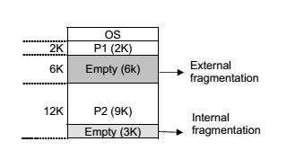
- **외부조각**
  
  - 프로그램의 크기보다 분할의 크기가 작은 경우 해당 분할이 비어 있는데도 불구하고 프로그램을 적재하지 못하기 때문에 발생하는 빈 메모리 공간이다.
- **내부조각**
  - 내부조각은 프로그램의 크기보다 분할의 크기가 큰 경우 해당 분할에 프로그램을 적재하고 남는 메모리 공간을 뜻한다. 
  - 즉 하나의 분할 내부에서 발생하는 사용되지 않는 메모리 조각을 말한다.

#### **👾 가변분할 방식**

- 가변분할 방식은 고정분할 방식과 달리 메모리에 적재되는 프로그램의 크기에 따라 분할의 크기, 개수가 동적으로 변하는 방식을 말한다.
- 가변분할 방식에서 분할의 크기를 프로그램에 딱 맞게 정하기 때문에 내부 조각은 발생하지 않는다.
- 하지만 이미 메모리에 존재하는 프로그램이 종료될 경우 중간에 빈 공간이 발생하게 되며, 이 공간이 새롭게 시작되는 프로그램의 크기보다 작을 경우 외부조각이 된다.
- 가변분할 방식에서는 주소 공간의 크기가 n인 프로세스를 메모리에 올릴 때 물리적 메모리 내 가용 공간 중 어떤 위치에 올릴 것인지 결정해야한다. 
- 이를 **동적 메모리 할당 문제**라고 부른다. 
- 가용공간은 사용되지 않은 메모리 공간으로서 메모리 내의 여러 곳에 산발적으로 존재할 수 있다.
- 한편, 연속할당 기법에서는 새로운 프로세스를 메모리에 통째로 올려야한다.
- 동적  메모리를 할당하는 문제는 대표적으로 3가지가 있다.
  - **최초적합(first-fit)**
    - 메모리에 존재하는 가용 공간을 차례대로 살펴보면서 가용 공간이 프로그램 크기보다 작으면 건너 뛰고, 그렇지 않은 가용 공간이 최초로 발견되면 그 공간에 프로그램을 적재한다. 
    - 가용 공간을 모두 탐색하지 않으므로 시간적인 측면에서 효율적이다.
  - **최적적합(best-fit)**
    - 크기가 n 이상인 가장 작은 가용 공간을 찾아 그곳에 새로운 프로그램을 할당하는 방법이다.
    - 최적적합은 공간적인 측면에서 효율적이다.
    - 하지만 작은 내부 조각이 여러개 생길 수 있고 모든 가용 공간을 탐색 해야하므로 시간적 오버헤드가 발생한다.
  - **최악적합(worst-fit)**
    - 가용 공간 중에서 가장 크기가 큰 곳에 새로운 프로그램을 할당하는 최악적합 방법이 있다.
    - 이 방법 또한 모든 가용 공간을 탐색해야한다는 단점이 있다.
- 위 3가지 방법중 실제 실험 결과에 의하면 최초적합과 최적적합 방식이 최악적합 방식에 비해 속도와 공간 이용률 측면에서 효과적인 것으로 알려져있다.
- 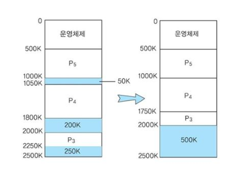
- 한편 가변분할 방식에서 발생하는 외부 조각 문제를 해결하기 위한 방법으로 **컴팩션(compaction)**이라는 것이 있다. 
- 컴팩션은 물리적 메모리 중에서 프로세스에 의해 사용 중인 메모리 영역을 한쪽으로 몰고 가용 공간들을 다른 한쪽으로 모아서 하나의 큰 가용 공간을 만드는 방법이다.
- 하지만 현재 수행 중인 프로세스의 메모리 위치를 상당부분 이동시켜야 하므로 비용이 매우 많이 드는 작업이다.
- 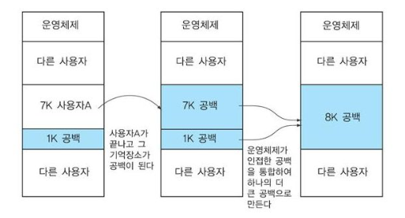
- **colaescing**은 인접한 조각 또는 빈 영역들을 합치는 방법이다. 

#### **🤠버디 시스템**
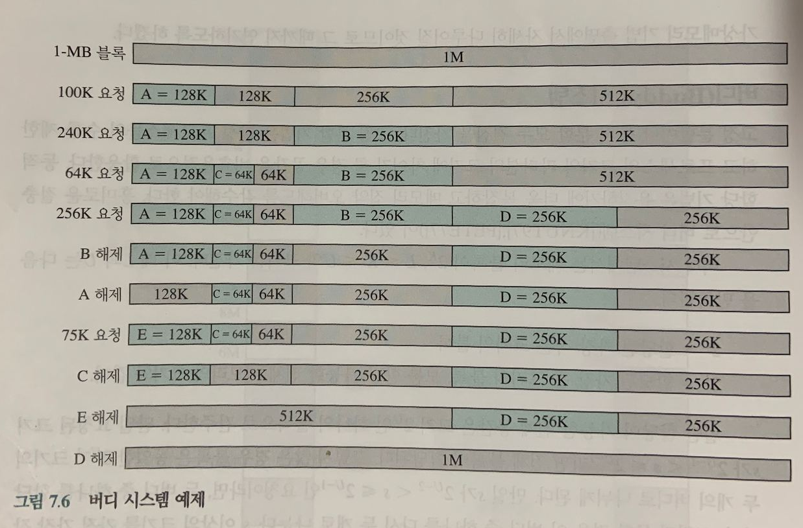

-  고정 분할 기법은 메모리에 적재할 수 있는 프로세스의 수가 고정되어 있고, 내부 단편화가 발생할 수 있다는 단점이 있다.
- 가변 분할 기법은 외부 단편화를 발생 시키고, 이를 해결하기 위해 compaction을 수행해야하는 단점이 있다.
- 이에 대한 절충안으로 버디 시스템이 있다. 위 그림과 함께 알아보자
- 초기 블록은 1MB 크기의 블록이다.
- A는 100KB 크기의 공간을 요구한다.
- 1M 블록은  512K인 두 개의 버디로 나누어지고, 그 중 첫 번째 버디는 두 개의 256K 버디 다시 그 중 첫 번째 버디는 두 개의 128K 버디로 나누어져 그 중 하나가 A에게 할당된다.
- 다음 요청인 B는 240K 크기의 공간을 요청하므로, 256K의 버디를 할당한다.
- 할당 과정에서 블록은 필요에 따라 나눠지고 합쳐진다.
- E가 해제되는 부분을 살펴보자. 두 개의 128K 버디는 256K로 합쳐지고, 다시 두 개의 256K가 합쳣져 512K 버디가 만들어진다. 
- 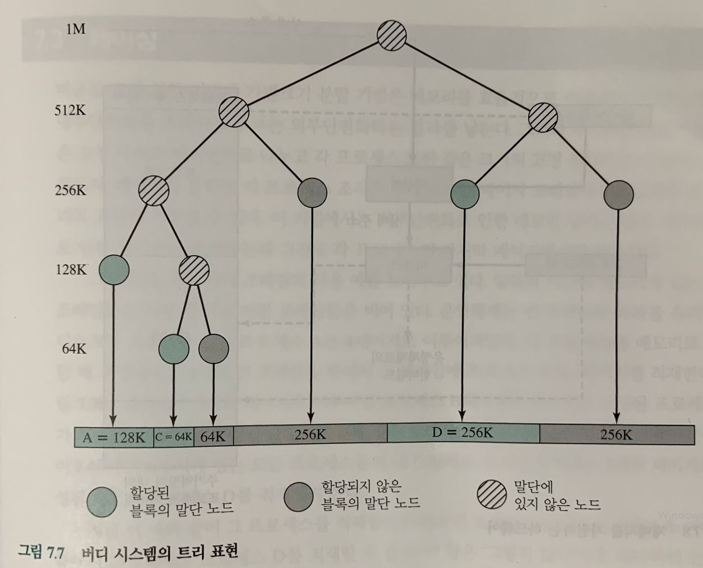
- 위 그림은 B가 해제된 직후의 버디 할당 모습을 이진 트리로 나타내고 있는 그림이다.
- 말단 노드는 현재 메모리의 분할 상태를 나타낸다. 
- 만일 두개의 버디가 말단 노드라면 적어도 하나는 할당이 되었음을 의미한다. 
- 그렇지 않다면 둘은 조금 더 큰 블록으로 합쳐졌을 것이다. 

### 2️⃣ 불연속할당 방식

- 불연속할당 기법이란 하나의 프로세스가 물리적 메모리의 여러 위치에 분산되어 올라갈 수 있는 메모리 할당 기법을 말한다. 
- 불연속할당 방식에는 하나의 프로그램을 분할하는 기준에 따라 동일한 크기로 나누어 메모리에 올리는 페이징 기법과 크기는 일정하지 않지만 의미 단위로 나누어 메모리에 올리는 세그멘테이션 기법이 있다.
- 그리고 세그멘테이션을 기본으로 하되 이를 다시 동일 크기의 페이지로 나누어 메모리에 올리는 페이지드 세그멘테이션 기법등이 있다. 

##  📌 페이징 기법
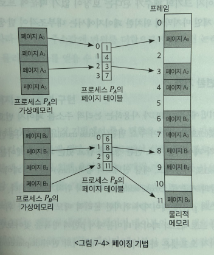
- 페이징(paging) 기법이란 프로세스의 주소 공간을 동일한 크기의 **페이지(page)** 단위로 나누어 물리적 메모리의 서로 다른 위치에 페이지들을 적재하는 방식이다.
- 페이징 기법에서 각 프로세스의 주소 공간 전체를 물리적 메모리에 한꺼번에 올릴 필요가 없으며, 일부는 백킹스토어에, 일부는 물리적 메모리에 혼재시키는 것이 가능하다.
- 페이징 기법에서는 물리적 메모리를 페이지와 동일한 크기의 **페이지 프레임(page frame)**으로 미리 나눈다.
- 페이징 기법은 동적 메모리 할당 문제가 발생하지 않는다는 장점을 가진다.
- 또한 프로세스의 주소 공간과 물리적 메모리가 모두 같은 크기의 페이지 단위로 나누어지기 때문에 외부조각이 발생하지 않는다. 
- 페이징 기법에서 특정 프로세스의 몇 번째 페이지가 물리적 메모리의 몇 번째 페이지 프레임에 들어 있는지에 대한 페이지별 주소 변환 정보를 **페이지 테이블(page table)**에 가지고 있어야 한다. 
- 페이지 테이블은 프로세스가 가질 수 있는 페이지의 개수만큼 주소 변환 엔트리를 가지고 있어야한다.
- 하지만 프로그램의 크기가 항상 페이지 크기의 배수가 된다는 보장이 없기 때문에 프로세스의 주소 공간 중 제일 마지막에 위치한 페이지에서는 내부 조각이 발생할 수 있다.

### 1️⃣ 주소 변환 기법
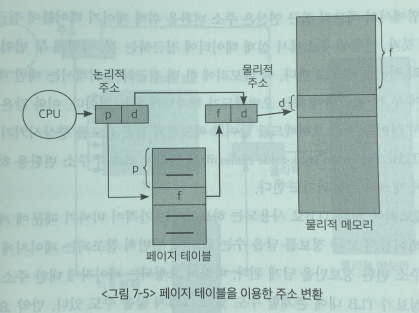
- 페이징 기법에서는 CPU가 사용하는 논리적 주소를 페이지 번호(p)와 페이지 오프셋(d)으로 나누어 주소 변환에 사용한다.
- 논리적 주소는 p와 d로 이루어져있다.
- 페이지 번호는 각 페이지별 주소 변환 정보를 담고 있는 페이지 테이블 접근 인덱스로 사용된다.
- 페이지의 인덱스 위치에 있는 엔트리에는 해당 페이지의 물리적 주소상의 기준 주소(base address) 즉, 시작 위치가 저장된다.
- 페이지 오프셋은 하나의 페이지 내에서의 위치를 알려준다. 따라서 기준 주소 값에 오프셋을 더함으로써 요청된 논리적 주소에 대응하는 물리적 주소를 얻을 수 있다.

### 2️⃣ 페이지 테이블의 구현
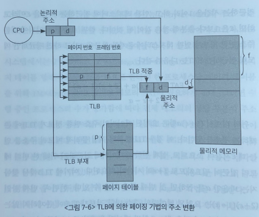
- 페이지 테이블은 페이징 기법에서 주소 변환을 하기 위한 자료구조로, 물리적 메모리에 위치하게 된다.
- 현재 CPU에서 실행 중인 프로세스의 페이지 테이블에 접근하기 위해 운영체젲는 2개의 레지스터를 사용한다.
- 이들은 각각 페이지 테이블 기준 레지스터(Page Table Base Register, PTBR)와 페이지 테이블 길이 레지스터 (Page Table Length Register, PTLR)로 불린다.
- PTBR은 메모리 내에서의 페이지 테이블의 시작 위치를 가리키며 PTLR은 페이지 테이블의 크기를 나타낸다.
- 페이징 기법에서 메모리 접근 연산은 주소 변환을 위해 페이지 테이블에 접근하는 것과
- 변환된 주소에서 실제 데이터에 접근하는 것 이렇게 두 번의 메모리 접근을 필요로 한다.
- 즉 메모리에 한 번 접근하려면 매번 메모리에 두 번 접근 해야하는 오버헤드가 있다.
- 이와 같은 페이지 테이블 접근 오버헤드를 줄이고 메모리의 접근 속도를 향상 시키기 위해 TLB(Translation Look-aside Buffer)라고 불리는 고속 주소 변환용 하드웨어 캐시가 사용 되기도 한다.
- TLB에는 빈번히 참조되는 페이지에 대한 주소 변환 정보를 가지고 있다. 
- 만약 요청된 페이지 번호가 TLB에 존재한다면 곧바로 빠르게 물리적 주소를 얻을 수 있지만 
- TLB에 요청된 페이지의 주소 변환 정보가 없다면, 메인 메모리에 있는 페이지 테이블로부터 물리적 주소를 알아내야한다. 
- 주소 변환 정보는 프로세스 별로 다르기 때문에 문맥교환이 이루어지면 TLB 내용은 모두 지워버려야 한다. 
- 페이지 테이블에는 하나의 프로세스를 구성하는 모든 페이지에 대한 주소 변환 정보가 페이지 번호에 따라 순차적으로 들어 있기 때문에 페이지 번호가 주어지면 테이블의 시작 위치에서 페이지 번호만큼 떨어진 인덱스에 곧바로 접근해 해당 페이지에 대응되는 페이지 프레임 번호를 얻을 수 있다.
- TLB에서는 프로세스의 모든 페이지에 대한 주소 변환 정보를 가지고 있지 않기 떄문에 페이지 번호와 이에 대응하는 프레임 번호가 쌍으로 저장되어 있다.
- 따라서 TLB를 통한 주소 변환을 위해서는 TLB의 모든 항목(entry)를 다 찾아야하는 오버헤드가 발생한다. 
- 이러한 오버헤드를 줄이기 위해 TBL 구현에는 일반적으로 병렬 탐색이 가능한 연관 레지스터를 사용한다. 
- 병렬 탐색이란 TLB내의 모든 항목을 동시에 탐색할 수 있는 기능을 말한다. 

### 3️⃣ 계층적 페이징

- 32비트 주소 체계를 사용하는 컴퓨터에서는 2^32byte(4GB)의 주소 공간을 갖는 프로그램을 지원할 수 있다.
- 이러한 환경에서 페이지 크기가 4KB라면, 1M개의 페이지 테이블 항목이 필요하다.
- 각 페이지 테이블 항목이 4byte 씩을 필요로 한다면 한 프로세스 당 페이지 테이블을 위해 1M x 4byte = 4MB 크기의 메모리 공간이 필요하다. 
- 그러면 수행 중인 프로세스의 수가 증가함에 따라 전체 메모리의 상당 부분이 주소 변환을 위한 페이지 테이블에 할애되어 실제로 사용 가능한 메모리 공간이 크게 줄어들게 된다.
- 또한 대부분의 프로그램들은 메모리 주소 공간 중 지극히 일부분만을 사용한다. 따라서 페이지 테이블을 위한 메모리 사용은 심각한 공간 낭비이다. 
- 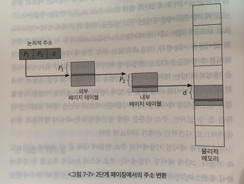
- 따라서 페이지 테이블에 사용되는 메모리 공간의 낭비를 줄이기 위해 **2단계 페이징(tow-level paging)** 기법을 사용한다. 사용되지 않는 주소 공간에 대해서는 외부 페이지 테이블의 항목을 NULL로 설정하여, 여기에 대응하는 내부 페이지 테이블을 생성하지 않는 것이다.
- 2단계 페이징 기법에서는 주소 변환을 위해 외부 페이지 테이블과 내부 페이지 테이블의 두 단계에 걸친 페이지 테이블을 사용한다.
- 사용되지  않는 주소 공간에 대해서는 외부 페이지 테이블의 항목을 NULL로 설정하며, 여기에 대응하는 내부 페이지 테이블을 생성하지 않는다.
- 이러한 기법을 통해 1단계 페이징 기법에 비해서 메모리의 낭비를 크게 줄일 수 있다. 
- 하지만 2단계 페이징은 두 개의 페이지 테이블을 접근해야 하기 때문에 시간적인 손해가 뒤따른다.
- 2단계 페이징 기법에서는 프로세스의 논리적 주소를 두 종류의 페이지번호 (p1, p2)와 페이지 오프셋(d)로 구분한다. 
- 첫 번째 페이지 번호(p1)는 외부 페이지 테이블 인덱스다.
- 두 번째 페이지 번호(p2)는 내부 페이지의 테이블 인덱스다.
- 논리적 주소를 이와 같은 세 부분으로 나누어 <p1, p2, d>의 형태로 표시한다.
- 먼저 외부 페이지 테이블로부터 p1 만큼 떨어진 우치에서 내부 페이지 테이블의 주소를 얻는다.
- 다음으로 내부 페이지 테이블로부터 p2 만큼 떨어진 위치에서 요청된 페이지가 존재하는 프레임의 위치를 얻는다.
- 마지막으로 해당 프레임으로부터 d만큼 떨어진 곳에서 원하는 정보에 접근할 수 있게 된다. 

### 4️⃣ 역페이지 테이블
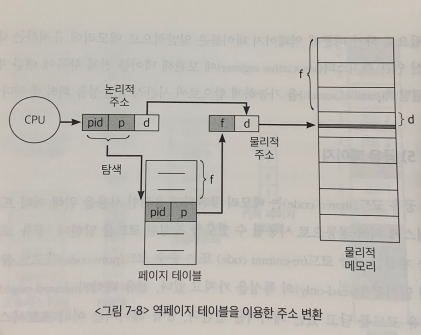
- 페이지 테이블로 인한 메모리 공간의 낭비가 심한 이유는 모든 프로세스의  모든 페이지에 대해 페이지 테이블 항목을 다 구성해야 하기 때문이다.                                                               
- 이 문제를 해결하기 위한 대안으로 역페이지 테이블 기법이 사용될 수 있다.
- 역페이지 테이블 기법은 물리적 메모리의 페이지 프레임 하나당 페이지 테이블에 하나씩의 항목을 두는 방식이다.
- 다시 말하면 논리적 주소에 대해 페이지 테이블을 만드는 것이 아니라, 물리적 주소에 대해 페이지 테이블을 만드는 것이다.
- 즉, 각 프로세스마다 페이지 테이블을 두지 않고, 시스템 전체에 페이지 테이블을 하나만 두는 방법을 말한다. 
- 역페이지 테이블의 각 항목은 어느 프로세스의 어느 페이지가 어떤 페이지 프레임에 적재되었는지에 대한 정보를 보관하고 있다.
- 즉, 페이지 테이블의 각 항목은 프로세스 번호(pid)와 그 프로세스 내의 논리적 페이지 번호(p)를 담고 있게된다.
- 역페이지 테이블 기법에서는 pid와 p를 통해 페이지 프레임 f를 찾은뒤, 거기에 오프셋 d를 더하여 물리적 메모리 주소를 얻어낸다. 
- 하지만 역페이지 테이블에 주소 변환 요청이 들어오면, 그 주소를 담은 페이지가 물리적 메모리에 존재하는지 여부를 판단하기 위해 페이지 테이블 전체를 다 탐색해야 하는 단점이 있다.
- 따라서 역페이지 테이블은 일반적으로 메모리에 올려두는 것이 아니라 연관 레지스터에 보관하여 병렬 탐색의 이점을 보게한다. 

### 5️⃣ 공유 페이지
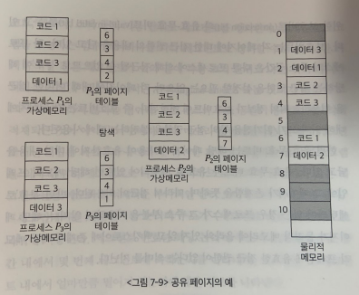
- 공유 코드는 메모리 공간의 효율적인 사용을 위해 여러 프로세스에 의해 공통으로 사용될 수 있도록 작성된 코드를 말한다.
- 공유 페이지란 공유 코드를 담고 있는 페이지를 말한다. 
- 공유 페이지는 여러 프로세스에 의해 공유되는 페이지이므로  물리적 메모리에 하나만 적재되어 메모리를 좀 더 효율적으로 사용할 수 있게 한다.
- 하지만 공유 페이지는 그 페이지를 공유하는 모든 프로세스의 주소 공간에서 동일한 페이지 번호를 가져야한다. 
- 공유 페이지와 대비되는 개념으로 사유 페이지(private page)가 있는데, 이것은 프로세스들이 공유하지 않고 프로세스별로 독자적으로 사용하는 페이지를 말한다.

### 6️⃣ 메모리 보호

- 페이지 테이블의 각 항목에는 주소 변환 정보뿐 아니라 메모리 보호를 위한 **보호비트(protection bit)**와 **유효-무효(vaild-invaild bit)**를 두고 있다.
- **보호 비트**
  - 각 페이지에 대해 읽기-쓰기/읽기전용 등의 접근 권한을 설정하는데 사용된다.
- **유효-무효 비트**
  - 유효로 세팅되어 있으면 해당 페이지 프레임에 페이지가 존재함을 뜻한다.
  - 무효로 세팅되어 있으면 해당 페이지 프렘임에 페이지 프레임이 존재하지 않음을 뜻한다.

## 📌 세그먼테이션
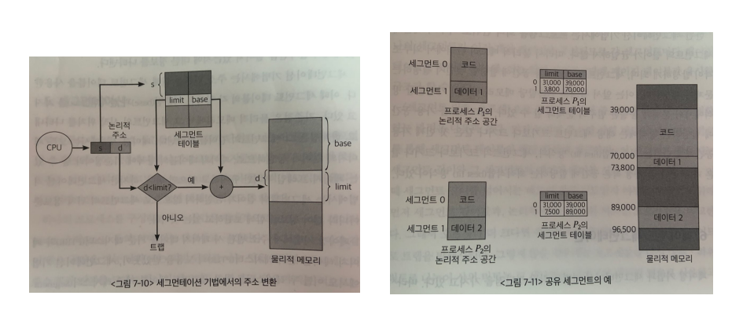
- 세그멘테이션 기법은 프로세스의 주소 공간을 의미 단위의 세그먼트로 나누어 물리적 메모리에 올리는 방법이다.
- 세그먼트는 이와 같이 주소 공간을 기능 단위 또는 의미 단위로 나눈 것을 뜻한다. 일반적으로는 코드(code), 데이터(data), 스택(stack) 등의 기능 단위로 세그먼트를 정의한다.
- 프로그램을 구성하는 함수 하나하나를 각각 세그먼트로 정의할 수도 있다.
- 세그먼트는 의미를 가질 수 있는 논리적인 단위이기 때문에 크기는 균일하지 않다.
- 세그먼테이션 기법에서는 논리적 주소가 <세그먼트 번호, 오프셋> 으로 나뉘어 사용된다.
- 세그먼트 번호는 해당 논리적 주소가 프로세스 주소 공간 내에서 몇 번째 세그먼트에 속하는지를 나타낸다.
- 오프셋은 그 세그먼트 내에서 얼마만큼 떨어져 있는지에 대한 정보를 나타낸다.
- 세그먼테이션 기법에서는 주소 변환을 위해 세그먼트 테이블을 사용한다.
- 이 때 세그먼트 테이블의 각 항목은 기준점(base)과 한계점(limit)를 가지고 있다.
- 기준점은 물리적 메모리에서 그 세그먼트의 시작 위치를 나타낸다.
- 한계점은 그 세그먼트의 길이를 나타낸다. 
- 각 세그먼트의 길이는 균일하지 않으므로 세그먼트의 위치 정보 뿐 아니라 길이 정보를 함께 보관하고 있다.
- 세그먼테이션 기법에서도 세그먼트 테이블 기준 레지스터(Segment Table Base Register:STBR)와 세그먼트 테이블 길이 레지스터(Segment Table Length Register:STLR)를 사용한다.
- 세그먼트 테이블 기준 레지스터는 현재 CPU에서 실행 중인 프로세스의 세그먼트 테이블이 메모리의 어느 위치에 있는지 그 시작 주소를 담고 있다.
- 세그먼트 테이블 길이 레지스터는 그 프로세스 주소 공간이 총 몇 개의 세그먼트로 구성되는지 세그먼트의 개수를 나타낸다. 
- 세그먼테이션 기법에서는 논리적 주소를 물리적 주소로 변환하기 전에 두 가지 사항을 먼저 확인한다. 
- 첫 번째는 요청된 세그먼트 번호가 STLR에 저장된 값보다 작은 값인지 체크한다. 작은 값이라면 예외상황을 발생시킨다.
- 두 번째는 논리적 주소의 오프셋 값이 그 세그먼트의 길이보다 작은 값인지 체크한다. 
- 논리적 주소의 오프셋 값과 해당 세그먼트 테이블의 엔트리의 limit 값을 비교한다. 
- 두 가지 사항을 만족하면 유효한 메모리 접근 요청으로 판단해 주소 변환 작업이 이루어진다.
- 세그멘테이션 기법에서도 세그먼트 테이블의 각 엔트리에 보호비트와 유효비트를 둔다.
- 세그멘테이션 기법에서도 공유 세그먼트 개념을 지원한다. 공유되는 세그먼트는 이 세그먼트를 공유하는 모든 프로세스의 주소 공간에서 동일한 논리적 주소에 위치해야한다. 
- 세그먼트는 의미 단위로 나누어져 있기 때문에 공유와 보안의 측면에서 페이징 기법에 비해 훨씬 효과적이다.
- 주소 공간의 일부를 공유하거나 특정 주소 공간에 읽기전용 등의 접근 권한 제어를 하고자 할 경우, 이는 어떤 의미 단위로 이루어지지 단순히 크기 단위로 수행되지 않기 때문이다. 
- 예를들어 페이징 기법에서는 동일한 크기로 주소 공간을 나누다 보면 공유하려는 코드와 사유 데이터 영역이 동일 페이지에 공존하는 경우가 발생할 수 있다. 
- 세그멘테이션 기법에서는 이러한 현상이 발생하지 않으므로 공유나 보안처럼 의미 있는 단위에 대해 수행하는 업무에서는 페이징 기법보다 세그먼테이션 기법이 장점을 가진다.
- 하지만 각 세그먼트는 길이가 균일하지 않으므로 외부 조각이 발생하고, 세그먼트를 어느 가용 공간에 할당하는지 결정해야하는 문제가 생긴다. frist fit, best fit 방식이 있다. 

## 📌 페이지드 세그먼테이션 
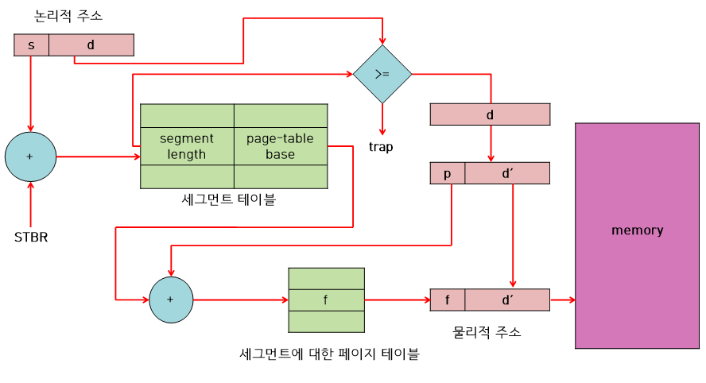
- 페이징 기법과 세그먼테이션 기법은 각각 장단점을 깆고 있다.
- 이들 두 기법의 장점만을 취하는 주소 변환 기법으로 페이지드 세그먼테이션 기법이 있다.
- 페이지드 세그먼테이션은 프로그램을 의미 단위의 세그먼트로 나눈다.
- 단 하나의 세그먼트가 반드시 동일한 크기의 페이지들의 집합으로 구성되어야 한다.
- 그리고 물리적 메모리에 적재하는 단위는 페이지 단위 이다.
- 즉, 페이지드 세그먼테이션 기법에서는 하나의 세그먼트 크기를 페이지 크기의 배수가 되도록 함으로써 세그먼테이션 기법에서 발생하는 외부조각의 문제점을 해결한다.
- 그리고 세그먼트 단위로 프로세스 간의 공유나 프로세스 내의 접근 권한 보호가 이루어지도록 함으로써 페이징 기법의 약점을 해소한다.

- 즉, 페이지드 세그먼테이션 기법에서는 주소 변환을 위해 외부의 세그먼트 테이블과 내부의 페이지 테이블 이렇게 두 단계의 테이블을 이용한다. 이는 2단계 페이지 테이블과 유사한 구조라 할 수 있다.
- <세그먼트 번호 s, 오프셋 d>으로 구성된 논리적 주소를 물리적 주소로 변환하는 과정은 다음과 같다. 
  1. 먼저 STBR로 메모리에 적재되어있는 Segment Table을 찾는다.
  2. 논리적주소의 세그먼트 번호 s를  Segment Table의 인덱스로 사용하여 해당 엔트리를 찾는다. 엔트리에는 해당 세그먼트의 길이와,  세그먼트를 구성하는 Page들의 Page Table의 시작 주소가 들어있다. 만약 세그먼트 길이보다 오프셋 값 d가 크다면 trap에 걸린다.
  3. 논리적 주소 d로부터 페이지 번호 p와 페이지 오프셋 d'를 얻어낸다. 페이지 번호를 페이지 테이블의 인덱스로 사용하여 페이지 프레임 번호 f를 얻어낸다.
  4. 페이지 프레임 번호 f와 페이지 오프셋 d'를 더해서 물리적 주소를 얻어낸다. 

 

# 🔎 출처 & 더 알아보기 

  * [운영체제와 정보기술의 원리(개정판)](https://book.naver.com/bookdb/book_detail.nhn?bid=16345019)
  * [메모리 관리 전략](https://slidesplayer.org/slide/11087763/ )
  * [MMU (Memory Management Unit)](http://recipes.egloos.com/5232056)
  * [메모리 관리 장치(MMU)](https://ko.wikipedia.org/wiki/메모리_관리_장치)

​    

