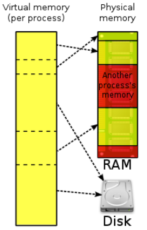

# 📝Virtual Memory(가상메모리)

- 가상 메모리는 각 프로세스마다 가상 주소를 할당하는 메모리 관리 방법이다.
- 프로세스의 가상 메모리 공간 중 일부는 메모리에 적재 되거나 일부는 디스크의 스왑 영역에 존재할 수 있다.
- 메모리의 연장 공간으로 디스크의 스왑 영역이 사용될 수 있기 때문에 프로그램 입장에서는 물리적 메모리 크기에 대한 제약을 생각할 필요가 없어진다. 
- 프로세스의 주소 공간을 메모리로 적재하는 단위에 따라 가상메모리 기법은 요구 페이징 방식과 요구 세그먼테이션 방식으로 구현될 수 있다.
- 요구 세그먼테이션 방식도 페이지드 세그먼테이션 기법을 사용하는 경우가 대부분이기 때문에 실질적으로 요구 페이징 기법만이 사용된다고 할 수 있다. 

 

# 📝 Demand Paging(요구 페이징)

- 요구 페이징이란 프로그램 실행 시 프로세스를 구성하는 모든 페이지를 한꺼번에 메모리에 올리는 것이 아니라 당장 사용될 페이지만을 올리는 방식을 말한다.
  - 메모리 사용량이 감소한다.
  - 프로세스 전체를 메모리에 적재하는데 소요되는 오버헤드가 줄어든다.
  - 시스템이 더 많은 프로세스를 수용할 수 있게 해준다. 
  - 프로그램이 물리적 메모리의 용량 제약을 벗어날 수 있다.
- 특정 페이지에 대해 CPU 요청이 들어오면, 해당 페이지를 메모리에 적재한다. 
- 시스템에서는 특정 프로세스를 구성하는 페이지 중에서 어떤 페이지가 메모리에 존재하고 어떤 페이지가 디스크의 스왑 영역에 존재하는지 유효-무효(vaild-invaild) 비트로 표시한다.
  - 페이지가 메모리에 적재될 때는 유효 비트로 표시한다.
  - 페이지가 디스크로 스왑될 때는 무효 비트로 표시한다.
- CPU가 참조하려는 페이지가 현재 메모리에 올라와 있지 않아 무효 비트로 표시 되어 있는 경우를 '페이지 부재(page fault)'라고 한다.

## 1) 요구 페이징의 페이지 부재 처리 

- 운영체제의 페이지 부재 처리 루틴
  1. 해당 페이지에 대한 접근이 올바른지 확인한다.
     - 사용되지 않은 주소 영역에 속한 페이지에 접근하거나 접근 권한 위반을 했을 경우에는 해당 프로세스를 종료 시킨다.
  2. 해당 페이지에 대한 접근이 문제가 없다면, 물리적 메모리에서 비어 있는 프레임을 할당 받아 그 공간에 해당 페이지를 적재한다.
     - 만약 비어 있는 페이지 프레임이 없다면 기존에 메모리에 올아와 있는 페이지중 하나를 디스크로 쫓아낸다.
  3. 빈 페이지 프레임을 찾았으면, 해당 페이지를 하드 디스크에서 찾아서 물리적 메모리에 적재한다. 
     - 요청된 페이지를 디스크로부터 메모리로 적재하는데까지 오랜 시간이 소요된다. (I/O 작업이기 때문이다.)
  4. 요청된 페이지를 메모리로 적재하는 것은 오랜 시간이 걸리는 I/O 작업이다. 따라서 페이지 부재를 발생시킨 프로세스는 CPU를 빼앗기고 block 된다. 
  5. 디스크 입출력이 완료되면(페이지가 물리적 메모리에 적재되면), 인터럽트가 발생하여 해당 페이지의 비트가 유효로 표시되고, block 되었던 프로세스를 준비큐로 이동시킨다. 

## 2) 요구 페이징의 성능

- 요구 페이징 기법의 성능에 가장 큰 영향을 미치는 요소는 페이지 부재의 발생 빈도이다.
- 페이지 부재가 발생하면, 요청된 페이지를 디스크로부터 메모리로 읽어오는 막대한 오버헤드가 발생하기 때문이다. 

 

# 📝 페이지 교체

- 페이지 부재가 발생하면 요청된 페이지를 디스크에서 메모리로 읽어와야 한다.
- 이때 물리적 메모리에 빈 프레임이 존재하지 않을 수 있다.
- 이 경우 메모리에 올라와 있는 페이지 중 하나를 디스크로 쫓아내 메모리에 빈 공간을 확보하는 작업이 필요하다. 이것을 페이지 교체라고 한다.
- 페이지 교체를 할 떄 어떤 프레임에 있느 페이지를 쫓아낼 것 인지 결정하는 알고리즘을 교체 알고리즘이라고 한다.
- 교체 알고리즘의 목표는 페이지 부재율을 최소화 하는 것이다.

## 1) 최적 페이지 교체

- 페이지 교체 시 물리적 메모리에 존재하는 페이지 중 가장 먼 미래에 참조될 페이지를 쫓아내면 된다.
- 이러한 최적의 알고리즘을 빌레디의 최적 알고리즘 또는 MIN, OPT라고 불린다. 
- 이 알고리즘은 미래에 어떤 페이지가 어떤 순서로 참조될지 미리 알고 있다는 전제가 필요하다.
- 따라서 실제로 사용할 수 있는 알고리즘이 아니다.
- 최적 페이지 교체 알고리즘은 다른 페이지 교체 알고리즘의 성능에 대한 상한선(upper bound)을 제공한다. 

## 2) 선입선출 알고리즘

- 선입선출(First In First Out : FIFO) 알고리즘은 페이지 교체 시 물리적 메모리에 가장 먼저 올라온 페이지를 우선적으로 내 쫓는다.
- 페이지의 향후 참조 가능성을 고려하지 않고, 물리적 메모리에 들어온 순서대로 내쫓을 대상을 선정하기 때문에 비효율적인 상황이 발생할 수 있다. 
  - 예를들어, 가장 먼저 물리적 메모리에 들어온 페이지가 계속해서 많은 참조가 이루어진다 하더라도 FIFO 알고리즘은 이 페이지를 내 쫓는다.
- 위 그림의 예제는 물리적 메모리의 공간을 3개에서 4개로 증가 시켰을 경우 페이지 부재가 9회에서 10회로 증가하는 이상한 현상이 발생한다. 이를 FIFO의 이상 현상(FIFO anomaly)이라고 부른다.

## 3) LRU(Least Recently Used) 알고리즘

- 메모리 페이지의 참조 성향 중 중요한 한 가지 성질로 시간지역성이라는 것이 있다.
- 이 성질은 최근에 참조된 페이지가 가까운 미래에 다시 참조될 가능성이 높은 성질을 말한다.
- LRU 알고리즘은 이와 같이 성질을 활용해서 페이지 교체 시 가장 오래전에 참조가 이루어진 페이지를 쫓아낸다.
- LRU 알고리즘의 구현 
  - LRU 알고리즘은 연결 리스트를 사용해서 O(n) 시간에 구현할 수 있다.
  - LRU는 메모리 내의 페이지들을 참조 시간 순서대로 연결리 스트로 나열해서 관리한다.
  - 연결 리스트의 앞쪽으로 갈 수록 오래전에 참조된 페이지고, 뒤쪽으로 갈수록 최근에 참조된 페이지다.
  - LRU 알고리즘은 가장 오래전에 참조된 페이지를 내쫓는 알고리즘이므로, 연결 리스트의 가장 앞쪽에 있는 원소에 해당하는 페이지를 쫓아내면 된다. 
  - 만약 어떤 페이지가 새롭게 메모리에 적재되거나, 원래 적재 되어있던 페이지가 다시 참조되면,
  - 해당 페이지를 연결 리스트의 가장 뒤쪽으로 이동시킨다.

## 4) LFU(Least Frequently Used) 알고리즘

-   LFU 알고리즘은 페이지의 참조 횟수로 교체시킬 페이지를 결정한다.
-   즉 물리적 메모리 내에 존재하는 페이지 중에서 과거에 참조 횟수가 가장 적었던 페이지를 쫓아내고 그 자리에 새로 참조될 페이지를 적재한다. 
-   최저 참조 횟수를 가진 페이지들이 여러 개라면, 상대적으로 더 오래전에 참조된 페이지를 쫓아내도록 구현하는 것이 효율적이다. 
-   LFU 알고리즘은 페이지 참조 횟수를 계산하는 방식에 따라 Incache-LFU와 Perfect-LFU의 서로 다른 방식으로 구현할 수 있다.
- Incache-LFU

  - 페이지가 물리적 메모리에 올라온 후부터의 참조 횟수를 카운트 하는 방식이다.
- Perfect-LFU

  - 페이지의 과거 총 참조 횟수를 카운트 하는 방식이다. 
  - 페이지의 참조 횟수를 정확히 반영할 수 있다는 장점이 있지만, 메모리에서 쫓겨난 페이지의 참조 기록까지 모두 보관하고 있어야 하므로 오버헤드가 상대적으로 크다.
  
-   LFU 알고리즘의 구현
    -   LFU 알고리즘도 연결 리스트를 사용해서 O(N) 시간에 구현할 수 있다.
    -   연결 리스트의 앞쪽에 있을 수록 참조 횟수가 적은 페이지고, 뒤쪽으로 갈수록 참조 횟수가 많은 페이지다.
    -   LFU 알고리즘은 가장 적게 참조된 페이지를 내쫓는 알고리즘이다. 즉, 연결 리스트의 가장 앞쪽에 있는 원소에 해당하는 페이지를 내쫓으면 된다. 
    -   어떤 페이지가 새롭게 참조돼서 메모리에 적재되거나, 이미 참조 되었어서 메모리에 적재되어 있던 페이지가 다시 참도되면,
    -   해당 페이지를 참조 횟수 순을 고려하여 연결리스트에 적절히 재배치 해야한다. 따라서 O(N) 시간이 걸린다.
    -   min heap 자료구조를 사용하여 페이지의 참조 횟수를 관리하면, LFU 알고리즘을 O(logN) 시간에 구현할 수 있다.
## 5) LRU와 LFU 알고리즘 비교 예제

- LRU 알고리즘의 문제점
  - LRU는 1번 페이지를 내쫓는다.
  - 1번 페이지는 가장 오래전에 참조되었지만 참조 횟수가 가장 높음에도 불구하고 내쫓아 버리는 문제가 있다.
- LFU 알고리즘의 문제점
  - LFU는 페이지 참조 횟수가 가장 적은 페이지 4를 내쫓는다.
  - 하지만 4번 페이지가 미래에 여러번 참조된다면, 4번 페이지를 내쫓는 것은 좋은 선택이 아니다. 

## 5) 클럭 알고리즘

- LRU와 LFU 알고리즘은 페이지의 참조 시각 및 참조 횟수를 소프트웨어적으로 유지하고 비교해야 하므로 알고리즘의 운영에 시간적인 오버헤드가 발생한다. 
- 클럭 알고리즘은 하드웨어적인 지원을 통해 이와 같은 알고리즘의 오버헤드를 줄인 방식이다.
- 클럭 알고리즘은 LRU를 근사시킨 알고리즘으로 NUR 또는 NRU 알고리즘으로도 불린다.
- LRU는 '가장' 오래전에 참조된 페이지를 교체하는 것에 비해 클럭 알고리즘은 오랫동안 참조되지 않은 페이지중 하나를 교체한다.
- 위와 같이 클럭 알고리즘은 LRU를 근사시킨 알고리즘으로 볼 수 있다.
- 대부분의 시스템에서 페이지 교체 알고리즘으로 클럭 알고리즘을 채택한다.
- 클럭 알고리즘은 교체할 페이지를 선정하기 위해 페이지 프레임들의 참조비트를 순차적으로 조사한다.
- 참조비트는 각 프레임마다 하나씩 존재하며 그 프레임 내의 페이지가 참조될 때 하드웨어에 의해 1로 자동 세팅 된다.
- 여기서 클럭 알고리즘은 참조비트가 1인 페이지는 0으로 바꾼 후 그냥 지나가고 참조비트가 0인 페이지는 교체한다.
- 모든 페이지 프레임을 다 조사한 경우 첫 번째 페이지 프레임부터 조사 작업을 반복한다.
- 이 방식은 간단히 말해 시계바늘이 한 바퀴 도는 동안 다시 참조되지 않은 페이지를 교체하는 것이다. 
- 그림을 통해 더 구체적으로 알아보자
  - 교체 대상 페이지를 찾기 위해 클럭 알고리즘은 메모리에 현재 올라와 있는 페이지의 참조 비트 정보를 시계방향으로 따라가며 조사한다.
  - 시곗바늘이 가리키는 페이지의 참조 비트가 1인 경우 클럭 알고맂므은 참조비트를 0으로 바꾼 후 시곗바늘을 한 칸 진행시키고 참조비트가 0인 페이지를 찾으면 그 페이지를 교체한다.
  - 한 편 참조비트는 그 페잊가 참조 될 때 1로 자동 세팅되므로 시곗바늘이 한 바퀴 돌아오는 동안에 다시 참조되지 않을 경우 그 페이지는 교체된다. 
  - 이는 참조 비트가 1인 페이지는 0으로 바꾼 후 교체하지 않고 그냥 지나가게 되는데, 
  - 이렇게 시곗바늘이 한 바퀴를 돌아왔을 때 여전히 참조 비트가 0이라면, 그 시간 동안 다시 참조되지 않았다는 뜻이기 때문이다.
  - 자주 사용되는 페이지라면 시곗바늘이 한 바퀴 도는 동안 참조비트가 1로 세팅되어 교체되지 않으므로 이 알고리즘은 최근에 참조가 일어나지 않은 페이지를 교체하는 알고리즘이라 할 수 있다.
  - 적어도 시곗바늘이 한 바퀴를 도는 데 소요되는 시간만큼 페이지를 메모리에 유지시켜줌으로써 페이지 부재율을 줄이도록 설계되었기 때문에 이 알고리즘을 2차 기회 알고리즘이라고도 부른다. 

# 📝 페이지 프레임의 할당

- 프로세스마다 페이지 프레임을 할당하는 두 가지 방법이 있다.
- 균등할당 방식
  - 모든 프로세스에게 페이지 프레임을 균일하게 할당하는 방식이다.
- 비례할당 방식
  - 프로세스의 크기에 비례해 페이지 프레임을 할당하는 방식이다.
- 우선순위 할당 방식
  - 프로세스의 우선순위에 따라 페이지 프레임을 다르게 할당하는 방식이다. 
- CPU에서 명령을 실행할 때에는 일반적으로 여러 페이지를 동시에 참조하게 된다.
- 이는 명령을 실행할 때 프로세스의 주소 공간 중 코드, 데이터, 스택 등 각기 다른 영역을 참조하기 때문이다.
- 따라서 프로세스를 정상적으로 수행하기 위해서는 적어도 일정 수준 이상의 페이지 프레임을 각 프로세스에 할당 해야한다. 
- 반복문을 실행 중인 프로세스의 경우 반복문을 구성하는 페이지들을 한꺼번에 메모리에 올려 놓는 것이 유리하다.
- 반복문을 구성하는 페이지의 수보다 적은 양의 페이지 프레임을 할당한다면 매 반복마다 적어도 한 번 이 상의 페이지 부재가 발생하여 시스템 성능이 현저히 떨어지게 되기 때문이다.
- 또한 프로세스에게 최소한으로 필요한 메모리의 양은 시간에 따라 다를 수 있다.
- 이와 같은 종합적인 상황을 고려해서 각 프로세스에 할당되는 페이지 프레임의 수를 결정할 필요가 있으며, 
- 경우에 따라서는 일부 프로세스에게 메모리를 할당하지 않은 방식으로 나머지 프로세스들에게 최소한의 메모리 요구량을 충족시킬 수 있어야한다. 

 

# 📝 전역교체와 지역교체

- 교체할 페이지를 선정할 때, 교체 대상이 될 프레임의 범위를 어떻게 정할지에 따라 교체 방법을 전역교체와 지역 교체로 구분될 수 있다.
- 전역교체
  - 모든 페이지 프레임이 교체 대상이 될 수 있는 방법이다. 
  - 프로세스마다 메모리를 할당하는 것이 아니라 전체 메모리를 각 프로세스가 공유해서 사용하고 교체 알고리즘에 근거해서 할당되는 메모리 양이 가변적으로 변하는 방법이다. 
  - LRU, LFU, 클럭 등의 알고리즘을 물리적 메모리 내에 존재하는 전체 페이짐 프레임들을 대상으로 적용하는 경우이다.
- 지역교체
  - 현재 수행 중인 프로세스에게 할당된 페이지 프레임 내에서만 교체 대상을 선정할 수 있는 방법이다. 
  - 프로세스마다 페이지 프레임을 미리 할당하는 것을 전제로 한다.
  - LRU, LFU, 클럭 등의 알고리즘을 프로세스별로 독자적으로 운영하는 경우이다.

 

# 📝 쓰레싱

- 프로세스가 원할하게 수행되기 위해서는 일정 수준 이상의 페이지 프레임을 할당 받아야 한다. 
- 프로세스가 최소한의 페이지 프레임을 할당받지 못할 경우 성능상의 심각한 문제가 발생할 수 있다.
- 집중적으로 참조되는 페이지들의 집합을 메모리에 한꺼번에 적재하지 못하면 페이지 부재율이 크게 상승해 CPU 이용률이 급격히 떨어질 수 있다. 이와 같은 현상을 쓰레싱(thrashing)이라고 부른다. 
- 스레싱이 발생하는 시나리오
  - 운영체제는 CPU의 이용률이 낮을 경우 메모리에 올라와 있는 프로세스의 수가 적기 때문이라고 판단한다.
  - 레디 큐에 프로세스가 단 하나라도 있으면 CPU는 그 프로세스를 실행하므로 쉬지 않고 일하제 된다.
  - 그런데 CPU 이용률이 낮다는 것은 레디 큐가 비는 상황이 발생한다는 뜻이다.
  - 이는 메모리에 올라와 있는 프로세스의 수가 너무 적어 이들 프로세스가 모두 I/O 작업을 함으로써 레디 큐가 비는 경우가 발생했다는 뜻이다.
  - 따라서 CPU 이용률이 낮으면 운영체제는 메모리에 올라가는 프로세스의 수를 늘리게 된다.
  - 우리는 메모리에 동시에 올라가 있는 프로세스의 수를 다중 프로그래밍의 정도(Mutil-Programming Degree : MPD)라고 부른다.
  - 요약하자면, CPU 이용률이 낮을 경우 운영체제는 MPD를 높이게 된다. 
  - 그런데 MPD가 과도하게 높아지면 각 프로세스에게 할당되는 메모리의 양이 지나치게 감소하게 된다.
  - 그렇게되면 각 프로세스는 그들이 원할하게 수행되기 위해 필요한 최소한의 페이지 프레임도 할당받지 못하는 상태가 되어 페이지 부재가 빈번하게 발생하게 된다.
  - 페이지 부재가 발생하면 디스크 I/O 작업을 수반하므로 문맥교환을 통해 다른 프로세스에게 CPU가 이양된다. 
  - 이때 다른 프로세스 역시 할당받은 메모리 양이 지나치게 적으면 페이지 부재가 발생할 수밖에 없다. 
  - 이러한 상황이 반복어 모든 프로세스가 페이지 부재를 발생시켜 시스템은 페이지 부재를 처리하느라 매우 분주해지고 CPU의 이용률은 급격히 떨어지게 된다.
  - 이상황에서 운영체제는 메모리에 올라와 있는 프로세스의 수가 적어 이러한 현상이 발생했다고 판단하고, MPD를 높이기 위해 또 다른 프로세스를 메모리에 추가하게 된다.
  - 이로 인해 프로세스당 할당된 프레임의 수가 더욱 감소하고 페이지 부재는 더욱 빈번히 발생하게 된다.
  - 이 경우 프로세스들은 서로의 페이지를 교체하며 스왑 인과 스왑 아웃을 지속적으로 발생시키고, CPU는 대부분의 시간에 일을 하지 않게 된다. 이러한 상황을 스레싱이라고 부른다.
- 스레싱이 발생하지 않도록 하면서 CPU 이용률을 최대한 높일 수 있도록 MPD를 조절하는 것이 중요하다.
- MPD를 적절히 조절해 CPU 이용률을 높이는 동시에 스레싱 발생을 방지하는 방법에는 워킹셋 알고리즘과 페이지 부재 빈도 알고리즘이 있다. 

## 1) 워킹셋 알고리즘

- 프로세스는 일정 시간 동안 특정 주소 영역을 집중적으로 참조하는 경향이 있다.
- 이렇게 집중적으로 참조되는 페이지들의 집합을 지역성 집합(locality-set)이라고 한다. 
- 워킹셋 알고리즘은 이러한 지역성 집합이 메모리에 동시에 올라갈 수 있도록 보장하는 메모리 알고리즘을 뜻한다. 
- 워킹셋 알고리즘에서는 프로세스가 일정 시간 동안 원활히 수행되기 위해 한꺼번에 메모리에 올라와 있어야 하는 페이지들의 집합을 워킹셋이라고 정의한다.
- 프로세스의 워킹셋을 구성하는 페이지들이 한꺼번에 메모리에 올라갈 수 있는 경우에만 그 프로세스에게 메모리를 할당한다.
- 만약 그렇지 않을 경우에는 프로세스에게 할당된 페이지 프레임들을 모두 반납시킨 후 그 프로세스의 주소 공간 전체를 디스크로 스왑 아웃 시킨다.
- 이와 같은 방법을 통해 워킹셋 알고리즘은 MPD를 조절하고 스레싱을 방지하게 된다. 
- 워킹셋 알고리즘이 워킹셋을 어떻게 구성하는지 알아보도록 하자
- 한 꺼번에 메모리에 올라가야할 페이지들의 집합을 결정하기 위해 위킹셋 알고리즘은 워킹셋 윈도우를 사용한다.
- 윈도우의 크기가 Δ인 경우, 워킹셋 알고리즘은 시각 ti에서의 워킹셋 WS(ti)을 시간 간격 [ti-Δ, ti]사이에 참조된 서로 다른 페이지들의 집합으로 정의한다. 
- ti 시간점에 워킹셋에 포함된 페이지들은 메모리에 유지되고 그렇지 않은 페이지들은 메모리에서 쫓겨나게 된다. 
- 이는 달리 표현하면 페이지가 참조된 시점부터 Δ시간 동안은 메모리에 유지하고, 그 시점이 지나면 메모리에서 지워버리는 것이다.
- 워킹셋 알고리즘은 메모리에 올라와 있는 프로세스들의 워킹셋 크기의 합이 프레임의 수보다 클 경우 일부 프로세스를 스왑 아웃시켜서 남은 프로세스의 워킹셋이 메모리에 모두 올라가는 것을 보장한다. 이는 MPD를 줄이는 효과를 발생시킨다.
- 반면 프로세스들의 워킹셋을 모두 할당한 후에도 페이지 프레임이 남을 경우, 스왑 아웃되었던 프로세스를 다시 메모리에 올려서 워킹셋을 할당함으로써 MPD를 증가 시킨다.
- 이러한 방식으로 워킹셋 알고리즘은 CPU 이용률을 높게 유지하면서 MPD를 적절히 조절해 스레싱을 방지한다. 
- 윈도우 Δ의 크기가 너무 작으면 지역성 집합을 모두 수용하지 못할 우려가 있다.
- 위도우 Δ의 크기가 너무 크면 여러 규모의 지역성 집합을 수용할 수 있는 반면 MPD가 감소해 CPU 이용률이 낮아질 우려가 있다.
- 따라서 워킹셋 알고리즘에서 시스템의 성능을 향상시키기 위해서는 프로세스들의 지역성 집합을 효과적으로 탐지할 수 있는 윈도우 크기 Δ를 결정하는 것이 중요하다.
- 위킹셋 알고리즘에서 워킹셋의 크기는 시간의 흐름에 따라 변한다. 위 그림에서 윈도우의 크기가 10에서 2로 변하는 것을 볼 수 있다.
- 이처럼 워킹셋 알고리즘은 프로세스가 메모리를 많이 필요로 할 때에는 많이 할당하고 적게 필요로 할 때에는 적게 할당하는 일종의 동적인 프레임 할당 기능까지 수행한다고 할 수 있다. 

## 2) 페이지 부재 빈도 알고리즘

- 페이지 부재 빈도(Page Fault Frequency:PFF) 알고리즘은 프로세스의 페이지 부재율을 주기적으로 조사하고 이 값에 근거해서 각 프로세스에 할당할 메모리 양을 동적으로 조절한다. 
- 어떤 프로세스의 페이지 부재율이 시스템에서 미리 정해놓은 상한값을 넘게 되면 이 프로세스에 할당된 프레임의 수가 부족하다고 판단하여 이 프로세스에게 프레임을 추가로 더 할당한다.
- 이때 추가로 할당할 빈 프레임이 없다면 일부 프로세스를 스왑 아웃시켜 메모리에 올라가 있는 프로세스의 수를 조절한다.
- 반면 프로세스의 페이지 부재율이 하한값 이하로 떨어지면 이 프로세스에게 필요 이상으로 많은 프레임이 할당된 것으로 간주해 할당된 프레임의 수를 줄인다.
- 이런 방식으로 메모리 내에 존재하는 모든 프로세스에 필요한 프레임을 다 할당한 후에도 프레임이 남는 경우 스왑 아웃되었던 프로세스에게 프레임을 할당함으로써 MPD를 높인다. 
- 페이지 부재 빈도 알고리즘에서는 이러한 원리로 MPD를 조절하면서 CPU 이용률을 높이는 동시에 스레싱을 방지한다.  

# 🔎 출처 & 더 알아보기

- [KOCW 운영체제-반효경](http://www.kocw.net/home/search/kemView.do?kemId=1046323)
- [운영체제와 정보기술의 원리(개정판)](https://book.naver.com/bookdb/book_detail.nhn?bid=16345019)
