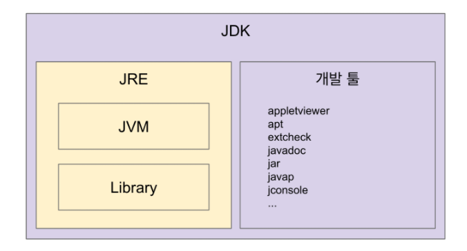
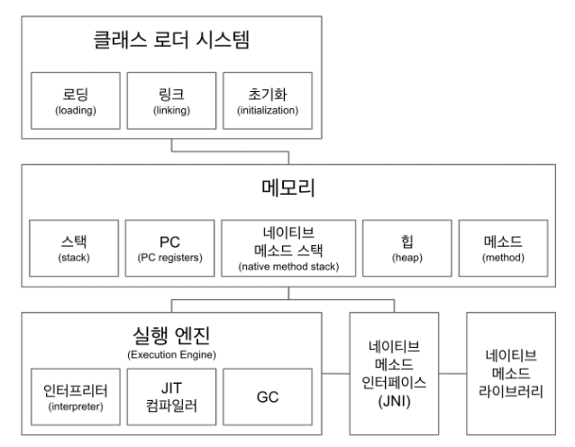
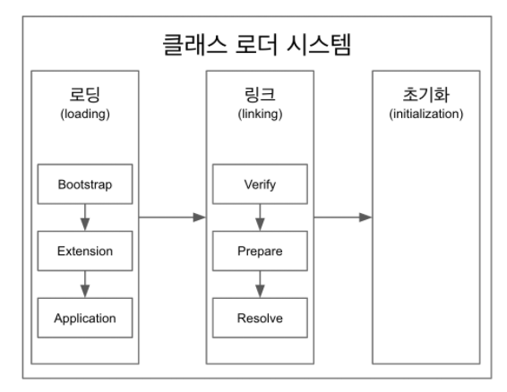

 

# 📝 Java 

-  썬 마이크로시스템즈의 제임스 고슬링이 개발한 객체 지향 프로그래밍 언어이다. 웹과 모바일 앱 개발에 많이 사용된다. 문법적인 특성이 C 언어와 비슷하다.

-  Java로 개발된 프로그램은 CPU나 운영체제의 종류에 상관없이, JVM을 설치할 수 있는 시스템 어디서나 실행될 수 있다. 즉, Java로 작성된 프로그램은 플랫폼 독립적이다. 

-  프로그램은 본래 운영체제에 따라 구현 방법이 달라진다. 자바 프로그램은 JVM 위에서 실행되기 때문에 같은 코드의 프로그램으로 다양한 운영체제에서 실행될 수 있다. (하지만 운영체제에 따른 알맞은 JVM이 필요하다.)

------

 

# 📝 Java file, Java Compiler, Java Bytecode 

- 몇 가지 Java 관련 용어를 살펴보자.
- 자바 소스파일 (*.java) - 확장자가 .java인 파일이다. 소스파일에 저장된 프로그램 코드를 가리켜 소스코드라고 한다.
- Java Compiler (Javac.exe) - .java 파일의 소스코드를 JVM이 이해할 수 있는 자바 바이트코드로 변환한다.
- Java Bytecode (.class) - 확장자가 .class인 클래스 파일이다. 자바와 기계어 사이의 중간 언어이다. JVM이 사용할 수 있다. 각각의 바이트코드는 1바이트로 구성된다. 
- 자바 가상 머신(JVM) - 자바 바이트코드를 기계어로 변환하고 실행한다.

 

------

# 📝 JVM, JRE, JDK

## JVM(Java Vitual Machine)

- JVM은 자바 바이트코드(.class 파일)를 운영체제가 이해할 수 있는 기계어(네이티브 코드, 바이너리코드)로 변환하여 실행한다. 
- JVM은 자바 바이트 코드를 실행하는 표준이자 구현체이다.
- JVM 스팩 : https://docs.oracle.com/javase/specs/jvms/se11/html/
- 오라클, 아마존, Azul 등의 JVM 밴더들은 JVM을 구현한다.
- JVM은 플랫폼에 종속적이다. 즉, 운영체제에 종속적이다.
- 반면, 자바 소스 코드는 JVM 위에서 동작하므로 플랫폼에 독립적이다.
- 자바 이외에 JVM에서 동작하는 프로그래밍 언어들이 있다. (클로저, 그루비, JRuby, Kotlin, Scala 등)

 

## JRE(Java Runtime Environment)

- JVM이 자바 프로그램을 실행할 때 필요한 라이브러리와 기타 파일들을 가지고 있다. 
- JRE는 JVM의 실행 환경을 구현한 것이다. 
- 간단히 말해서 JVM + 라이브러리다. 개발 관련 도구는 포함하지 않는다.

## JDK(Java Development Kit, JDK)

- JDK는 java 개발을 위한 도구이다. JRE, 자바 컴파일러(Javac), 각종 라이브러리 등을 포함하고 있다. 
- 간단히 말해서 JRE + 개발에 필요한 툴이다.
- 오라클은 자바 11부터 JDK만 제공하고 JRE를 따로 제공하지 않는다.

 

------

# 📝 JVM 구조

### 클래스 로더 시스템

- .class 파일에서 바이트 코드를 읽고 메모리에 저장한다.
- 로딩 : 클래스를 읽어오는 과정
- 링크 : 레퍼런스를 연결하는 과정
- 초기화 : static 값들 초기화 및 변수 할당

### 메모리

- 스택, PC, 네이티브 메소드 스택은 쓰레드마다 별도로 가지고 있고
- 힙, 메소드 영역은 공유 되는 영역이다.
- **스택** 영역에는 각 쓰레드의 메서드 호출을 스택 프레임이라 부르는 블럭으로 쌓는다. 쓰레드가 종료되면 스택도 사라진다.
- **PC(Program Counter) 레지스터**에는 쓰레드마다 쓰레드 내 현재 실행할 명령어의 위치를 가리키는 포인터가 생성된다.
- **네이티브 메소드 스택**에는 네이티브 메서드 호출에 대한 스택을 쌓는다.
- **힙 영역**에는 객체를 저장한다.
- **메서드 영역**에는 클래스 수준의 정보(클래스 이름, 부모 클래스 이름, 메서드, 변수)가 저장된다. 

### 실행 엔진

- 인터프리터는 바이트 코드를 한줄씩 읽고 기계어로 변환한뒤 명령어 단위로 실행한다.
- JIT 컴파일러 인터프리터의 효율을 높이기 위해 인터프리터가 반복되는 코드를 발견하면 JIT 컴파일러로 반복되는 코드를 모두 네이티브 코드로 바꿔둔다.
-  그 다음부터 반복되는 코드 발견시 인터프리터는 네이티브 코드로 컴파일된 코드를 바로 사용한다. 
- GC(Garbage Collector)
  - GC는 Heap 메모리 영역에 생성된 객체들 중에 참조되지 않은 객체들을 탐색 후 제거하는 역할을 한다. 필요하지 않은 쓰레기 객체를 효과적으로 처리한다. 
  - GC가 언제 동작하는지 정확히 알 수 없다. (참조가 없어지자마자 해제되는 것을 보장하지 않는다.)

  - GC가 수행되는 동안 GC를 수행하는 쓰레드가 아닌 다른 모든 쓰레드가 일시정지된다. 

### 네이티브 메소드 인터페이스(JNI)

- 네입티브 메소드 인터페이스는 자바 애플리케이션이 C, C++, 어셈블리로 작동된 함수를 사용할 수 있는 방법을 제공한다. 

### 네이티브 메소드 라이브러리

- C, C++로 작성된 라이브러리이다. 

 

------

# 📝클래스 로더 시스템 더 알아보기

- 클래스 로더 시스템은 로딩, 링크, 초기화 순으로 진행된다.
- 클래스 로더는 계층 구조이다. 기본적으로 3가지 클래스 로더가 제공된다.
  - 부트 스트랩 클래스 로더 - JAVA_HOME\lib에 있는 코어 자바 API를 제공한다. 최상위 우선순위를 가진 클래스 로더
  - 플랫폼 클래스로더 - JAVA_HOME\lib\ext 폴더 또는 java.ext.dirs 시스템 변수에 해당하는 위치에 있는 클래스를 읽는다.
  - 애플리케이션 클래스로더 - 애플리케이션 클래스패스(애플리케이션 실행할 때 주는 -classpath 옵션 또는 java.class.path 환경 변수의 값에 해당하는 위치)에서 클래스를 읽는다.

## 로딩

- 클래스로더가 .class 파일을 읽고 그 내용에 따라 적절한 바이너리 데이터를 만들고 "메소드" 영역에 저장한다.
- 이때 메소드 영역에 저장되는 데이터는 아래와 같다.
  - FQCN
  - Class, Interface, Enum
  - 메소드와 변수 
- 로딩이 끝나면 해당하는 클래스 타입의 Class 객체를 생성해서 "힙"영역에 저장한다.

## 링크

- Verify, Prepare, Resolve(optional) 3 단계로 나눠져 있다.
- Verify : .class 파일 형식이 유효한지 체크한다.
- Preparation : 클래스 변수(static 변수)와 기본값에 필요한 메모리
- Resolve : 심볼릭 메모리 레퍼런스를 메소드 영역에 있는 실제 레퍼런스로 교체한다.

## 초기화

- static 변수에 값을 할당한다. (static 블럭이 있다면 이때 실행된다.)

 

------

# 🔎 출처 & 더 알아보기

* [부스트코스 - 웹 프로그래밍](https://www.edwith.org/boostcourse-web/joinLectures/12956)
* [AOP 정리](https://jojoldu.tistory.com/71?category=635883)
* [예제로 배우는 스프링 입문](https://www.inflearn.com/course/spring_revised_edition/lecture/19744?tab=curriculum)
* [스프링 PSA](https://atoz-develop.tistory.com/entry/Spring-%EC%8A%A4%ED%94%84%EB%A7%81-PSA)