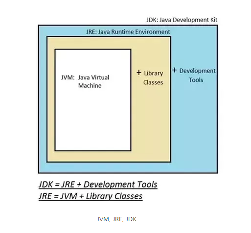
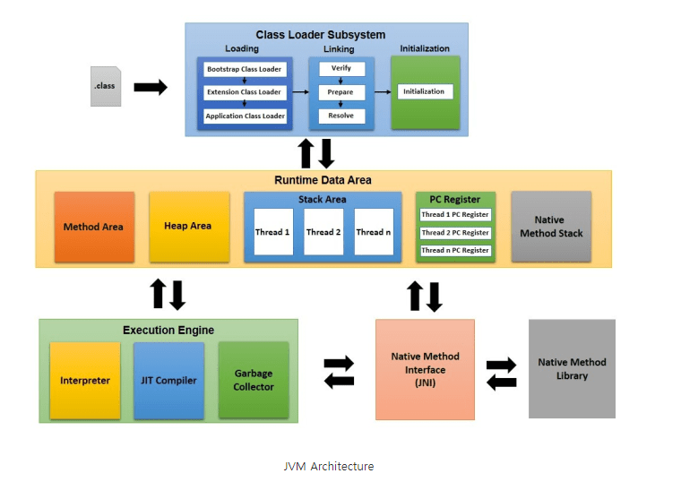
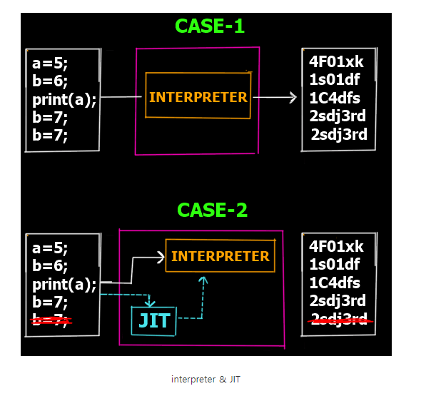

# 📝 Java 

-  썬 마이크로시스템즈의 제임스 고슬링이 개발한 객체 지향 프로그래밍 언어이다. 웹과 모바일 앱 개발에 많이 사용된다. 문법적인 특성이 C 언어와 비슷하다.

- Java로 개발된 프로그램은 CPU나 운영체제의 종류에 상관없이, JVM을 설치할 수 있는 시스템 어디서나 실행될 수 있다. 즉, Java로 작성된 프로그램은 플랫폼 독립적이다. 

- 프로그램은 본래 운영체제에 따라 구현 방법이 달라진다. 자바 프로그램은 JVM 위에서 실행되기 때문에 같은 코드의 프로그램으로 다양한 운영체제에서 실행될 수 있다. (하지만 운영체제에 따른 알맞은 JVM이 필요하다.)

------

 

# 📝 Java file, Java Compiler, Java Bytecode 

- 몇 가지 Java 관련 용어를 살펴보자.
- 자바 소스파일 (*.java) - 확장자가 .java인 파일이다. 소스파일에 저장된 프로그램 코드를 가리켜 소스코드라고 한다.
- Java Compiler (Javac.exe) - .java 파일의 소스코드를 JVM이 이해할 수 있는 자바 바이트코드로 변환한다.
- Java Bytecode (.class) - 확장자가 .class인 클래스 파일이다. 자바와 기계어 사이의 중간 언어이다. JVM이 사용할 수 있다. 각각의 바이트코드는 1바이트로 구성된다. 
- 자바 가상 머신(JVM) - 자바 바이트코드를 기계어로 변환하고 실행한다.

------

 

# 📝 JVM, JRE, JDK

## 1️⃣ JVM(Java Vitual Machine)

- JVM은 운영체제 위에서 동작하는 소프트웨어로 자바 소스 코드(.java)를 컴파일해서 얻은 자바 바이트 코드(.class)를 운영체제가 이해할 수 있는 기계어(=네이티브 코드 =바이너리코드)로 바꾼뒤 실행한다.

## 2️⃣ JRE(Java Runtime Environment)

- JVM이 자바 프로그램을 실행할 때 필요한 라이브러리와 기타 파일들을 가지고 있다. 

- JRE는 JVM의 실행 환경을 구현한 것이다. 

## 3️⃣ JDK(Java Development Kit, JDK)

- JDK는 java 개발을 위한 도구이다. JRE, 자바 컴파일러(Javac), 각종 라이브러리 등을 포함하고 있다. 

------

 

# 📝 자바 가상 머신(JVM) 내부 구조

## 📋 JVM 구성요소

### 1️⃣ Class Loader 

-  .java 소스 파일을 자바 컴파일러가 컴파일하면 .clss 파일(자바 바이트코드)이 만들어진다. 이렇게 만들어진 클래스 파일들을 엮어서 JVM이 운영체제로부터 할당 받은 메모리 영역인 Runtime Data Area로 적재하는 역할을 한다. 

### 2️⃣ Runtime Data Area

- JVM 메모리 영역으로 자바 애플리케이션을 실행할 때 사용되는 데이터들을 적재하는 영역이다. 

- Method Area, Heap Area, Stack Area, PC Register, Native Method Stack으로 나누어진다. 

### 3️⃣ Excution Engine

- Class Loader에 의해 Runtime Data Area에 적재된 클래스(자바 바이트 코드)들을 기계어로 변환하고 명령어 단위로 실행한다. 

-  자바 바이트코드를 기계어로 변환할 때 interpreter 또는 JIT Compiler를 사용한다.

### 4️⃣ Garbage Collector

- Garbage Collector(GC)는 Heap 메모리 영역에 생성된 객체들 중에 참조되지 않은 객체들을 탐색 후 제거하는 역할을 한다. 필요하지 않은 쓰레기 객체를 효과적으로 처리한다. 

- GC가 언제 동작하는지 정확히 알 수 없다. (참조가 없어지자마자 해제되는 것을 보장하지 않는다.)

- GC가 수행되는 동안 GC를 수행하는 쓰레드가 아닌 다른 모든 쓰레드가 일시정지된다. 

------

 

# 📝 Java 프로그램 실행 과정

1. 개발자가 작성한 abc.java라는 자바 소스 파일이 있다. 

2. abc.java를 빌드(컴파일)하면 자바 컴파일러는 구문 오류검사 및 기타 오류를 확인하고 오류가 없으면, 자바 소스코드를 (abc.java)을 자바 바이트 코드(abc.class)로 변환한다.

3. JVM의 Class Loader는 자바 바이트 코드를 JVM 메모리 공간에 적재한다.

4. 바이트 코드 검증기는 자바 바이트 코드의 무결성을 검사하고 문제가 없으면 Interpreter에게 전달한다.

5. Interpreter는 바이트 코드의 각 행을 기계어 코드로 변환해 CPU에 전달하고 실행시킨다. 

### 📋 위에서 언급하지 않았던 JIT 컴파일러의 작동

#### 🔎 CASE-1

- 기계 코드로 변환되어야 하는 5줄의 바이트코드를 살펴보자. Interpreter는 4, 5번째 줄이 중복됨에도 불구하고 5줄의 바이트 코드에 대해 5줄의 기계 코드를 만든다. 

#### 🔎 CASE-2

-  JIT 컴파일러는 먼저 전체 코드를 스캔하여 최적화가 가능한지 확인한다. 4, 5번째 줄이 중복되어 있음을 발견하면 바이트 코드에서 해당 줄을 제거하고 Interpreter에게 4줄만 전달한다. Interpreter은 4줄만 변환하면 되므로 효율적이고 빨라진다. 이외에 JIT 컴파일러는 필요한 패키지만 포함하는 것, 코드 최적화, 이미 변환된 기계어 코드 재사용, 중복코드 제거 등의 일을 수행하며 전체적인 프로세스를 매우 빠르고 효율적으로 만든다. 

------

 

# 🔎 출처 & 더 알아보기

* https://d2.naver.com/helloworld/1230

  https://simplesnippets.tech/execution-process-of-java-program-in-detail-working-of-just-it-time-compiler-jit-in-detail/

* https://jeong-pro.tistory.com/148

* https://lazymankook.tistory.com/79

* [https://ko.wikipedia.org/wiki/%EC%9E%90%EB%B0%94_%EA%B0%80%EC%83%81_%EB%A8%B8%EC%8B%A0

* [https://ko.wikipedia.org/wiki/%EC%9E%90%EB%B0%94_(%ED%94%84%EB%A1%9C%EA%B7%B8%EB%9E%98%EB%B0%8D_%EC%96%B8%EC%96%B4)#cite_note-1](https://ko.wikipedia.org/wiki/자바_(프로그래밍_언어)#cite_note-1)