# 📝 **Blocking**

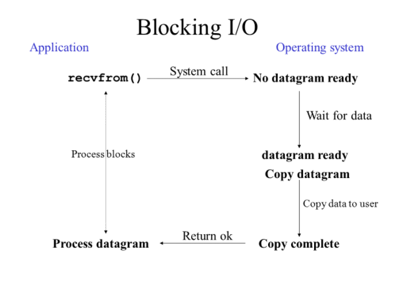

## 📌 핵심 요약

**블로킹이란 호출된 함수가 자신이 할 일을 모두 마칠 때까지 제어권을 계속 가지고 있고, 그 동안 호출한 함수는 대기 하는 것을 말한다.**

## 📌 설명

- blocking이란 작업의 멈춤, 대기(wait)를 뜻하는 단어다. 어떤 상황에서 누가 blocking이 된다는 것일까?
  - 블로킹 방식하에서 A함수에서 B함수를 호출하는 상황을 가정해보자.
  - A함수는 B함수를 호출하면서 제어권을 넘겨준다.
  - B함수는 제어권을 넘겨 받고, 자신의 작업을 완료하기 전까지 제어권을 돌려주지 않는다.
  - A함수는 B함수가 완료될 때까지 제어권을 돌려받지 못하므로 아무것도 못한다. 즉, 대기상태, block 상태가 된다.
  - B함수가 완료되면 제어권을 A함수에게 리턴한다.
  - 제어권을 다시 돌려받은 A함수는 그 다음 작업을 수행한다. 

* 다시 한 번 정리해보자면, Blocking이란 호출된 함수가 자신의 작업을 모두 마칠때까지 호출한 함수에게 제어권을 주지 않고 대기하게 만드는 것이다.
* 위 그림을 보면 프로세스는 커널을 통해 I/O 작업(Read)을 한다.
* 프로세스는 I/O 작업을 위한 시스템콜 호출 이후 
* I/O 기기에서 datagram을 읽어올 때까지 프로세스는 blocking 되는 것을 볼 수 있다.

<br>

# 📝 **Non-Blocking**

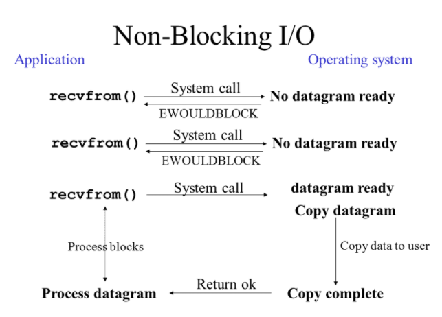

## 📌 핵심 요약

**논블로킹이란 호출된 함수의 작업 완료 여부에 상관없이 제어권을 호출한 함수한테 바로 리턴하여, 호출한 함수가 다른 작업을 할 수 있는 것을 말한다.**

## 📌 설명

- non-blocking이란 말그대로 블로킹이 안된다는 것이다. 어떤 상황에서 누가 non-blocking 된다는 것일까?

- 논블로킹 방식하에서 A함수에서  B함수를 호출하는 상황을 가정해보자
  - A함수는 B함수를 호출하면서 제어권을 넘겨준다.
  - B함수는 제어권을 넘겨받는다. 그리고 자신의 작업 완료 여부에 상관없이 
  - 제어권을 곧장 A함수에게 다시 넘겨준다.
  - A함수는 제어권을 곧장 돌려받고, 다른 작업을 수행할 수 있다.(B함수의 완료와 상관없이)
  - B함수의 작업이 완료되면, 그 결과를 A함수에게 통지한다. 

- 다시 한 번 정리 해보자면, Non-Blocking이란 호출된 함수의 작업 완료 여부에 상관 없이, 호출한 함수는 제어권을 곧장 돌려받고, 다른 작업을 수행할 수 있는 것이다.
- 위 그림을 보면 프로세스는 커널을 통해 I/O 작업(Read)을 한다.
- 프로세스는 I/O 작업을 위한 시스템콜을 호출한다.
- 하지만 I/O 기기에서 데이터를 읽기전에(No datagram ready) 
- EWOULDBLOCK을 리턴 받는다. (EWOULDBLOCK는 아직 작업이 진행 중이란 뜻이다.)
- 즉, I/O 작업이 완료되지 않았음에도 불구하고 제어권을 곧장 돌려받아 
- 프로세스는 block되지 않는 것이다. (block되지 않는 동안 다른 작업 수행 가능.

<br>

# 📝 Synchronous

​												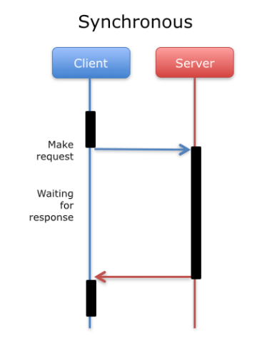
<br>

​            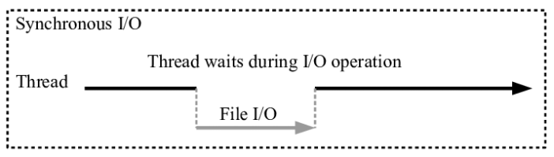

## 📌 핵심요약

**동기식 모델은 호출된 함수의 수행 결과 및 종료를 호출한 함수가 처리하는 것이다.**

## 📌 설명

* Synchronous의 뜻은 무엇일까? 네이버에 검색해보면 "동시 발생[존재]하는"라고 나와있다.
* 어원을 파해져보자 Synchronous는  Sync(함께)와 Chrono(시간)가 결합된 단어이다.
* "시간을 함께 맞춘다." 대충 이런 의미로 생각해볼 수 있다. 누가 어떤 시간을 맞춘다는 것일까?
* 먼저 동기식 모델이 어떻게 동작하는지 알아보자

* 동기식 모델에서 A함수에서  B함수를 호출하는 상황을 가정해보자
  * B 함수의 작업 완료는 A함수가 최종적으로 처리한다.
  * 즉, A함수는 B함수를 호출하고 B함수의 수행 결과 및 종료를 처리한다.
    * B함수가 완료될 때까지 대기하다가 처리할 수도 있고(블로킹 동기)
    * B함수가 완료될 때까지 다른 작업을 수행하면서, B작업의 완료 여부를 계속 체크하다가 처리할 수도 있다. (논블로킹 동기)
* 요약 하자면, 동기식에서는 작업을 요청한 함수가 작업 완료를 계속 확인하며 신경쓴다.
* 동기식 모델에서는 작업이 순차적으로 진행된다. 
* 위에서 살펴본 상황에서 A함수는 B함수의 완료를 직접 처리하고나서 다음 작업을 수행할 것이다.
* B함수가 완료될 때까지 다른 작업을 수행하기도 한다며? (논블로킹 동기)
* 이는 B함수의 작업이 완료되었는지 체크하는 와중에 다른 작업을 할 수 있다는 뜻이다.
* 크게보면 어쨌든 B함수의 작업이 완료 되어야지 A함수는 다른 작업을 수행할 수 있다. (아래코드 참조)

```java
Future ft = asyncFileChannel.read(~~~);

while(!ft.isDone()) {
    // isDone()은 asyncChannle.read() 작업이 완료되지 않았다면 false를 바로 리턴해준다.
    // isDone()은 물어보면 대답을 해줄 뿐 작업 완료를 스스로 신경쓰지 않고,
    // isDone()을 호출하는 쪽에서 계속 isDone()을 호출하면서 작업 완료를 신경쓴다.
    // asyncChannle.read()이 완료되지 않아도 여기에서 다른 작업 수행 가능 
}

// 작업이 완료되면 작업 결과에 따른 다른 작업 처리
```

* 다시,  누가 어떤 시간을 맞춘다는 것일까?(동기라고 부르는 이유는 무엇일까?)라는 질문으로 돌아가보자.  (이유 추가 수정 필요.)
  * B함수의 실행과 그것에 대한 결과가 한 타이밍에 이루어진다고 해석할 수 있다. (B함수를 실행하고 그 결과를 받을때까지 기다리니까)
  * A함수가 B함수를 호출했으면, B함수의 결과는 (시간이 얼마나 걸리더라도) 그 자리에서 받는다. 
  * 즉, 작업의 요청과 결과가 동시에 일어나기 때문에 **동기**라고 부르는 것이다.

<br>

# 📝 ASynchronous
​											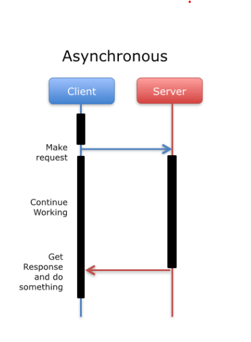
​	<br>
​        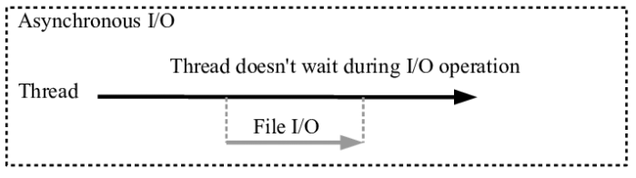

## 📌 핵심요약

**비동기식 모델은 호출된 함수의 수행 결과 및 종료를 호출된 함수가 처리하는 것이다.**

## 📌 설명

* 부정관사 A가 붙어있는 ASynchronous는 비동기라는 뜻이다.
* 비동기식 모델이 어떻게 동작하는지 알아보자
* 비동기식 모델에서 A함수에서  B함수를 호출하는 상황을 가정해보자
  * B함수의 작업 완료는 B함수가 직접 혼자 처리한다.
  * 즉 B함수는 스스로 수행 결과 및 종료를 처리한다. 
  * B함수는 작업 수행을 완료하면 그 결과를 A함수에게 알릴 뿐이다.
  * A함수는 B함수의 작업 완료를 신경쓰지 않기 때문에 B함수를 호출한후 다른 작업을 수행할 수 있다.
* 요약하자면, 작업을 요청한 함수가 작업 완료 여부를 신경쓰지 않고 자기 할일을 한다면, 비동기다.

- 비동기식 모델에서는 작업이 순차적으로 진행되는 것을 보장할 수 없다.
- 위에서 살펴본 상황에서 A함수는 B함수의 완료 여부에 상관없이 작업을 수행한다.
- B함수가 끝나지 않았는데도 A함수는 다른 작업을 수행할 수 있으므로 
- 작업이 순차적으로 수행되지 않을 수 있다.

- 비동기라고 부르는 이유는 동기라고 부르는 이유의 반대라고 생각하면 된다.
  - 비동기식 모델에서 B함수의 실행과 결과는 한 타이밍에 이루어지지 않는다.
  - B함수를 호출하고, A함수가 다른 작업을 다끝내고, B함수가 완료될 수도 있다.
  - 즉, 작업의 요청과 결과가 동시에 이루어지지 않기 때문에 **비동기**라고 부르는 것이다.
- 

<br>

# 📝 동기 비동기 이해를 돕는 그림들
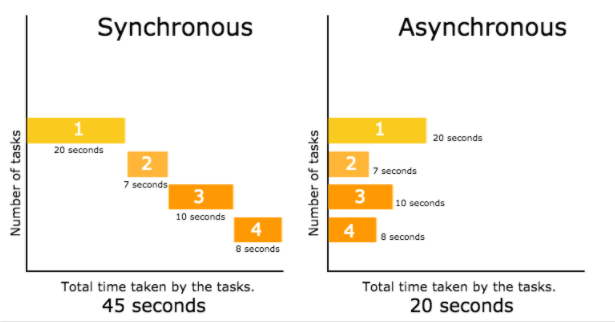
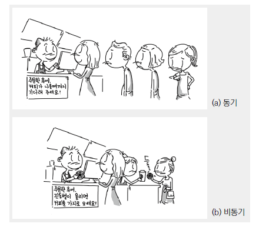

<br>

# 📝 Synchronous, ASynchronous, Blocking, **Non-Blocking**

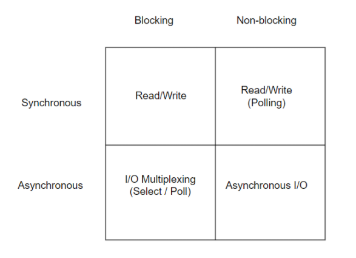

- 블락, 논블락, 동기, 비동기가 각각 쌍을 이루어 4가지 조합이 만들어 진다. 
- 머리가 복잡해지지만, 4개의 조각을 채워가며 하나씩 살펴보자

## 📌 Synchronous-Blocking
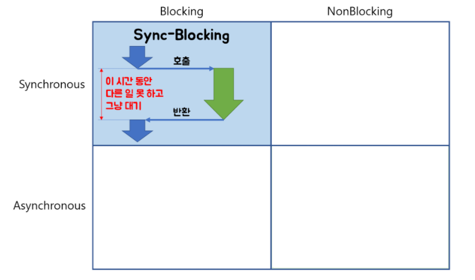
## 📌 Asynchronous-**Non-Blocking**

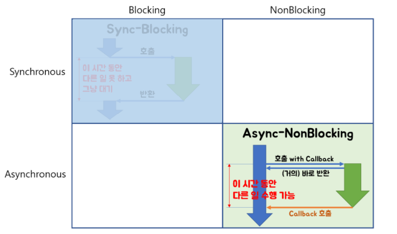

## 📌 Synchronous-**Non-Blocking**

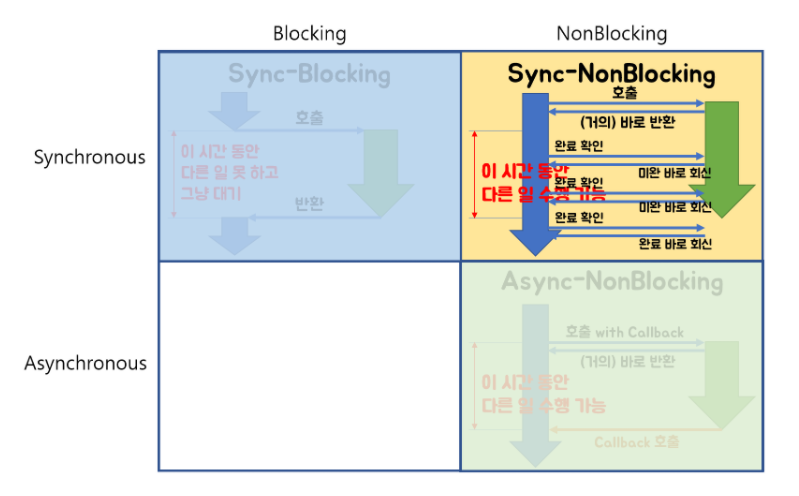

## 📌 ASynchronous-**Blocking**
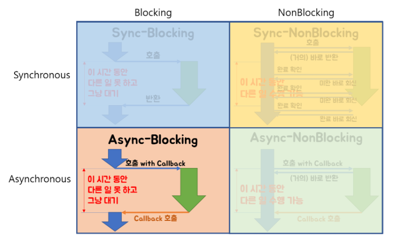

<br>

# 🔎 출처 & 더 알아보기

* [Blocking-NonBlocking-Synchronous-Asynchronous](http://homoefficio.github.io/2017/02/19/Blocking-NonBlocking-Synchronous-Asynchronous/#about)

* [Synchronous(동기식) 통신과 Asynchronous(비동기식) 통신이란?]([https://khj93.tistory.com/entry/%EB%84%A4%ED%8A%B8%EC%9B%8C%ED%81%AC-Synchronous%EB%8F%99%EA%B8%B0%EC%8B%9D-%ED%86%B5%EC%8B%A0%EA%B3%BC-Asynchronous%EB%B9%84%EB%8F%99%EA%B8%B0%EC%8B%9D-%ED%86%B5%EC%8B%A0%EC%9D%B4%EB%9E%80](https://khj93.tistory.com/entry/네트워크-Synchronous동기식-통신과-Asynchronous비동기식-통신이란)) 

*  [Node.js-28.2.Nodejs에서 동기와 비동기 2 - 생활코딩](https://www.youtube.com/watch?v=7woGFlMhSgk) 

* [동기(Synchronous) 작업과 비동기(Asynchronous) 작업, 그리고 블락(Blocking) 과 넌블락(Non-Blocking) 의 개념](https://jins-dev.tistory.com/entry/동기Synchronous-작업과-비동기Asynchronous-작업-그리고-블락Blocking-과-넌블락NonBlocking-의-개념)

* [동기와 비동기 방식(Asynchronous processing model)](https://webclub.tistory.com/605)

* [🙈동기(synchronous)와 비동기(asynchronous) / 블로킹(blocking)과 논블로킹(non-blocking)🐵](https://victorydntmd.tistory.com/8)

* [동기와 비동기, 그리고 블럭과 넌블럭](https://musma.github.io/2019/04/17/blocking-and-synchronous.html)

  