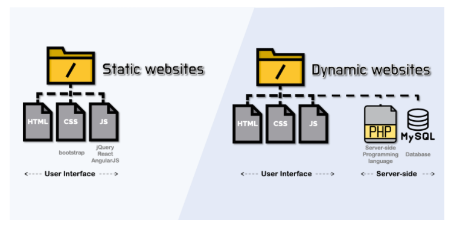
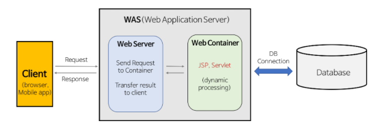
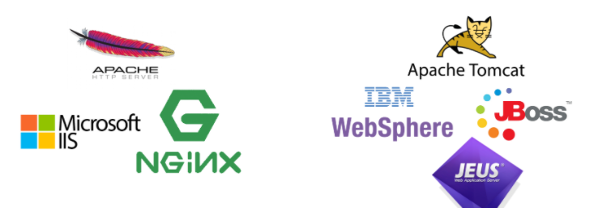
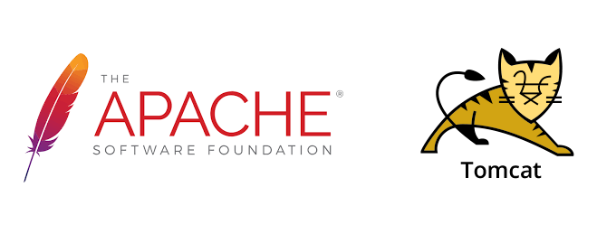
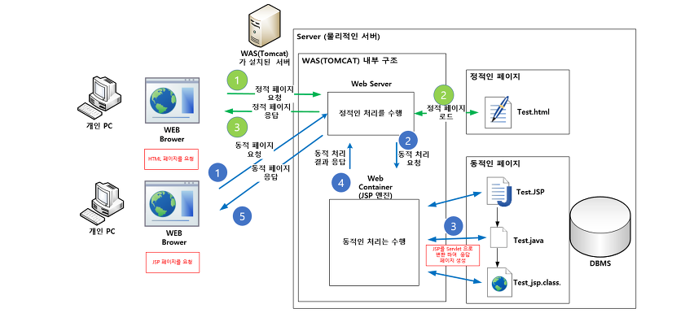

# 📝 정적 페이지와 동적 페이지

## 📌 Static web page(정적 웹 페이지)

- 정적 웹 페이지는 정적인 컨텐츠를 제공한다.
- 정적인 컨텐츠는 html, css, js 등으로 서버에 저장되어 있으며,
- 사용자가 요청하면 그대로 제공된다.

- 어느 사용자던지 동일한 요청에 대해 동일한 결과를 응답한다.

## 📌 Dynamic web page(동적 웹 페이지)

- 동적 웹 페이지는 동적인 컨텐츠를 제공한다.
- 동적인 컨텐츠는 누가, 언제, 어떻게 서버에게 요청했는지에 따라
- 응답되는 결과가 달라진다. ex) 사용자에 따른 유튜브, 넷플릭스 추천
- 사용자에게 동적인 웹 페이지를 제공하기 위해
- 서버는 동적 웹 페이지를 생성하는 프로그램([Servlet](https://ko.wikipedia.org/wiki/%EC%9E%90%EB%B0%94_%EC%84%9C%EB%B8%94%EB%A6%BF), [JSP](https://ko.wikipedia.org/wiki/%EC%9E%90%EB%B0%94%EC%84%9C%EB%B2%84_%ED%8E%98%EC%9D%B4%EC%A7%80) 등)을 구동해서 동적인 웹 페이지를 생성하고 사용자에게 응답한다.
  - 웹 서버에서 이러한 외부 프로그램을 호출하는 조합을 [CGI](https://ko.wikipedia.org/wiki/%EC%9E%90%EB%B0%94%EC%84%9C%EB%B2%84_%ED%8E%98%EC%9D%B4%EC%A7%80)라고 한다.
  - Servlet, JSP를 실행할 수 있는 소프트웨어를 웹 컨테이너 또는 서블릿 컨테이너라고 한다. 

 

# 📝 Web Server와 WAS
	

## 📌 Web Server

- 웹 서버는 정적인 페이지(컨텐츠)를 제공하는 컴퓨터이자 소프트웨어다.

- 웹 서버는 클라이언트의 HTTP 요청을 서비스 한다.
- 정적인 컨텐츠를 제공할 뿐만 아니라,
- 동적인 컨텐츠 제공을 위한 요청을 WAS로 전달하는 역할도 한다.
  - 클라이언트의 요청을 WAS에 보내고, WAS가 처리한 결과를 클라이언트에게 응답한다.
- 웹 서버의 종류로는 Apache Server, Nginx, IIS(Windows 전용 Web 서버) 등이 있다.

## 📌 WAS(Web Application Server)

- WAS는 동적인 페이지(컨텐츠)를 제공하는 컴퓨터이자 소프트웨어다.
- WAS는 웹 서버와 웹 컨테이너로 구성되어 있다.
- 동적인 처리가 요구되는 사용자 요청을 받으면,
- WAS 컨테이너를 통해 Servlet, JSP 등을 실행시켜, 동적인 웹 페이지를 생성하고 제공한다.
- WAS의 기능을 나열해보자
  - 동적 웹 페이지를 생성하는 프로그램 환경을 제공한다.
  - DB 접속 기능을 제공한다.
  - 여러 개의 트랜잭션을 관리한다.
  - 업무를 처리하는 비지니스 로직을 수행한다. 
- WAS의 종류로는 Tomcat, JBoss, Jeus, Web Sphere 등이 있다. 

 

# 📝 Apache와 Tomcat

## 📌 Apache(아파치)

- 아파치는 오픈소스 소프트웨어 그룹인 아파치 소프트웨어 재단에서 만든 웹 서버 프로그램이다.

- 아파치는 클라이언트 요청이 오면 정적인 웹 페이지를 제공한다.

## 📌 Tomcat(톰캣)

- 톰캣은 WAS다. 아파치 톰캣이라고도 불린다.
- 톰캣은 아파치(웹 서버)의 기능과 컨테이너를 포함한다.
- 톰캣은 정적 데이터와 동적 데이터를 제공할 수 있다.

# 🔎 출처 & 더 알아보기

* [Web Server와 WAS의 차이와 웹 서비스 구조](https://gmlwjd9405.github.io/2018/10/27/webserver-vs-was.html)
* [아파치 톰캣이란?](https://wodonggun.github.io/wodonggun.github.io/study/%EC%95%84%ED%8C%8C%EC%B9%98-%ED%86%B0%EC%BA%A3-%EC%B0%A8%EC%9D%B4.html)

