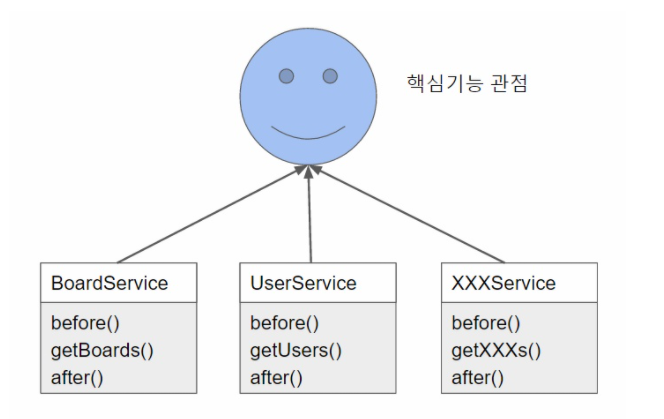
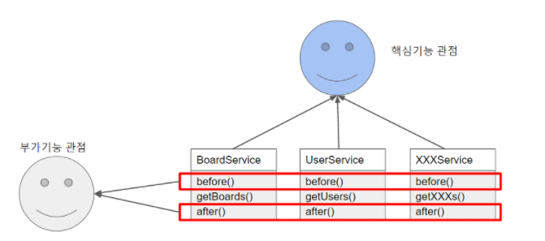

# AOP(Aspect-Oriented Progarmming, 관점 지향 프로그래밍)
- AOP란 애플리케이션 전체에 걸쳐 사용되는 기능을 재사용하도록 지원하는 것 이다.
- 관점 지향 프로그래밍이란 프로젝트 구조를 바라보는 관점을 바꿔보자는 의미다.
- 핵심 기능 관점과 부가 기능 관점을 그림으로 살펴보자.

- 각각의 서비스를 핵심 기능 관점으로 보았을 때는 공통된 요소가 없다.
  
- 각각의 서비스를 부가기능 관점으로 보았을 때는 before과 after라는 메서드가 공통된 요소로 보인다.
- 즉, AOP는 OOP 관점과 다른 부가기능적인 관점으로 보았을 때 공통된 요소를 추출하여 재사용하는 기법이다. 
  - OOP : 비지니스 로직의 모듈화
    - 모듈화의 핵싱 단위는 비지니스 로직
  - AOP : 인프라 혹은 부가기능의 모듈화
    - 대표적 예 : 로깅, 트랜잭션, 보안 등
    - 각각의 모듈들의 주 목적 외에 필요한 부가적인 기능들
- OOP에서 공통된 기능을 재사용하는 방법으로 상속이나 위임을 사용한다. 
- 하지만 전체 애플리케이션 여기저기에서 사용되는 부가기능들을 상속이나 위임으로 처리하기 위해 깔끔하게 모듈화하기 어렵다.
- 그래서 AOP가 등장한 것이다. AOP의 장점은 아래와 같다.
  - 애플리케이션 전체에 흩어진 공통 기능을 하나의 장소에서 관리할 수 있다.
  - 다른 서비스 모듈들이 본인의 목적에만 충실하고 그 외 사항들은 신경쓰지 않아도 된다. 

- 위 그림에서 각 서비스들이 실행 되기 전에는 `before()` 메서드가, 실행 되고 나서는 `after()` 메서드가 실행된다. 
- 스프링 컨테이너는 각 서비스 객체에 대한 프록시 객체를 만들어서 DI를 한다. 즉 `BoardService 객체`가 주입 되는 것이 아니라 `프록시 BoardService 객체`가 주입 되는 것이다. 
- `프록시 BoardService객체`는 `BoardService 객체`의 `getBoards()` 메서드를 호출한다. 그리고 호출 전후로 `before() `메서드와 `after()` 메서드를 호출한다. 
- 컨테이너가 프록시 객체를 만들어서 DI 해주기 때문에 이렇게 AOP가 가능 한 것이다. 이는 DI의 장점이다. 
- 이러한 스프링의 AOP 방식을 프록시 방식의 AOP라고 한다. 
- 자바 바이트 코드를 조작해서 AOP를 구현할 수도 있다. 

# 참고
- https://jojoldu.tistory.com/71?category=635883

- https://www.inflearn.com/course/스프링-입문-스프링부트/dashboard