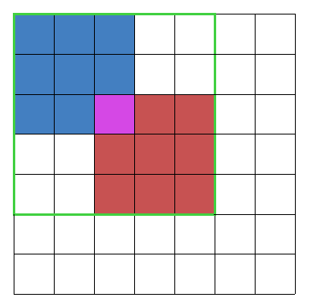

## ✔️ 문제  
* 문제 링크 : [https://programmers.co.kr/learn/courses/30/lessons/60059](https://programmers.co.kr/learn/courses/30/lessons/60059)
* 카카오 기술블로그 문제 해설 :  [https://tech.kakao.com/2019/10/02/kakao-blind-recruitment-2020-round1/](https://tech.kakao.com/2019/10/02/kakao-blind-recruitment-2020-round1/)
* 2020 카카오 블라인드 채용 1차 코딩테스트 3번 문제이다. 
* 출제 의도 :  "2차원 배열을 다룰 수 있는지 파악"


## ✔️ 문제 이해

* 정사각 격자 형태의 2차원 배열로 자물쇠와 열쇠가 주어진다.
  
* 열쇠의 크기는 M x M 이고, 자물쇠의 크기는 N x N 이다. ( M <= N )
  
* 자물쇠와 열쇠는 돌기와 홈으로 이뤄져있다. ( 돌기 : 1, 홈 : 0 )

* 열쇠의 돌기 부분을 자물쇠의 홈 부분에 딱 맞게 채우면 자물쇠가 열린다. 

* 단, 열쇠와 자물쇠의 돌기 부분이 만나면 안된다.

* 자물쇠 영역을 벗어난 부분에 있는 열쇠의 홈과 돌기는 자물쇠를 여는데 영향을 주지 않는다. 그리고 열쇠는 회전 시킬 수 있다.
  
* 주어진 열쇠로 자물쇠를 열 수 있으면 true 없으면 false를 반환해야한다. 

* 값 범위
  * 3 ≤ M ≤ 20
  * 3 ≤ N ≤ 20


## ✔️ 알고리즘 설계

1. 가능한 모든 위치에서 열쇠를 자물쇠에 맞춰보고, 자물쇠가 열리는지 확인해본다. 
  
2. 자물쇠가 열리지 않는다면, 열쇠를 회전 시켜서 1 를 다시 수행한다.
   

## ✔️ 상세 구현설명



* 3 x 3 열쇠와 좌물쇠를 기준으로 설명하겠다.

* 파란색은 열쇠, 빨간색은 자물쇠, 연보라색은 겹친 부분을 나타낸다. 

* 먼저 N + (M - 1) * 2 크기의 map을 만들고 중앙에 자물쇠를 위치 시킨다.
  
* 초록색 테두리 안쪽에 해당하는 모든 위치에 열쇠의 좌상단을 위치시켜 열쇠를 맞춰보고 자물쇠가 열리는지 확인한다. (열쇠를 회전시킨 경우도 고려한다.)
  


## 👨🏻‍💻 소스 코드

```cpp
#include <string>
#include <vector>
#include<iostream>
using namespace std;
int m, n;
int mapSize;

bool open(int sx, int sy, vector<vector<int>> &key, vector<vector<int>> map) {

	// 기준 위치 sx, sy에서 열쇠를 자물쇠에 끼워본다. 
	for (int i = sx; i < sx + m; i++) { 
		for (int j = sy; j < sy + m; j++) {
			map[i][j] += key[i - sx][j - sy]; // 자물쇠에 열쇠를 더한다.
		}
	}

	// map에 위치한 자물쇠의 모든 원소가 1이라면, 자물쇠가 열린 것이다. 
	// 원소가 2라면, 돌기 부분이 겹친경우다.

	for (int i = m - 1; i < m - 1 + n; i++) {
		for (int j = m - 1; j < m - 1 + n; j++) {
			if (map[i][j] != 1) return false; // 0 또는 2면 open 실패.
		}
	}

	return true;
}

// 2차원 배열을 오른쪽으로 90도 회전 시킨다.
void rotateKey(vector<vector<int>>& key) { 

	vector<vector<int>> tmp = key;
	for (int i = 0; i < m; i++) {
		for (int j = 0; j < m; j++) {
			key[i][j] = tmp[m - j - 1][i];
		}
	}

}

bool solution(vector<vector<int>> key, vector<vector<int>> lock) {

	m = key.size(); // 열쇠 크기 저장.
	n = lock.size(); // 자물쇠 크기 저장.

	mapSize = n + (m - 1) * 2; // map 사이즈.
	vector<vector<int>> map(mapSize, vector<int>(mapSize, 0)); // map을 만든다.

	for (int i = m - 1; i < m - 1 + n; i++) { // map의 중앙에 자물쇠를 넣는다. 
		for (int j = m - 1; j < m - 1 + n; j++) {
			map[i][j] = lock[i - (m - 1)][j - (m - 1)];
		}
	}

	for (int i = 0; i < 4; i++) { // 열쇠를 회전 시키면서,

		for (int r = 0; r < m + n - 1; r++) {
			for (int c = 0; c < m + n - 1; c++) {
				// 적절한 각 위치에서 자물쇠가 열리는지 확인한다.
				if (open(r, c, key, map)) return true; 
			}
		}
		rotateKey(key); // 열쇠를 회전 시킨다.
	}

	return false;
}

```


## ✔️ 문제 회고

* 2차원 배열 조작이 능숙하면, 쉽게 풀 수 있는 문제다.
* 2차원 배열 회전을 구현할 수 있어야 했다.
