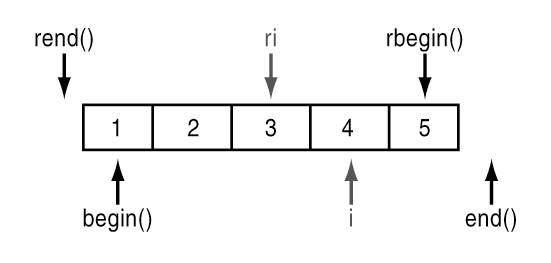

## ✔️ 문제  

*  문제 링크 : [https://programmers.co.kr/learn/courses/30/lessons/17682](https://programmers.co.kr/learn/courses/30/lessons/17682)

*  카카오 기술블로그 문제 해설 : [https://tech.kakao.com/2017/09/27/kakao-blind-recruitment-round-1/](https://tech.kakao.com/2017/09/27/kakao-blind-recruitment-round-1/)

*  2018 카카오 블라인드 채용 1차 코딩테스트 2번 문제이다. 

* 출제 의도 : "문자열 처리를 묻는 문제"


## ✔️ 문제 이해

* 주어진 문자열을 해석해서 다트 게임의 점수를 계산 해야한다.
* 다트 게임은 총 3번의 기회로 구성된다.
* 각 기회마다 얻을 수 있는 점수는 0점에서 10점까지다.
* 점수마다 Single(`S`), Double(`D`), Triple(`T`) 영역이 존재하고 각 영역에 해당하면 점수에서 1제곱, 2제곱, 3제곱 (점수^1 , 점수^2 , 점수^3 )으로 계산된다.
* 옵션으로 스타상(`*`) , 아차상(`#`)이 존재하며 스타상(`*`) 당첨 시 해당 점수와 바로 전에 얻은 점수를 각 2배로 만든다. 아차상(`#`) 당첨 시 해당 점수는 마이너스된다.
* 스타상의 효과는 다른 스타상의 효과와 중첩될 수 있다.
* 스타상의 효과는 아차상의 효과와 중첩될 수 있다. 
* 스타상(`*`), 아차상(`#`)은 점수마다 둘 중 하나만 존재할 수 있으며, 존재하지 않을 수도 있다.
* 0~10의 정수와 문자 `S, D, T, *, #`로 구성된 문자열이 입력될 시 총점수를 계산해서 반환하는 함수를 작성하면 된다. 


## ✔️ 알고리즘 설계

1. 주어진 문자열을 문제 조건에 따라 차례대로 해석해서 점수를 계산한다. 

   

## ✔️ 상세 구현설명

* 주어진 문자열을 for문으로 조회하며 점수를 계산한다.
* 숫자 문자일 경우 score 변수에 점수를 저장해둔다.
* 'S', 'D', 'T' 일 경우 문제조건에 따라 score 저장해둔 점수를 제곱 처리하고, 결과를 저장할 vector scoreList에 넣는다. 그리고 score 변수를 초기화 한다. 
* '*' 일 경우 현재 점수와 이전 점수를 2배한다.
* '#' 일 경우 현재 점수에 -1 를 곱한다.
* scoreList에 들어있는 3개의 점수를 합한 값을 반환한다. 


## 👨🏻‍💻 소스 코드

```cpp
#include<string>
#include<vector>
#include<cmath>
using namespace std;

int solution(string dartResult) {
	vector<int> scoreList;
	int score = 0;

	for (int i = 0; i < dartResult.size(); i++) {

		if (isdigit(dartResult[i])) {
			score = score * 10 + dartResult[i] - '0';
		}
		else if (dartResult[i] == 'S') scoreList.push_back(score), score = 0;
		else if (dartResult[i] == 'D') scoreList.push_back(pow(score, 2)), score = 0;
		else if (dartResult[i] == 'T') scoreList.push_back(pow(score, 3)), score = 0;
		else if (dartResult[i] == '*') {

			scoreList.back() *= 2;
			if (scoreList.size() > 1) 
				*(scoreList.end() - 2) *= 2;
				
		}
		else if (dartResult[i] == '#') {
			scoreList.back() *= -1;
		}

	}

	return scoreList[0] + scoreList[1] + scoreList[2];
}
```


## ✔️ 복기해야 할 지식 



* c++ vector는 위 그림에 나와 있는 함수를 사용할 수 있다.
* 위 함수를 사용하여 그림과 같은 특정 위치의 iterator 를 얻어낼 수 있다. 

  

## ✔️ 문제 회고

* 처음에 문자열을 전처리하고 3번의 다트 기록을 토큰화해서 풀었다.
* 하지만 토큰화할 필요없이 위의 코드처럼 한 번의 for문 조회를 통해 해결할 수 있는 문제였다.
