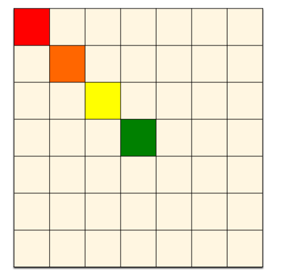
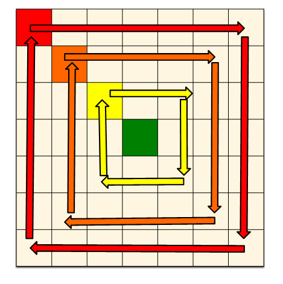

## ✔️ 문제  
* 문제 링크 : https://www.acmicpc.net/problem/17406
* 삼성전자 상시 SW 역량테스트 A형 기출 문제다.

## ✔️ 문제 이해

* 크기가 NxN인 배열 A가 있다. 

* 배열 A의 값은 각 행에 있는 모든 수의 합 중 최솟값을 의미한다. 

* 배열 A가 아래와 같은 경우 **배열 A의 값은 4다.**

* ```
  1 2 3 // 행의 합 6
  2 1 1 // 행의 합 4
  4 5 6 // 행의 합 15
  ```

- 배열은 회전 연산을 수행할 수 있다. 

-  회전 연산은 세 정수 (r, c, s)로 이루어져 있고, 가장 왼쪽 윗 칸이 (r-s, c-s), 가장 오른쪽 아랫 칸이 (r+s, c+s)인 정사각형을 시계 방향으로 한 칸씩 돌린다는 의미이다. 배열의 칸 (r, c)는 r행 c열을 의미한다.

- ```
  A[1][1]   A[1][2] → A[1][3] → A[1][4] → A[1][5] → A[1][6]
               ↑                                       ↓
  A[2][1]   A[2][2]   A[2][3] → A[2][4] → A[2][5]   A[2][6]
               ↑         ↑                   ↓         ↓
  A[3][1]   A[3][2]   A[3][3]   A[3][4]   A[3][5]   A[3][6]
               ↑         ↑                   ↓         ↓
  A[4][1]   A[4][2]   A[4][3] ← A[4][4] ← A[4][5]   A[4][6]
               ↑                                       ↓
  A[5][1]   A[5][2] ← A[5][3] ← A[5][4] ← A[5][5] ← A[5][6]
  
  A[6][1]   A[6][2]   A[6][3]   A[6][4]   A[6][5]   A[6][6]
  ```

- 배열 A와 사용 가능한 회전 연산이 주어졌을 때, 배열 A의 최솟값을 구하자. 
- 회전 연산은 모두 한 번씩 사용해야 하며, 순서는 임의로 정해도 된다.

## ✔️ 알고리즘 설계

* **주어진 K개의 회전 연산을 어떤 순서로 배열에 적용하는지에 따라 A 배열의 값이 달라진다.**
* K개의 회전 연산에 대해 `next_permutation`을 사용하여 회전 연산의 모든 순열을 구하고
* 각 순열마다 배열 A에 회전 연산을 적용하고, **배열의 값**을 구해보며 최솟값을 찾는다.

## ✔️ 상세 구현 설명

* r, c, s 의 값을 가지는 회전연산을 구조체로 관리했다. 구조체 배열을 만들어 모든 회전 연산을 저장했다.
* 주어진 회전 연산들의 모든 순열을 구해야하는데, 회전 연산들이 저장된 구조체 배열의 인덱스를 배열로 만들어 `next_permutation` 을 적용시켰다. 
* 회전 시키는법
  * 주어진 회전 연산 r, c, s 값을 활용한다.
  * r, c, s 값을 활용하여 기준점 sx, sy를 잡는다. (아래 빨간색 박스가 좌표가 (sx,sy)인 기준점이다.) 
  * 이제 이 기준점을 배열 중앙으로, 대각선 방향으로 한 칸씩 옮길 것이다. (빨, 주, 노, 초 순서로)
  * 
  * 기준점을 옮길때마다 테두리 부분을 회전 시킨다. (아래 그림 참조)
  * 
  * 주어진 모든 회전 연산들에 대해서 위 과정을 수행한다.
  * 테두리 부분회전은 원본 배열을 복사해둔 임시 배열 `tmp`를 하나 만들어두고, 임시 배열의 값을 참조하면서 원본 배열(테두리 회전 결과를 저장할 배열) `tmpMap`에 시계방향으로 한 칸씩 옆으로 원소를 옮기면서 넣어주면 된다.

## 👨🏻‍💻 소스 코드

```cpp
#include<iostream>
#include<vector>
#include<algorithm>
#include<unordered_map>
#include<cstring>
using namespace std;

typedef struct {
	int r, c, s;
}rotationInfo;

int n, m, k;
int map[50][50];
int tmpMap[50][50];
unordered_map<int, rotationInfo> info;
vector<int> arr;

void rotate(rotationInfo info) {
	int r = info.r;
	int c = info.c;
	int s = info.s;
	int tmp[50][50];
	memcpy(tmp, tmpMap, sizeof(tmpMap));

	int len = (r + s) - (r - s) + 1;
	int cnt = len / 2 + 1;
	int sx = r - s - 1, sy = c - s -1;

	while (cnt--) {
		// 위쪽 행  →
		for (int col = sy; col < sy + len - 1; col++) {
			tmpMap[sx][col + 1] = tmp[sx][col];
		}

		// 오른쪽 열 ↓
		for (int row = sx; row < sx + len - 1; row++) {
			tmpMap[row + 1][sy + len - 1] = tmp[row][sy + len - 1];
		}
	
		// 아래쪽 행  ←
		for (int col = sy + len - 1; col > sy; col--) {
			tmpMap[sx + len - 1][col-1] = tmp[sx+len - 1][col];
		}

		// 왼쪽 열 ↑
		for (int row = sx + len - 1; row > sx; row--) {
			tmpMap[row - 1][sy] = tmp[row][sy];
		}
		sx++, sy++, len-=2;
	}
}

int main() {
	int ret = 0x7fffffff;

	cin >> n >> m >> k;

	for (int i = 0; i < n; i++) {
		for (int j = 0; j < m; j++) {
			cin >> map[i][j];
		}
	}

	for (int i = 0; i < k; i++) {
		int r, c, s;
		cin >> r >> c >> s;
		info[i] = { r,c,s };
		arr.push_back(i);
	}

	do {
		memcpy(tmpMap, map, sizeof(map));
	
		for (int order : arr) {
			rotate(info[order]);
		}

		for (int r = 0; r < n; r++) {
			int candi = 0;
			for (int c = 0; c < m; c++) {
				candi += tmpMap[r][c];
			}
			ret = min(ret, candi);
		}
	} while (next_permutation(arr.begin(), arr.end()));

	cout << ret;

	return 0;
}
```

## ✔️ 문제 회고

* 순열을 활용하는 브루트 포스 문제다.
* 2차원 배열 조작은 임시 배열을 사용하는 것이 편리하다.
* 2차원 배열 회전, 대칭을 구현할 수 있어야 한다. 그림을 그려가며 하나씩 해보면 어렵지 않다. 

<br>